# Photogrammetrie auf dem Laptop: Möglichkeiten und Grenzen einer in Python implementierten 3D Rekonstruktions-Pipeline

Rudolf Hoffmann1, Frank Neumann1
{: .authors}

1HTW Berlin, Fachbereich 2 Informatik in Ingenieurwissenschaften, Wilhelminenhofstr. 75a, 12459 Berlin, Rudolf.Hoffmann@Student.HTW-Berlin.de, www.htw-berlin.de
{: .affiliation}

**Abstract:** Wie weit trägt eine selbst implementierte Photogrammetrie-Pipeline auf einem
handelsüblichen Laptop, ohne GPU-Cluster und ohne kommerzielle Software? Diese Langfassung
beantwortet die Frage anhand eines studentischen Implementierungsprojekts, erklärt dazu
jede Stufe der Verarbeitungskette mit ihrem Modell, ihren Parametern und ihren
Datenmengen, und grenzt genau ab, was „selbst implementiert" bedeutet: Aus Bibliotheken
stammen die numerischen Primitive, aus eigener Hand die gesamte Rekonstruktionslogik samt
Fehlermodell des Bundle Adjustment. Auf einem Datensatz mit 67 Aufnahmen und
mitgelieferten Ground-Truth-Posen registriert die Pipeline alle Kameras und liefert eine
formtreue Punktwolke aus 39.721 Punkten bei 2,08 px Reprojektions-RMSE. Der Vergleich mit
der Ground Truth zeigt Schwächen, die diese pipeline-eigene Kennzahl nicht anzeigt: Die
geschätzte Brennweite liegt 47 % neben dem wahren Wert, die Kameraorientierungen weichen
im Median um 6,29° ab, und zwei identische Aufrufe liefern unterschiedliche Ergebnisse.
COLMAP erreicht auf denselben Bildern, derselben CPU und mit derselben Merkmalszahl 0,2 %
Brennweiten- und 0,11° Orientierungsfehler in einem Viertel der Laufzeit. Ein eigens für
diese Fassung gebautes Experiment mit synthetischen Korrespondenzen auf den echten
Ground-Truth-Posen klärt die Ursache: Das Bundle Adjustment holt die Brennweite in seiner
voreingestellten Konfiguration selbst dann nicht zurück, wenn Struktur und Posen exakt
vorgegeben sind und der Restfehler bei 190 px liegt, weil es vorzeitig auf dem
Schrittweitenkriterium abbricht. Werden Parametervektor und Abbruchkriterien angepasst,
wandert die Brennweite von 47 % auf 6,9 % Fehler und der Orientierungsfehler auf 0,13°.
Die Brennweite ist also bestimmbar, und der Defekt liegt in der Konfiguration des Lösers,
nicht im Modell. Zugleich reagiert die Zahl akzeptierter Punkte deutlich auf eine falsche
Brennweite, der Reprojektionsfehler dagegen kaum. Die Genauigkeit steckt in den Daten, und
die Lücke liegt in der Umsetzung. Für jede gefundene Grenze benennt der Beitrag die
Ursache im Code und den Beleg aus einer Messung.
{: .abstract}

**Keywords:** Structure-from-Motion; Photogrammetrie; Python; Punktwolke; Bundle Adjustment; Visualisierung; Studierendenprojekt
{: .keywords}

## 1  Einleitung

Aus einer Handvoll gewöhnlicher Fotos ein dreidimensionales Modell zu berechnen, gehört
heute zu den Standardwerkzeugen von Vermessung, Denkmalpflege, Robotik und AR/VR. Drohnen
kartieren Baustellen, Museen digitalisieren Exponate, autonome Systeme rekonstruieren ihre
Umgebung. Die zugrundeliegende Technik ist in allen Fällen *Structure-from-Motion* (SfM),
also die gleichzeitige Schätzung der Szenengeometrie und der Kamerapositionen aus reinen
Bilddaten [1].

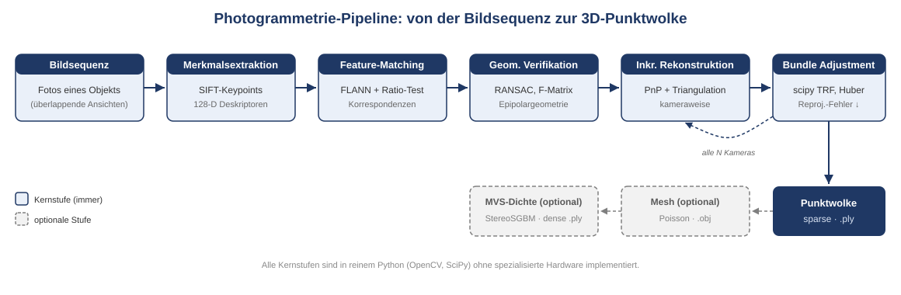

**Fig. 1:** Übersicht der Verarbeitungskette von den Eingabebildern über Merkmale,
Matching, geometrische Verifikation, inkrementelle Rekonstruktion und Bundle Adjustment
bis zur Punktwolke und optional zum Mesh. Das Diagramm bildet den roten Faden für
Abschnitt 4.

In der Praxis greifen die meisten Anwender zu fertigen Werkzeugen wie COLMAP [2],
Meshroom oder RealityCapture. Diese liefern gute Ergebnisse, verbergen die
zugrundeliegenden Algorithmen aber als Blackbox. Das hier beschriebene Projekt geht den
umgekehrten Weg und baut die Verarbeitungskette selbst, mit frei verfügbaren Bibliotheken
und ohne spezialisierte Hardware.

Daraus ergeben sich vier Fragen, die diese Fassung der Reihe nach beantwortet.

**F1: Was heißt hier „selbst implementiert"?** Beide Gutachten der eingereichten
Kurzfassung fragten, wie sich der Anspruch einer eigenen Pipeline mit der Verwendung von
SIFT, FLANN, RANSAC und Open3D verträgt. Abschnitt 3 beantwortet das stufenweise und
belegt die Aufteilung am Quelltext.

**F2: Wie funktioniert die Kette im Einzelnen?** Abschnitt 4 erklärt jede Stufe mit ihrem
mathematischen Modell, den tatsächlich gesetzten Schwellen, der Datenmenge am Ein- und
Ausgang und der Entwurfsentscheidung, die dahintersteht. Alle Zwischenergebnisse sind als
Diagnosebilder eines echten Laufs abgebildet.

**F3: Wie gut ist das Ergebnis wirklich?** Abschnitt 6 misst gegen zwei unabhängige
Maßstäbe, nämlich die mitgelieferten Ground-Truth-Posen und COLMAP auf denselben Bildern,
derselben CPU und mit derselben Merkmalszahl.

**F4: Wo liegen die Ursachen?** Für jede gemessene Grenze benennt Abschnitt 7 die Stelle
im Code und die Messung, die sie belegt. Wo die Datenlage für eine Ursachenaussage nicht
reichte, wurde ein eigenes Experiment gebaut; Abschnitt 6.5 berichtet es.

Der Beitrag versteht sich als Erfahrungsbericht mit Messwerten. Sein Ertrag liegt weniger
in einem neuen Verfahren als in der belegten Aussage, welche Teile einer SfM-Pipeline sich
mit vertretbarem Aufwand selbst bauen lassen, welche nicht, und woran man das merkt. Die
Kurzfassung dieses Beitrags erscheint im Tagungsband; die vorliegende Fassung ergänzt sie
um die vollständige Methodik, die Herleitung der Kennzahlen, zusätzliche Messreihen und
das Brennweitenexperiment.

## 2  Grundlagen

### 2.1  Kameramodell

Alle Stufen beruhen auf dem Lochkameramodell. Ein Punkt **X** in Weltkoordinaten wird über
die Rotation R und die Translation t in das Kamerasystem gebracht, perspektivisch geteilt
und mit der Kalibriermatrix K in Pixel abgebildet:

xcam = R **X** + t,  (xn, yn) = (xcam/zcam, ycam/zcam),  K = [[f, 0, cx], [0, f, cy], [0, 0, 1]].

Die Implementierung erweitert das Modell im Bundle Adjustment um eine radiale Verzeichnung
nach Brown-Conrady mit zwei Koeffizienten. Mit r² = xn² + yn² und dem
Verzeichnungsfaktor d = 1 + k1r² + k2r⁴ lautet die Projektion

u = f · xn · d + cx,  v = f · yn · d + cy.

Quadratische Pixel, also fx = fy, sind der Normalfall; eine Option
trennt beide Brennweiten. Das Kamerazentrum in Weltkoordinaten ergibt sich als
C = −RTt. Diese Größe wird für jeden Vergleich mit der Ground Truth gebraucht,
weil sich Positionsfehler nur im Weltsystem sinnvoll angeben lassen.

Monokulares SfM bestimmt Geometrie nur bis auf eine Ähnlichkeitstransformation. Eine
Rekonstruktion kann also gedreht, verschoben und beliebig skaliert sein, ohne dass sich
ein einziger Bildpunkt ändert. Jeder Vergleich mit einer Referenz muss diese sieben
Freiheitsgrade zuerst binden; Abschnitt 5.4 beschreibt, wie das geschieht.

### 2.2  Epipolargeometrie

Zwei Ansichten desselben Punktes sind über die Fundamentalmatrix F verknüpft. Für
korrespondierende homogene Bildpunkte x1 und x2 gilt
x2T F x1 = 0. Ein Punkt im ersten Bild schränkt seinen
Partner im zweiten also auf eine Gerade ein, die Epipolarlinie. Diese Bedingung ist rein
geometrisch und erlaubt es, falsche Zuordnungen zu verwerfen, ohne die Szene zu kennen.

Ist die Kalibrierung bekannt, geht F in die Essential-Matrix E = KTFK über.
Aus E lassen sich vier Kombinationen aus Rotation und Translationsrichtung gewinnen, von
denen die Cheiralitätsbedingung, also die Forderung positiver Tiefe in beiden Kameras, die
richtige auswählt. Die Länge der Translation bleibt unbestimmt; sie ist der Skalenfreiheit
geschuldet und wird üblicherweise auf eins gesetzt.

Ist F fehlerhaft geschätzt, überträgt sich der Fehler unmittelbar auf E und damit auf die
Startpose der gesamten Rekonstruktion. Deshalb erhält die Verifikation in Abschnitt 4.4
vier hintereinandergeschaltete Prüfungen statt einer.

### 2.3  Triangulation und Triangulationswinkel

Sind zwei Posen bekannt, ergibt sich ein 3D-Punkt als Schnitt zweier Sehstrahlen. Die
Implementierung benutzt dafür die direkte lineare Transformation: Aus den beiden
Projektionsgleichungen entsteht ein homogenes Gleichungssystem, dessen kleinster
singulärer Vektor den gesuchten Punkt liefert.

Entscheidend für die Qualität ist der Winkel zwischen den Sehstrahlen. Bei kleinem Winkel
verläuft der Schnitt flach, und ein Messfehler von wenigen Zehntel Pixeln verschiebt den
Punkt entlang der Sichtachse um ein Vielfaches. Für zwei Kameras mit Basislinie b im
Abstand Z und einem Messrauschen σ in Pixeln gilt näherungsweise
σZ/Z ≈ σ / (f · sin α).

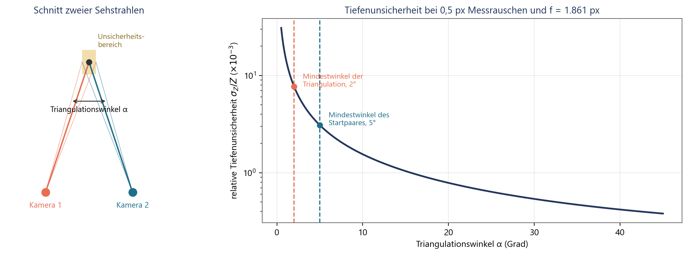

**Fig. 2:** Links schematisch der Schnitt zweier Sehstrahlen: Je flacher der Winkel, desto
länger wird der Unsicherheitsbereich entlang der Sichtachse. Rechts der analytische
Zusammenhang für f = 1.861 px und ein Messrauschen von 0,5 px, mit den beiden Schwellen
der Implementierung. Zwischen dem Mindestwinkel für einen neuen Punkt (2°) und dem
Mindestwinkel für das Startpaar (5°) liegt bereits ein Faktor 2,5 in der
Tiefenunsicherheit. Die Kurve erklärt, warum Punkte aus nur zwei Ansichten in Abschnitt 6.6
die gesamte Fehlerspanne ausfüllen. Die Darstellung ist analytisch und stammt nicht aus
einer Messung.

### 2.4  Registrierung neuer Kameras

Sobald 3D-Punkte existieren, lässt sich eine weitere Kamera über ihre 2D-3D-Zuordnungen
einpassen. Das Perspective-n-Point-Problem sucht diejenige Pose, die alle bekannten Punkte
möglichst genau auf ihre gemessenen Bildpositionen abbildet. Robust wird das Verfahren
durch RANSAC [10]: Aus zufälligen Minimalmengen entstehen Hypothesen, gezählt wird die
Zahl der Zuordnungen, die dazu passen, und nur diese Inlier gehen in die abschließende
Verfeinerung ein.

### 2.5  Bundle Adjustment

Das Bundle Adjustment (BA) optimiert alle Kameraposen, alle 3D-Punkte und die gemeinsame
Intrinsik zugleich [11]. Minimiert wird die Summe der quadrierten Reprojektionsfehler über
alle Beobachtungen (i, j), also über jedes Paar aus Kamera i und Punkt j, das tatsächlich
gemessen wurde:

E = Σ(i,j) ρ( ‖ π(K, Ri, ti, **X**j) − xij ‖² ).

Dabei ist π die Projektion aus Abschnitt 2.1 und ρ eine robuste Verlustfunktion, die den
Einfluss grober Ausreißer begrenzt. Die Aufgabe ist groß, aber dünn besetzt: Eine
Beobachtung hängt nur von ihrer eigenen Kamera, ihrem eigenen Punkt und den gemeinsamen
Intrinsikparametern ab. Genau diese Struktur macht das Problem überhaupt lösbar;
Abschnitt 4.6 zeigt sie als Bild und beziffert sie für den Referenzlauf.

### 2.6  Verwandte Systeme

Die inkrementelle Bauform geht auf Photo Tourism [12] zurück und ist in COLMAP [2] zu
einem Referenzsystem ausgebaut, das robuste Merkmalsverarbeitung, sorgfältige
Ausreißerbehandlung und einen für dieses Problem gebauten C++-Kern verbindet. OpenMVG und
AliceVision beziehungsweise Meshroom verfolgen dieselbe Grundstruktur mit anderem
Schwerpunkt. Der vorliegende Beitrag tritt nicht in Konkurrenz zu diesen Systemen; er
benutzt COLMAP als Maßstab und fragt, wie weit eine Umsetzung kommt, die dieselben
Lehrbuchbausteine [1] in Python zusammensetzt.

## 3  Abgrenzung: eigener Code und verwendete Bibliotheken

Die Formulierung „selbst gebaute Pipeline" verlangt eine genaue Abgrenzung, denn SIFT,
FLANN und RANSAC sind etablierte Verfahren, deren Implementierungen niemand ohne Not neu
schreibt. Die Arbeitsteilung in diesem Projekt sieht wie folgt aus: Aus den Bibliotheken
stammen die numerischen Primitive, also einzelne, klar umrissene Rechenschritte. Selbst
geschrieben ist alles, was diese Primitive zu einer Rekonstruktion verbindet, sowie das
vollständige Fehlermodell des Bundle Adjustment.

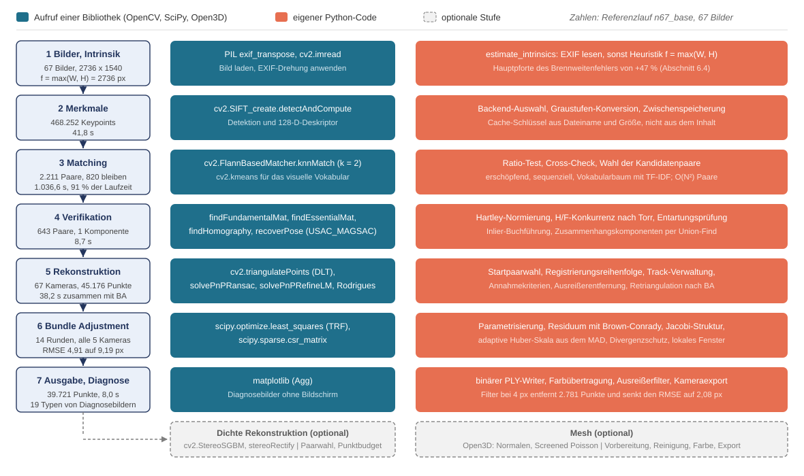

**Fig. 3:** Dieselbe Kette wie in Fig. 1, aufgetrennt nach Herkunft des Codes. Blau steht
für den Aufruf einer Bibliothek, orange für eigenen Python-Code, grau für optionale
Stufen. Die linke Spalte nennt die Kennzahlen des Referenzlaufs aus Abschnitt 5. Sichtbar
wird, dass keine Stufe allein aus Bibliotheksaufrufen besteht und dass die Entscheidungen
über Auswahl, Annahme und Verwerfen durchweg im eigenen Code liegen.

| Stufe | Aus Bibliotheken | Eigener Python-Code |
|---|---|---|
| Merkmale | `cv2.SIFT_create`, optional kornia auf der GPU | Bildladen mit EXIF-Rotation, Schätzung der Intrinsik, Zwischenspeicherung der Merkmale |
| Matching | `cv2.FlannBasedMatcher` (k-nächste Nachbarn), `cv2.kmeans` für das visuelle Vokabular | Lowe-Ratio-Test, Cross-Check, Auswahl der Kandidatenpaare (erschöpfend, sequenziell, Vokabularbaum mit TF-IDF), blockweiser GPU-Matcher |
| Geometrische Verifikation | `cv2.findFundamentalMat` (USAC_MAGSAC), `findEssentialMat`, `recoverPose`, `findHomography` | Hartley-Normierung, Planaritätsprüfung, Inlier-Buchführung, Zusammenhangskomponenten des Szenengraphen per Union-Find |
| Inkrementelle Rekonstruktion | `cv2.triangulatePoints` (DLT), `cv2.solvePnPRansac`, `solvePnPRefineLM`, `cv2.Rodrigues` | Wahl des Startpaars, Reihenfolge der Registrierung, Verwaltung von Tracks und Beobachtungen, Akzeptanzkriterien für neue Punkte, Ausreißerentfernung, Track-Merging, Retriangulation nach BA |
| Bundle Adjustment | `scipy.optimize.least_squares` (Trust-Region-Reflective), `scipy.sparse` | Parametrisierung, Residuenfunktion inklusive Brown-Conrady-Verzeichnung, Aufbau der dünnbesetzten Jacobi-Struktur, adaptive Huber-Skala, Divergenzschutz, lokales BA-Fenster |
| Dichte Rekonstruktion | `cv2.StereoSGBM`, `stereoRectify`, `reprojectImageTo3D` | Auswahl der Stereopaare, Sichtbarkeitsfilter, Punktbudget |
| Mesh | Open3D (Normalenschätzung, Screened Poisson) [3] | Vorbereitung und Reinigung der Wolke, Farbübertragung, Export |
| Ausgabe und Diagnose | matplotlib | binärer PLY-Writer, Kameraexport, 19 Typen von Diagnosebildern |

**Tab. 1:** Aufteilung zwischen Bibliotheksaufrufen und eigenem Code, verifiziert am
Quelltext in `sfm/` und `run_sfm.py`.

Die Antwort auf die Frage, ob wirklich alles Python ist, lautet damit: Der gesamte
Projektcode ist Python. Tab. 2 zählt 9.792 Zeilen, davon 1.586 für die Visualisierung und
560 für die Anbindung des COLMAP-Backends, das nur als Vergleichsmaßstab dient. Eine
eigene Zeile C++ oder CUDA existiert nicht. Die aufgerufenen Bibliotheken sind ihrerseits
in C++ geschrieben, so dass die rechenintensiven Primitive kompiliert ausgeführt werden
und Python die Steuerungsschicht bildet.

| Modul | Zeilen | Aufgabe |
|---|---:|---|
| `sfm/visualizer.py` | 1.586 | 19 Typen von Diagnosebildern, ohne Bildschirm |
| `run_sfm.py` | 1.482 | Kommandozeile, Ablaufsteuerung, Checkpointing, Export |
| `sfm/reconstruction.py` | 1.220 | inkrementelle Rekonstruktion, Tracks, Ausreißer |
| `sfm/feature_matching.py` | 1.109 | Matching-Strategien, Ratio-Test, Retrieval |
| `sfm/bundle_adjustment.py` | 783 | Residuen, Jacobi-Struktur, Solveranbindung |
| `sfm/colmap_backend.py` | 560 | Aufruf und Rückimport von COLMAP |
| `sfm/feature_extraction.py` | 506 | SIFT und alternative Detektoren |
| `sfm/mvs.py` | 395 | dichte Rekonstruktion über Stereo |
| `sfm/point_cloud.py` | 338 | Ausreißerfilter, Kolorierung, PLY-Export |
| `sfm/geometric_verification.py` | 312 | F, E, Homographiekonkurrenz, Pose |
| `sfm/mesh/*` | 1.050 | Poisson-Rekonstruktion und Nachbearbeitung |
| übrige Module | 451 | Intrinsik, Geräteauswahl, Hilfsfunktionen |
| **gesamt** | **9.792** | |

**Tab. 2:** Codeumfang je Modul, gezählt am Stand des ausgewerteten Baums.

Für die Laufzeit ist diese Aufteilung günstiger, als es zunächst klingt: Die in
Abschnitt 6.8 gemessene Dominanz des Matchings entsteht innerhalb der OpenCV-Aufrufe und
nicht im Python-Code darum herum. Der Engpass liegt also in der Strategie, nicht in der
Sprache. Eine Einschränkung gibt es dennoch, und sie ist messbar: Die Schleife über die
Bildpaare läuft seriell; im gesamten Pipeline-Code findet sich weder ein Thread-Pool noch
eine Prozessparallelisierung. Abschnitt 6.8 zeigt, was das im Vergleich mit COLMAP kostet.

## 4  Implementierung der Pipeline

Die Kette gliedert sich in die Stufen aus Fig. 1 und Fig. 3. Sämtliche Diagnosebilder
dieses Abschnitts stammen aus einem einzigen Lauf über 67 Bilder (Lauf B, siehe
Abschnitt 5.2), zeigen also durchgehend dieselbe Rekonstruktion. Die Zahlen im Fließtext
beziehen sich dagegen auf den Referenzlauf `n67_base`, weil nur er mit COLMAP direkt
vergleichbar ist; wo Bildinhalt und Referenzlauf auseinanderfallen, ist das kenntlich
gemacht.

### 4.1  Bilder laden und Intrinsik schätzen

Die Pipeline liest alle Bilder eines Verzeichnisses, wendet die EXIF-Orientierung an und
schätzt daraus eine gemeinsame Kalibriermatrix. Der Hauptpunkt wird auf die Bildmitte
gesetzt. Für die Brennweite gibt es zwei Wege: Steht im EXIF-Feld eine
kleinbildäquivalente Brennweite, wird sie über die Sensordiagonale in Pixel umgerechnet;
fehlt sie, greift die Heuristik f = max(W, H), was einem diagonalen Bildwinkel von etwa 53°
entspricht.

Für den Buddha-Datensatz greift die Heuristik, denn die Bilder tragen kein EXIF. Sie
setzt f = 2.736 px an, während die mitgelieferte Ground Truth 1.860,9 px ausweist, also
47,0 % weniger. Diese eine Zeile ist die Eintrittspforte des wichtigsten Fehlers dieses
Beitrags. Erschwerend kommt hinzu, dass die Kommandozeile keine Möglichkeit bietet, eine
bekannte Kalibrierung vorzugeben. Abschnitt 6.5 verfolgt die Wirkung dieser Schätzung
durch die gesamte Kette.

### 4.2  Merkmalsextraktion

Für jedes Bild werden bis zu `--n_features` SIFT-Merkmale [4] mit 128-dimensionalen
Deskriptoren detektiert, im Referenzlauf 8.000 und im Bildlauf B 12.000. SIFT ist
skalierungs-, rotations- und beleuchtungsinvariant und findet Merkmale bevorzugt an Ecken,
Kanten und texturierten Flächen. Auf Systemen mit GPU übernimmt eine kornia-basierte
Detektion, sonst OpenCV-SIFT auf der CPU; beide Pfade liefern denselben Ausgabe-Kontrakt.
Der Referenzlauf findet 468.252 Merkmale, im Mittel 6.989 je Bild, und benötigt dafür
41,8 s.

| | |
|---|---|
| 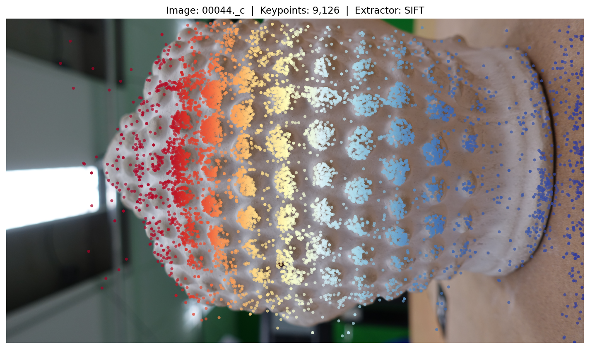 | 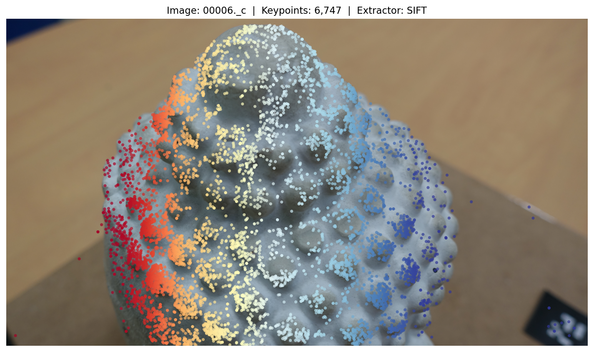 |
| Bild 00044: 9.126 Merkmale | Bild 00006: 6.747 Merkmale |

**Fig. 4:** Detektierte SIFT-Merkmale auf zwei Bildern desselben Laufs. Die Farbe kodiert
den Detektionsindex und dient als Näherung für die Stärke der Detektorantwort. Links
konzentrieren sich die Merkmale auf die genoppte Oberfläche der Statue, während die glatte
Wand links und die einfarbige Tischplatte rechts nahezu leer bleiben. Rechts füllt die
Statue fast das ganze Bild, und trotzdem liegen 26 % weniger Merkmale vor. Die
Merkmalszahl folgt also nicht dem Flächenanteil des Objekts. Naheliegend ist, dass die
Noppen im größeren Abbildungsmaßstab weniger Skalenstufen des Detektors belegen; geprüft
wurde diese Erklärung hier nicht.

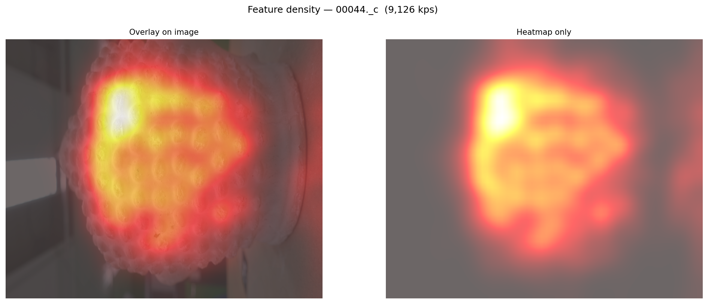

**Fig. 5:** Dichte-Heatmap von Bild 00044, links über dem Bild und rechts isoliert. Die
Dichte fällt zum Objektrand hin ab und ist auf dem strukturlosen Hintergrund praktisch
null. Diese Abhängigkeit von der Textur ist die Voraussetzung, deren Fehlen die Pipeline
in Abschnitt 7 scheitern lässt.

Extrahierte Merkmale werden zusammen mit den Matches in einem Checkpoint abgelegt, was
Wiederholungsläufe um den Faktor 19,9 beschleunigt (Abschnitt 6.9). Der Schlüssel dieses
Caches setzt sich allerdings nur aus Dateinamen und Dateigröße zusammen, nicht aus dem
Bildinhalt; die Folge steht in Abschnitt 7.

### 4.3  Feature Matching

Korrespondenzen zwischen Bildpaaren findet eine FLANN-basierte Suche [13] nach den beiden
nächsten Nachbarn im 128-dimensionalen Deskriptorraum. Der anschließende Ratio-Test nach
Lowe [4] behält nur Zuordnungen, deren bester Treffer deutlich eindeutiger ist als der
zweitbeste; im Referenzlauf liegt die Schwelle bei 0,75, im Bildlauf B bei 0,70. Ein
Cross-Check verlangt zusätzlich, dass die Zuordnung in beiden Richtungen dieselbe ist.

Welche Paare überhaupt verglichen werden, entscheidet die Strategie. Erschöpfendes
Matching prüft alle N(N−1)/2 Paare und ist damit quadratisch in der Bildzahl.
Sequenzielles Matching vergleicht nur benachbarte Dateinamen und ist linear. Der
Vokabularbaum gruppiert Deskriptoren mit `cv2.kmeans` zu visuellen Wörtern und wählt über
eine TF-IDF-Ähnlichkeit die aussichtsreichsten Kandidaten. Der Referenzlauf vergleicht
erschöpfend alle 2.211 Bildpaare und behält 820 Paare mit mindestens 15 Rohzuordnungen.

| | |
|---|---|
| 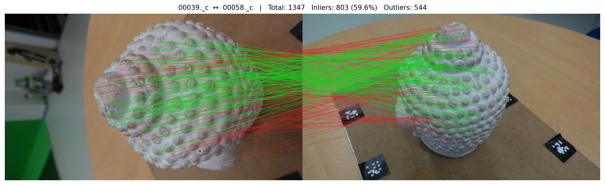 | 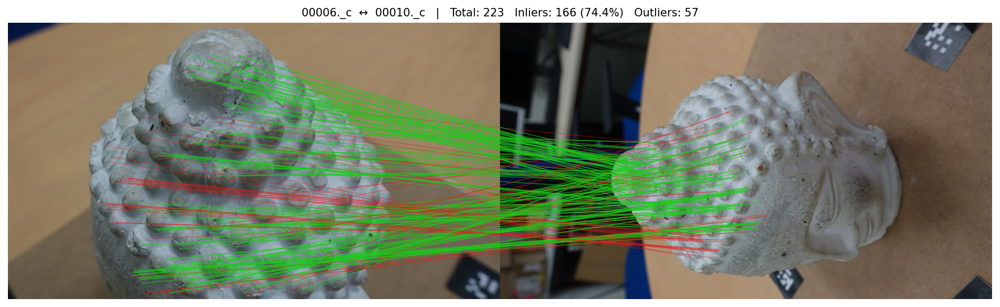 |
| Paar 00039 zu 00058: 1.347 Rohzuordnungen, 803 Inlier (59,6 %) | Paar 00006 zu 00010: 223 Rohzuordnungen, 166 Inlier (74,4 %) |

**Fig. 6:** Zwei Bildpaare desselben Laufs, jeweils als Zufallsstichprobe der Zuordnungen
gezeichnet; grün die geometrisch verifizierten Inlier, rot die verworfenen. Links fächern
die roten Linien sichtbar auf, weil die repetitive Noppenstruktur Verwechslungen zwischen
ähnlichen, aber verschiedenen Noppen begünstigt; der Ratio-Test allein genügt hier nicht.
Rechts steht ein Paar mit deutlich größerem Blickwinkel- und Maßstabsunterschied: Es
liefert nur ein Sechstel der Rohzuordnungen, davon aber einen höheren Inlier-Anteil. Viele
Zuordnungen und verlässliche Zuordnungen sind also verschiedene Dinge.

### 4.4  Geometrische Verifikation

Jedes Bildpaar durchläuft vier Filter, die alle im eigenen Code verschaltet sind.

Zuerst normiert eine Hartley-Transformation [14] die Pixelkoordinaten: Der Schwerpunkt
wandert in den Ursprung, und die Skalierung wird so gewählt, dass der mittlere Abstand vom
Ursprung √2 beträgt. Ohne diesen Schritt liegen die Einträge des linearen Systems bei
Bildern dieser Größe um Zehnerpotenzen auseinander, was die Konditionszahl verschlechtert.
Nach der Schätzung wird F über F = T2T Fnorm
T1 in den Pixelraum zurücktransformiert.

Danach schätzt `USAC_MAGSAC` [5] robust die Fundamentalmatrix mit einer Inlier-Schwelle
von 1,0 px und einer Konfidenz von 0,999. Nur geometrisch konsistente Zuordnungen
überleben; Paare mit weniger als 15 Inliern werden verworfen.

Der dritte Filter prüft nach dem Kriterium von Torr [15], ob eine Homographie dieselben
Inlier ebenso gut erklärt. Erklärt sie mehr als 85 %, gilt das Paar als planar und wird
verworfen, weil sich aus einer solchen Fundamentalmatrix keine belastbare Rotation
ableiten lässt. Ein zweiter Test soll entartete Punktverteilungen abfangen, prüft aber die
Singulärwerte der zweidimensionalen Bildkoordinaten und erkennt damit Kollinearität und
nicht die beabsichtigte Planarität der Szene. Der Test ist wirkungslos, aber auch
harmlos, denn die Homographiekonkurrenz davor fängt den gemeinten Fall bereits ab.

Zuletzt wird die Essential-Matrix bestimmt und über die Cheiralitätsbedingung in die
relative Kamerapose zerlegt. Paare mit nahezu verschwindender Basislinie entfallen, weil
sie keine Tiefeninformation tragen. Ein Union-Find-Verfahren prüft anschließend die
Zusammenhangskomponenten des Szenengraphen und verwirft alles außer der größten. Im
Referenzlauf überstehen 643 der 820 geprüften Paare die Verifikation, und alle 67 Bilder
liegen in einer einzigen Komponente.

| | |
|---|---|
| 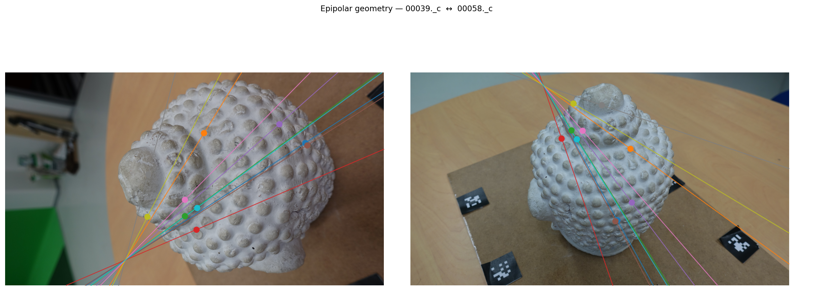 | 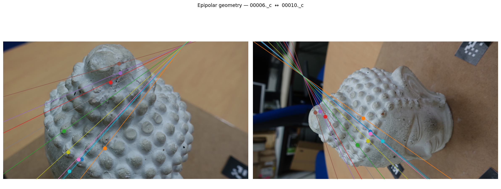 |

**Fig. 7:** Epipolargeometrie für dieselben beiden Paare wie in Fig. 6. Zusammengehörige
Punkte und Linien sind gleichfarbig gezeichnet: Zu jedem Punkt im einen Bild gehört die
gleichfarbige Epipolarlinie im anderen. Dass die Punkte auf ihren Linien liegen, belegt
anschaulich die Qualität der geschätzten Fundamentalmatrix. Im linken Paar schneiden sich
alle Linien unten links im Epipol, also in der Projektion des zweiten Kamerazentrums; im
rechten Paar liegt der Epipol weit außerhalb des Bildes, weshalb die Linien fast parallel
verlaufen.

### 4.5  Inkrementelle Rekonstruktion

Die Rekonstruktion wächst kameraweise. Als Startpaar wählt die Pipeline dasjenige mit dem
größten Produkt aus Basislinie und Inlier-Zahl unter allen Paaren, deren medianer
Triangulationswinkel mindestens 5° beträgt; findet sich keines, greift eine Notauswahl
nach reiner Inlier-Zahl. Im Referenzlauf fällt die Wahl auf die Bilder mit den Indizes 44
und 61, die 2.605 Punkte in einem einzigen Triangulationsschritt liefern.

Anschließend registriert die Pipeline iterativ jeweils das Bild mit den meisten
2D-3D-Korrespondenzen über PnP mit RANSAC und einer anschließenden
Levenberg-Marquardt-Verfeinerung. Neue 3D-Punkte werden mit allen sichtbaren Kameras
trianguliert und nur dann übernommen, wenn sie vier Bedingungen erfüllen: positive Tiefe
in beiden Kameras, Triangulationswinkel von mindestens 2°, Reprojektionsfehler unter
`--max_reproj_error` (Standard 4 px) in beiden Kameras und ein Abstand vom Ursprung von
höchstens dem Fünfzigfachen des Medians. Die letzte Bedingung fängt Punkte ab, die aus
fast parallelen Strahlen ins Unendliche wandern.

| | | |
|---|---|---|
| 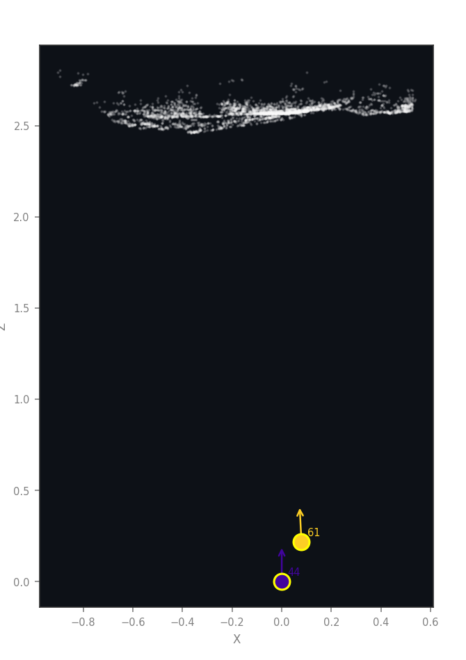 | 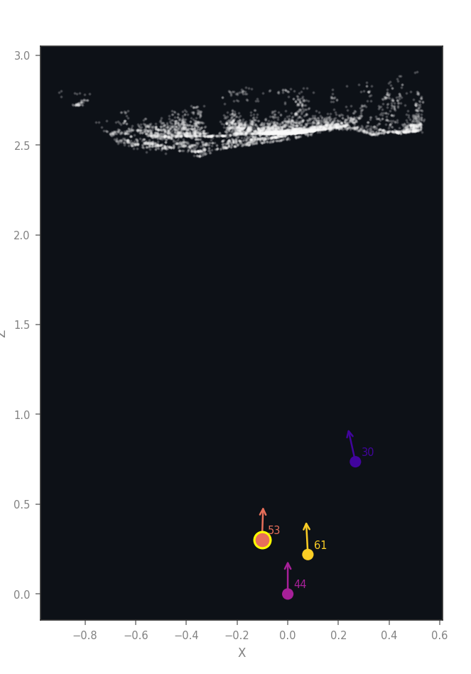 | 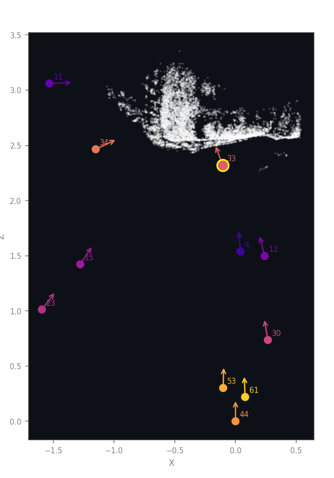 |
| Schritt 001: 2 Kameras, 3.348 Punkte | Schritt 003: 4 Kameras, 5.197 Punkte | Schritt 010: 11 Kameras, 12.573 Punkte |
| 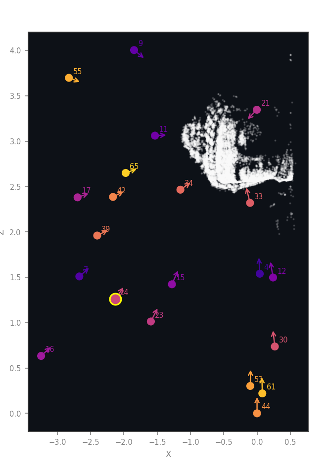 | 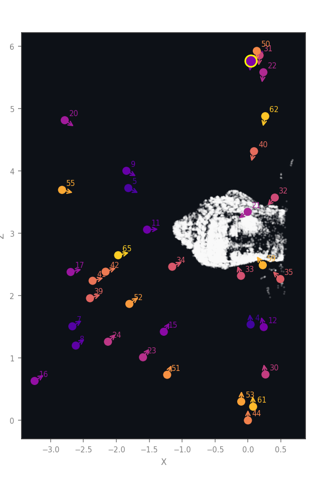 | 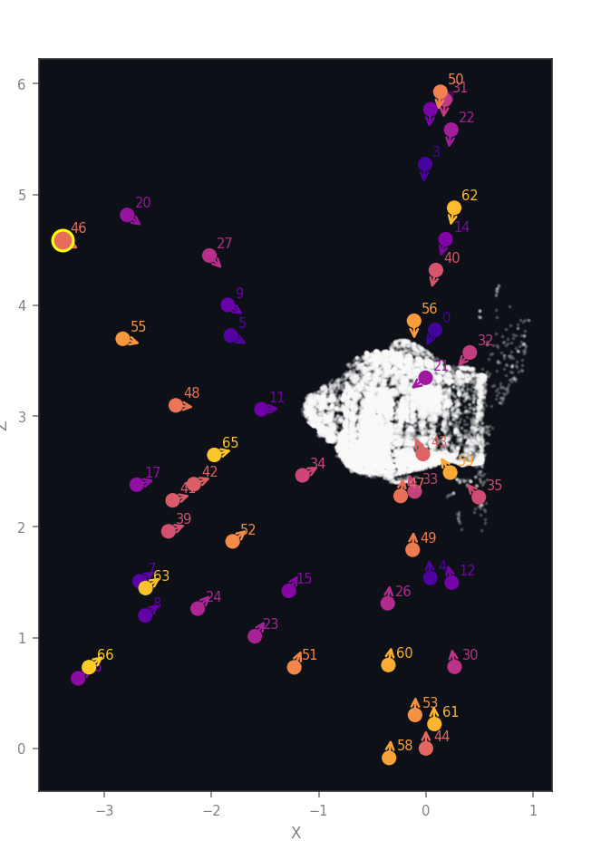 |
| Schritt 020: 21 Kameras, 19.917 Punkte | Schritt 035: 36 Kameras, 31.734 Punkte | Schritt 050: 51 Kameras, 41.716 Punkte |

**Fig. 8:** Sechs Momentaufnahmen desselben Laufs, jeweils die Draufsicht auf die
X-Z-Ebene des Rekonstruktionssystems, mit den bereits registrierten Kameras als
nummerierte Marker samt Blickrichtung und der Punktwolke in Weiß. Im ersten Schritt stehen
nur die beiden Kameras des Startpaars, und die 3.348 Punkte bilden ein schmales Band: Von
oben gesehen ist zunächst allein der Streifen der Oberfläche rekonstruiert, den beide
Kameras sehen. Mit jeder weiteren Kamera schließt sich das Band zu einer Fläche, bis ab
Schritt 035 der Umriss der Statue in der Draufsicht geschlossen ist und sich danach kaum
noch ändert, während weiter Kameras hinzukommen. Vereinzelte Punkte rechts neben der Wolke
gehören nicht zum Objekt, sondern zu Tischplatte und Kalibriermarken. Da das
Rekonstruktionssystem beliebig gedreht und skaliert ist, trägt die absolute Lage von
Kameras und Wolke in diesen Bildern keine Aussage; wie genau die Posen sind, zeigt erst
der Vergleich mit der Ground Truth in Fig. 17.

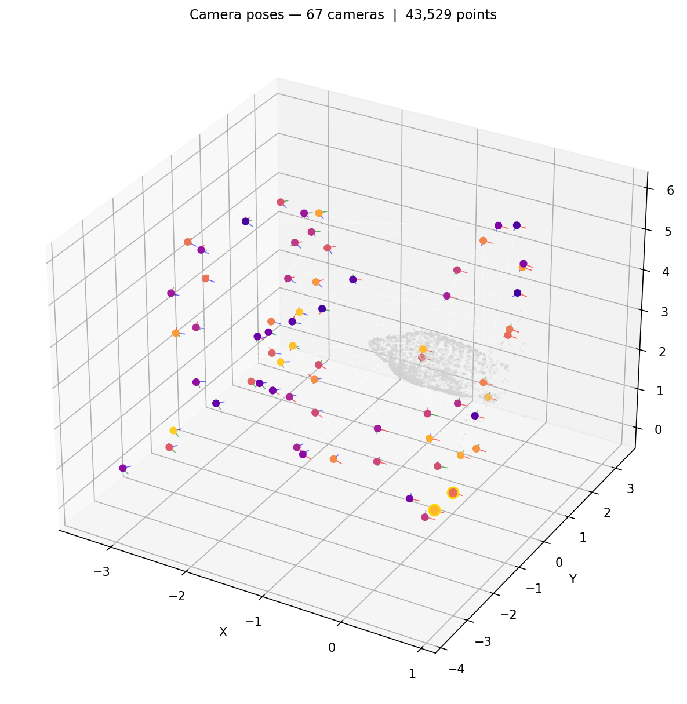

**Fig. 9:** Alle 67 registrierten Kameraposen mit Position und Achsenkreuz, dazu die
Punktwolke mit den 43.529 Punkten zum Zeitpunkt des Renderings. Die Kameras verteilen sich
räumlich um das Objekt, ohne einen Ring oder eine Bahn zu bilden. Das entspricht der
tatsächlichen Aufnahmegeometrie des Datensatzes (Fig. 14) und ist für sich genommen kein
Fehler. Wie groß die Abweichung von den wahren Posen ist, zeigt erst der Vergleich in
Abschnitt 6.4.

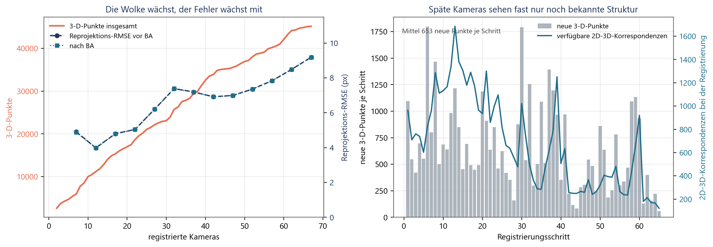

**Fig. 10:** Verlauf des Referenzlaufs, ausgewertet aus seinem Protokoll. Links wächst die
Punktzahl von 2.605 auf 45.176, während der Reprojektions-RMSE vor jeder BA-Runde von
4,91 px auf 9,19 px steigt; die Kurven vor und nach der Optimierung liegen dabei so dicht
beieinander, dass sie sich überdecken. Rechts der Zuwachs je Registrierungsschritt, im
Mittel 653 neue Punkte, zusammen mit der Zahl der 2D-3D-Korrespondenzen, die für die
Registrierung zur Verfügung standen. Beide Größen fallen gegen Ende deutlich ab: Späte
Kameras sehen überwiegend Struktur, die bereits trianguliert ist.

Nach jedem Bundle Adjustment retrianguliert die Pipeline verworfene Korrespondenzen erneut
und entfernt anschließend Punkte, deren mittlerer Reprojektionsfehler eine Schwelle
überschreitet. Die Schwelle ist das Minimum aus dem doppelten `--max_reproj_error` und dem
Median plus drei Standardabweichungen; im Referenzlauf greift die erste Bedingung mit
8,00 px und entfernt 2.674 der 45.176 Punkte.

### 4.6  Bundle Adjustment

Nach jeweils fünf neu registrierten Kameras und am Ende des Laufs optimiert ein Bundle
Adjustment alle Parameter gemeinsam. Der Parametervektor enthält die gemeinsame Brennweite,
die beiden Verzeichnungskoeffizienten, den Hauptpunkt sowie je Kamera sechs Werte für
Rotation im Rodrigues-Vektor und Translation und je Punkt drei Koordinaten. Im
Referenzlauf sind das beim letzten Aufruf 5 + 67 · 6 + 45.175 · 3 = 135.932 Parameter für
2 · 132.637 = 265.274 Residuen.

Als Solver dient `scipy.optimize.least_squares` im Trust-Region-Reflective-Verfahren. Die
Jacobi-Matrix wird numerisch bestimmt, was ohne Zusatzinformation eine Rechnung über alle
Parameterspalten je Residuum bedeutete. Deshalb baut die Implementierung die
Besetzungsstruktur selbst auf und übergibt sie als dünnbesetzte Matrix.

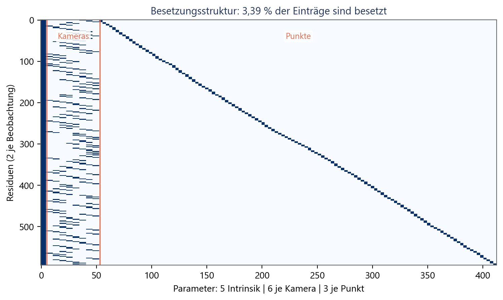

**Fig. 11:** Besetzungsstruktur der Jacobi-Matrix, erzeugt mit derselben Funktion, die auch
im Produktivbetrieb läuft, hier für ein kleines Beispiel mit 8 Kameras und 120 Punkten.
Links die dichten Spalten der gemeinsamen Intrinsik, in der Mitte die Blöcke der
Kameraposen, rechts die schmalen Blöcke der Punkte. Für das Beispiel sind 3,4 % der
Einträge besetzt. Im Referenzlauf mit 67 Kameras und 45.175 Punkten sind es
2 · 132.637 · 14 Einträge von 265.274 · 135.932 möglichen, also 0,010 %. Die Abbildung ist
schematisch in der Größe, aber nicht im Muster.

Als robuste Verlustfunktion dient ein Huber-Loss, dessen Skala aus der Streuung der
Startresiduen abgeleitet wird: Sie ist der mit 1,4826 auf eine Normalverteilung
umgerechnete Median der absoluten Residuen, begrenzt auf das Intervall zwischen 0,5 px und
10 px. Damit passt sich die Grenze zwischen Inlier und Ausreißer dem tatsächlichen
Rauschniveau an, statt auf einem festen Wert zu beharren. Die Brennweite ist auf das
Intervall zwischen dem Halben und dem Doppelten des Startwerts beschränkt, die
Verzeichnungskoeffizienten auf ±2 und der Hauptpunkt auf ±10 % der Bildabmessungen. Ein
Divergenzschutz verwirft das Ergebnis, falls sich der Fehler um mehr als den Faktor 1,5
verschlechtert.

Optional beschränkt ein lokales Fenster die Optimierung auf die zuletzt registrierten
Kameras, und ein alternativer Solverpfad über pyceres nutzt das Schur-Komplement. Auf der
Messmaschine ist pyceres nicht installiert, so dass alle berichteten Läufe den
SciPy-Pfad verwenden.

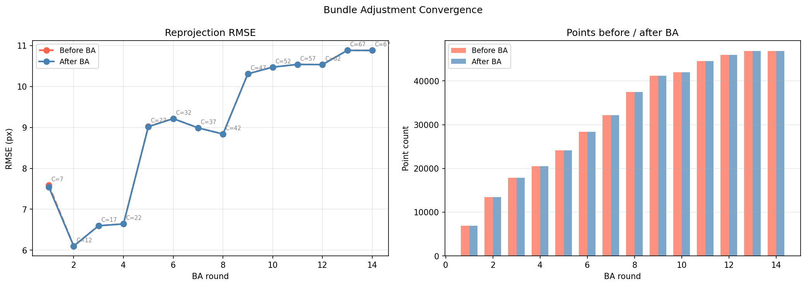

**Fig. 12:** Vierzehn BA-Runden des Bildlaufs B. Links der Reprojektions-RMSE vor (rot) und
nach (blau) jeder Runde, annotiert mit der jeweiligen Kamerazahl C, rechts die Punktzahl
vor und nach der Optimierung. Der Verlauf ist derselbe wie im Referenzlauf in Fig. 10 und
in Lauf A in Fig. 26: Der Fehler fällt nicht, er steigt, und die beiden Kurven liegen
übereinander. Die Punktzahl bleibt unverändert, weil das BA Punkte verschiebt, aber nicht
entfernt; gefiltert wird ausschließlich beim Triangulieren und beim Export.

Der Verlauf verdient eine genaue Lesart, denn er ist das wichtigste Diagnosebild dieses
Beitrags. Erstens steigt der Fehler mit jeder zusätzlichen Kamera, im Referenzlauf von
4,91 px bei 7 Kameras über ein Minimum von 3,99 px bei 12 Kameras auf 9,19 px bei allen
67. Mit jeder Kamera wird das Gleichungssystem widersprüchlicher, die Rekonstruktion
wächst also auf Kosten ihrer Konsistenz. Zweitens verbessert das BA den Fehler in keiner
Runde nennenswert; die größte Verbesserung über alle vierzehn Runden des Referenzlaufs
beträgt 0,021 px. Drittens protokolliert jede Runde für die Brennweite eine Änderung von
exakt null, und jede Runde endet mit derselben Abbruchmeldung: `xtol`, also das Kriterium
für eine zu kleine Schrittweite. Abschnitt 6.5 verfolgt diese Spur bis zur Ursache.

### 4.7  Dichte Rekonstruktion und Mesh

Optional erzeugt die Pipeline über StereoSGBM [16] eine dichte Punktwolke und über
Screened Poisson [17] in Open3D [3] eine Mesh-Oberfläche. Ausgewählt werden Stereopaare
mit ausreichender Basislinie, rektifiziert, disparitätsbasiert trianguliert und über einen
Sichtbarkeitszähler gefiltert. Im dichten Lauf umfasst die Wolke exakt 500.000 Punkte.
Dieser Wert ist keine Eigenschaft der Szene, sondern der fest verdrahtete Standardwert
`max_dense_pts`, der ohne Hinweis im Log abschneidet und über die Kommandozeile nicht
erreichbar ist. Die Punktzahl einer dichten Wolke trägt in dieser Fassung folglich keine
Qualitätsinformation. Die dichte Stufe kostet im Lauf `n67_user` 300,6 s zusätzlich.

### 4.8  Ausgabe, Filter und Diagnose

Vor dem Export filtert die Pipeline ein zweites Mal, nun mit der Schwelle
`--max_reproj_error`. Im Referenzlauf bleiben 39.721 der 42.502 Punkte übrig. Dieser
Filter ist für die Interpretation aller Kennzahlen wichtiger, als seine Beschreibung
vermuten lässt: Der Reprojektionsfehler, den die Pipeline am Ende ausweist, wird über die
verbliebenen Beobachtungen gerechnet. Aus 9,19 px im letzten Bundle Adjustment werden so
2,08 px im Ergebnisbericht, ohne dass sich an der Geometrie etwas geändert hätte.

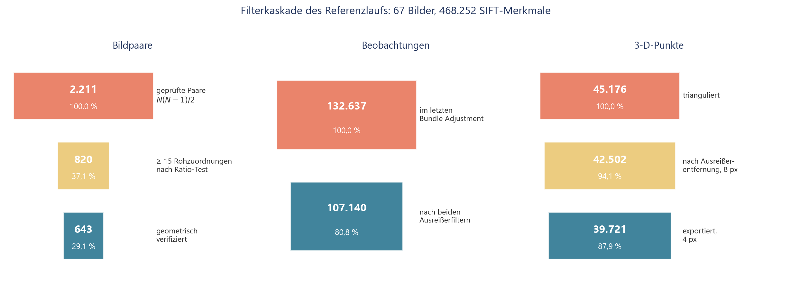

**Fig. 13:** Was jede Stufe des Referenzlaufs verwirft. Von 2.211 geprüften Bildpaaren
bleiben nach Ratio-Test und Mindestzahl an Rohzuordnungen 820, nach der geometrischen
Verifikation 643. Von 45.176 triangulierten Punkten überstehen 42.502 die
Ausreißerentfernung bei 8 px und 39.721 den Exportfilter bei 4 px. Von 132.637
Beobachtungen des letzten Bundle Adjustment gehen 107.140 in die ausgewiesene Kennzahl
ein. Die Filter arbeiten korrekt; bemerkenswert ist, dass die Pipeline ihre eigene
Qualität nach dem Filtern berichtet und nicht davor.

Die Punkte werden aus den Bildern koloriert, in ein binäres PLY mit einfacher Genauigkeit
geschrieben und auf Wunsch als Kameraposen im JSON-Format exportiert. Parallel schreibt der
Visualizer 19 Typen von Diagnosebildern ohne Bildschirm direkt auf die Platte, auf Wunsch
als vektorielles PDF mit 300 dpi. Sämtliche Bilder der Abschnitte 4 und 6 sind mit Ausnahme
der eigens erzeugten Abbildungen Nebenprodukte solcher Läufe.

### 4.9  COLMAP als Referenzsystem

Als Referenzsystem dient COLMAP [2], aufgerufen über denselben Einstiegspunkt
(`--backend colmap`) auf identischen Eingabedaten. Das Repository startet nacheinander
Merkmalsextraktion, erschöpfendes Matching und den inkrementellen Mapper und liest das
Ergebnis in dasselbe Ausgabeformat zurück. Verwendet wurde COLMAP 4.1.1 ohne CUDA mit
8.000 Merkmalen je Bild und abgeschalteter GPU, so dass beide Systeme ausschließlich auf
der CPU desselben Rechners arbeiten. COLMAP schätzt ein Kameramodell `SIMPLE_RADIAL` mit
gemeinsamer Brennweite für alle Bilder, also dieselbe Annahme wie die eigene Pipeline.

## 5  Versuchsaufbau

### 5.1  Datensatz

Ausgewertet wird der Datensatz „Buddha" aus dem AliceVision-Projekt: 67 Aufnahmen einer
genoppten Buddha-Statue, 2736 × 1540 Pixel, mit Ground-Truth-Projektionsmatrix je Bild.
Aus diesen Matrizen ergibt sich für alle Bilder dieselbe Brennweite von 1.860,90 px und
ein Hauptpunkt bei (1.368,8 / 774,3) px, also nahezu die Bildmitte.

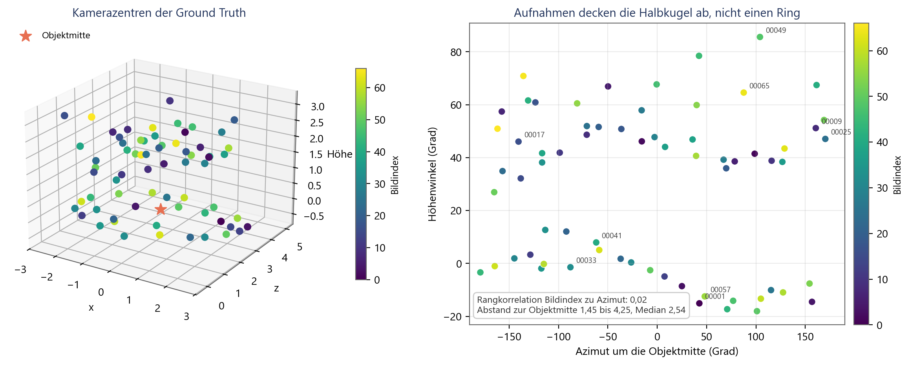

**Fig. 14:** Aufnahmegeometrie laut Ground Truth. Links die Kamerazentren im Raum,
eingefärbt nach Bildindex, mit der aus den optischen Achsen geschnittenen Objektmitte.
Rechts dieselben Kameras nach Azimut und Höhenwinkel. Die Aufnahmen decken den vollen
Azimutbereich und Höhenwinkel von −18° bis +86° ab, der Abstand zur Objektmitte schwankt
zwischen 1,45 und 4,25. Es handelt sich also nicht um eine gleichmäßige Ringaufnahme,
sondern um eine frei geführte Abtastung der oberen Halbkugel. Entscheidend für
Abschnitt 6.8: Die Rangkorrelation zwischen Bildindex und Azimut beträgt 0,02.
Aufeinanderfolgende Dateinamen entsprechen also gerade nicht benachbarten Blickwinkeln.

Diese Eigenschaft korrigiert eine naheliegende Annahme: Der Datensatz sieht nach einer
Drehtelleraufnahme aus, ist aber keine. Sie erklärt zugleich, warum sequenzielles Matching
auf diesen Bildern scheitert, und sie ist der Grund, warum die Kameraverteilung in Fig. 9
flächig und nicht ringförmig aussieht.

Für die Skalierungsmessungen dienen zusätzlich gleichmäßig ausgedünnte Teilmengen mit 6
und 20 Bildern.

### 5.2  Läufe

Die Auswertung stützt sich auf drei Gruppen von Läufen, die konsequent getrennt gehalten
werden.

| Gruppe | Konfiguration | Verwendung |
|---|---|---|
| Bildläufe A und B | 12.000 Merkmale, Ratio 0,70, dichte Stufe an, `--visualize` | alle Diagnosebilder der Abschnitte 4 und 6 |
| Messreihe `eval_results` | 14 Läufe mit 6, 20 und 67 Bildern, darunter der Referenzlauf `n67_base` mit 8.000 Merkmalen und Ratio 0,75 | alle Kennzahlen und Tabellen |
| Vergleichslauf COLMAP | 8.000 Merkmale, erschöpfend, ohne GPU, dieselben 67 Bilder | Maßstab in Abschnitt 6 |

**Tab. 3:** Die drei Gruppen von Läufen. Zahlen im Text stammen aus der Messreihe, Bilder
aus den Bildläufen. Kein Wert einer Tabellenzeile mischt zwei Läufe.

Referenzlauf ist `n67_base`, weil er dieselbe Merkmalszahl verwendet wie der
COLMAP-Vergleich und damit als einziger Lauf direkt vergleichbar ist. Die Bildläufe A und
B arbeiten mit mehr Merkmalen und einer strengeren Ratio-Schwelle; ihre Kennzahlen weichen
deshalb ab und werden nur dort zitiert, wo sie in einem Bild stehen.

### 5.3  Hardware und Software

| Element | Wert |
|---|---|
| Betriebssystem | Windows 10, Build 10.0.26200 |
| Prozessor | AMD64 Family 25 Model 80, ohne CUDA-Nutzung |
| Python | 3.10.6 |
| OpenCV | 4.13.0 |
| NumPy und SciPy | 2.2.6 und 1.15.3 |
| COLMAP | 4.1.1 ohne CUDA |
| nicht verfügbar | torch, kornia, pyceres, poselib, faiss |

**Tab. 4:** Messumgebung. Alle Läufe beider Systeme liefen auf demselben Rechner und
ausschließlich auf der CPU.

Weil torch, kornia, pyceres und poselib fehlen, sind die Pfade für SuperPoint, DISK,
LoFTR, DINOv2-Retrieval sowie der pyceres-Solver nicht gemessen. Sie erscheinen nur in der
Robustheitsprüfung in Abschnitt 6.10, die feststellt, ob sie verständlich scheitern.

### 5.4  Kennzahlen und ihre Definition

**Vollständigkeit** ist der Anteil registrierter Kameras an den Eingabebildern.

**Reprojektionsfehler** ist der euklidische Abstand zwischen gemessenem und
zurückprojiziertem Bildpunkt. Berichtet werden RMSE, Mittel, Median und das 95-Prozent-
Quantil über alle exportierten Beobachtungen. Der Wert ist eine Selbstauskunft: Er misst,
wie gut die Rekonstruktion zu sich selbst passt, nicht wie gut sie zur Wirklichkeit passt.

**Posenfehler** entstehen erst nach einer Ausrichtung. Da monokulares SfM skalenfrei ist,
wird die geschätzte Kameraposition zuerst über eine Sim(3)-Anpassung nach Umeyama [18] auf
die Ground Truth gelegt, geschätzt aus den Kamerazentren. Der Positionsfehler ist danach
der Abstand zur wahren Position, normiert auf die Ausdehnung der vollständigen
Ground-Truth-Trajektorie, damit Läufe mit unterschiedlich vielen registrierten Kameras
vergleichbar bleiben. Der Rotationsfehler ist der geodätische Winkel zwischen geschätzter
und wahrer Orientierung, nach Abzug der globalen Drehung aus der Ausrichtung. Zusätzlich
wird eine RANSAC-Variante der Ausrichtung berichtet, damit eine einzelne grob falsche
Kamera das Ergebnis nicht verzerrt; auf dem vollständigen Datensatz stimmen beide
Varianten überein.

**Tracklänge** ist die Zahl der Beobachtungen je 3D-Punkt. Sie misst, wie stark ein Punkt
mehrere Kameras miteinander verspannt.

Ein Hinweis zur Vergleichbarkeit mit COLMAP: Die eigene Pipeline mittelt den
Reprojektionsfehler über Beobachtungen, COLMAP schreibt in seine Modelldatei je Punkt
einen bereits über dessen Track gemittelten Fehler. Beide Größen werden im Folgenden
getrennt benannt und nicht in derselben Zeile verrechnet.

## 6  Ergebnisse

### 6.1  Vollständigkeit und Gesamtbild

Auf dem vollständigen, dicht abgetasteten Datensatz registriert die Pipeline alle 67
Kameras und liefert eine formtreue Rekonstruktion aus 39.721 Punkten. Auf den ausgedünnten
Teilmengen bricht die Vollständigkeit ein: Von 20 gleichmäßig verteilten Bildern werden 13
registriert, von 6 gleichmäßig verteilten Bildern mit rund 60° Winkelabstand nur noch 2.
Der Sechsbild-Satz, den der Datensatz selbst mitliefert und dessen Ansichten enger
beieinanderliegen, wird dagegen vollständig registriert, allerdings mit nur 3.851 Punkten
(Tab. B1). Nicht die Bildzahl entscheidet also, sondern der Winkelabstand zwischen
benachbarten Ansichten.

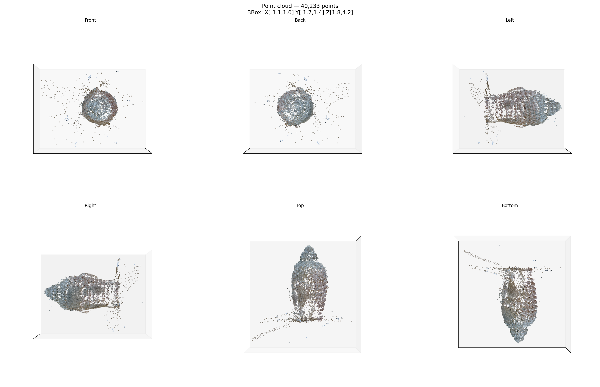

**Fig. 15:** Kolorierte Punktwolke aus sechs orthografischen Richtungen, Bildlauf B. Die
Statue ist in Seiten-, Auf- und Untersicht klar als Figur mit Kopf, Rumpf und Sockel
lesbar. Ebenso klar sind die Schwächen: In Front- und Rückansicht streuen Ausreißer um das
Objekt, und in Auf- und Untersicht zieht sich ein schmales Punktband schräg durch den
Raum. Dabei handelt es sich um Struktur des Aufnahmetischs und um Falschtriangulierungen,
die kein Filter entfernt hat.

### 6.2  Punktwolke im Vergleich mit COLMAP

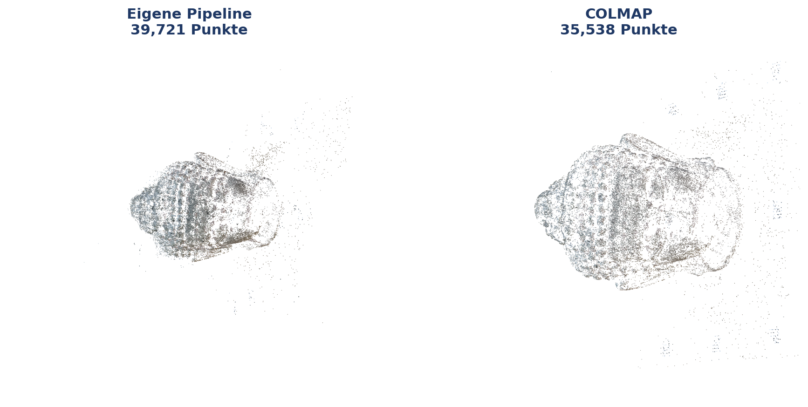

**Fig. 16:** Dieselben 67 Bilder, links die eigene Pipeline mit 39.721 Punkten, rechts
COLMAP mit 35.538 Punkten. Die eigene Wolke ist über eine Sim(3)-Anpassung, geschätzt aus
den Kamerazentren gleichnamiger Bilder, in das Koordinatensystem von COLMAP gelegt, so dass
beide Ansichten dieselbe Seite des Objekts aus derselben Richtung zeigen. Die eigene Wolke
enthält mehr Punkte, zeichnet die genoppte Oberfläche aber diffuser; bei COLMAP bleiben die
einzelnen Noppen als getrennte Strukturen erkennbar. Mehr Punkte bedeuten hier also nicht
mehr Information.

### 6.3  Punktwolkengesundheit

| Kennzahl | `n67_base` | `n20_base` | `n06_mini` |
|---|---:|---:|---:|
| Punkte | 39.721 | 5.522 | 3.851 |
| Bytes je Punkt | 15,0 | 15,0 | 15,0 |
| Median des Nachbarabstands | 0,0045 | 0,0069 | 0,0034 |
| exakte Duplikate | 8,14 % | 10,68 % | 14,23 % |
| Flyer (Abstand > 10× Median) | 0,83 % | 0,49 % | 0,57 % |
| Ausreißer (Radius > 5× Median) | 0,01 % | 0,18 % | 0,00 % |
| Punkte ohne echte Farbe | 0,00 % | 0,04 % | 0,00 % |

**Tab. 5:** Gesundheit der Punktwolke, gemessen an den exportierten PLY-Dateien der
Messreihe. Der Anteil echter Ausreißer liegt durchweg unter einem Prozent. Fig. 15 zeigt,
wie wenig dieser Anteil über den optischen Eindruck aussagt: Schon 0,83 % Flyer fallen als
Streuung um das Objekt deutlich ins Auge. Auffällig ist der Anteil exakter Duplikate. Jeder
zwölfte Punkt des Referenzlaufs existiert mehrfach, was auf Tracks hindeutet, die hätten
verschmelzen müssen.

### 6.4  Genauigkeit gegen Ground Truth

| Kennzahl | Referenzlauf `n67_base` | `n67_user` | COLMAP |
|---|---:|---:|---:|
| Registrierte Kameras | 67 von 67 | 67 von 67 | 67 von 67 |
| 3D-Punkte | 39.721 | 40.232 | 35.538 |
| Beobachtungen | 107.140 | 105.044 | 166.740 |
| Mittlere Tracklänge | 2,70 | 2,61 | 4,69 |
| Reprojektionsfehler je Beobachtung, RMSE | 2,08 px | 1,60 px | nicht exportiert |
| Reprojektionsfehler je Punkt, Mittel | nicht exportiert | nicht exportiert | 0,33 px |
| Geschätzte Brennweite | 2.736,0 px | 2.736,0 px | 1.857,5 px |
| Brennweitenfehler | +47,0 % | +47,0 % | −0,2 % |
| Rotationsfehler, Median und Maximum | 6,29° / 20,28° | 6,23° / 16,48° | 0,11° / 0,20° |
| Positionsfehler, Median und Maximum | 2,06 % / 11,60 % | 2,24 % / 9,79 % | 0,02 % / 0,05 % |
| Laufzeit | 1.135,5 s | 1.761,3 s (davon 300,6 s dicht) | 293,4 s |
| Spitzenspeicher | 1.470 MB | 1.541 MB | nicht gemessen |

**Tab. 6:** Gemessene Kennzahlen gegen Ground Truth. Die Ground-Truth-Brennweite beträgt
1.860,9 px. Referenzlauf und COLMAP verwenden beide 8.000 Merkmale je Bild und sind damit
direkt vergleichbar; `n67_user` arbeitet mit 12.000 Merkmalen und aktivierter dichter
Stufe. Die beiden Zeilen zum Reprojektionsfehler haben verschiedene Bezugsgrößen und sind
nicht gegeneinander zu verrechnen.

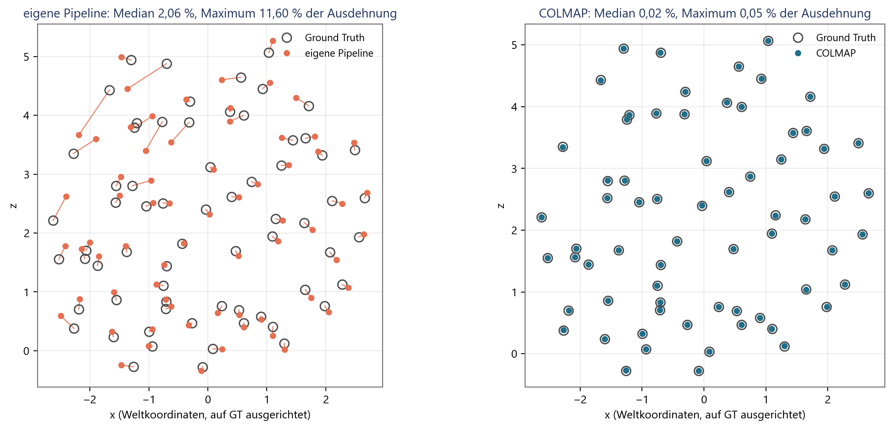

**Fig. 17:** Kamerazentren in der Aufsicht, jeweils nach der Sim(3)-Ausrichtung auf die
Ground Truth. Graue Kreise markieren die wahre Position, farbige Punkte die geschätzte,
die Verbindungslinie den Fehler. Links wandern die Schätzungen der eigenen Pipeline
sichtbar von ihren Sollpositionen ab, im Median um 2,06 % und im Extremfall um 11,60 % der
Szenenausdehnung. Rechts liegen die Punkte von COLMAP so genau auf den Kreisen, dass die
Fehlerlinien nicht sichtbar sind.

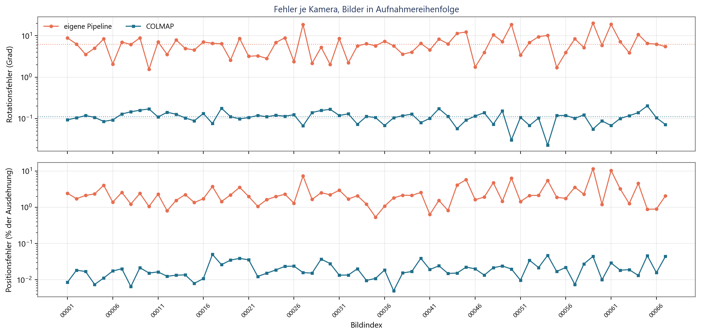

**Fig. 18:** Rotations- und Positionsfehler je Kamera in logarithmischer Auftragung, für
beide Systeme aus derselben Auswertung. Der Abstand beträgt durchgehend etwa zwei
Größenordnungen und ist nicht von wenigen Ausreißern getrieben: Die schlechteste
COLMAP-Kamera liegt mit 0,20° noch eine Größenordnung unter dem Median der eigenen
Pipeline. Ein systematischer Anstieg über den Bildindex ist nicht zu erkennen, was zu
Fig. 14 passt, denn die Reihenfolge der Dateinamen entspricht keiner Reihenfolge im Raum.

Das zentrale Ergebnis steht in der Zeile zur Brennweite. Die Bilder tragen kein EXIF,
weshalb die Intrinsik-Schätzung aus Abschnitt 4.1 auf f = max(W, H) zurückfällt und
2.736 px ansetzt. Der wahre Wert beträgt 1.860,9 px. COLMAP startet ebenfalls ohne
Kalibrierung, verfeinert die Brennweite aber im eigenen Bundle Adjustment bis auf
1.857,5 px. Der Datensatz enthält also genügend Information, um die Brennweite zu
bestimmen; die eigene Umsetzung holt sie nur nicht heraus.

Ein zweiter Unterschied erklärt einen Teil der Genauigkeitslücke und war in dieser Schärfe
bisher nicht vermessen. COLMAP verknüpft 166.740 Beobachtungen zu 35.538 Punkten, die
eigene Pipeline 107.140 Beobachtungen zu 39.721 Punkten. COLMAP holt also 56 % mehr
Beobachtungen aus denselben Bildern und verteilt sie auf 11 % weniger Punkte. Jede Kamera
ist dadurch an mehr gemeinsame Struktur gebunden, und die Lösung wird steifer.

### 6.5  Warum die Brennweite stehen bleibt

Der Befund aus Abschnitt 6.4 wirft eine Frage auf, die sich mit Beobachtungsdaten allein
nicht beantworten lässt: Warum korrigiert das Bundle Adjustment einen Fehler von 875 px
nicht, obwohl die Brennweite ein freier Parameter ist und die Schranken den wahren Wert
enthalten?

Zwei Erklärungen wurden bereits im Vorfeld ausgeschlossen. Die Schranken des Optimierers
liegen bei 1.368 px und 5.472 px und enthalten den wahren Wert. Eine Parameterskalierung
als Ursache wurde durch einen Kontrolllauf mit `x_scale="jac"` widerlegt, bei dem sich die
Brennweite ebenfalls nicht bewegte. Übrig blieb die Vermutung, die Rekonstruktion sei bei
der falschen Brennweite bereits in sich konsistent, so dass das BA nichts zu gewinnen
habe. Diese Vermutung ist prüfbar, und für die vorliegende Fassung wurde sie geprüft.

**Aufbau.** Aus den echten Ground-Truth-Posen jeder dritten Aufnahme, also 23 Kameras,
entsteht eine synthetische Szene: 1.500 Punkte auf einer leicht unregelmäßigen Kugelfläche
um die Objektmitte, sichtbar nur innerhalb eines Kegels von 75° um ihre Flächennormale, so
dass sich realistische Tracklängen von im Mittel 6,4 Kameras ergeben. Die Bildpunkte
entstehen durch analytische Projektion mit der wahren Brennweite, überlagert mit 0,5 px
Rauschen. Damit sind Merkmalsextraktion und Matching aus dem Versuch entfernt, und alle
Korrespondenzen sind exakt. Auf diesen Daten laufen dieselbe Verifikations- und
Rekonstruktionsklasse wie im Produktivbetrieb, jedoch mit einer angenommenen Brennweite,
die in sieben Stufen zwischen −30 % und +70 % um den wahren Wert variiert. Zufallszahlen
von NumPy und OpenCV sind gesetzt, so dass der Versuch wiederholbar ist.

| Brennweite | Kameras | Punkte | RMSE (px) | Median (px) | Rotation (°) | Position (%) | Δf durch BA (px) |
|---:|---:|---:|---:|---:|---:|---:|---:|
| −30,0 % | 23/23 | 611 | 6,12 | 2,94 | 6,15 | 2,07 | −0,12 |
| −15,0 % | 23/23 | 869 | 6,33 | 2,72 | 1,90 | 0,84 | −0,01 |
| 0,0 % | 23/23 | 1.214 | 2,86 | 1,22 | 0,18 | 0,07 | +0,00 |
| +15,0 % | 23/23 | 890 | 5,50 | 2,86 | 1,85 | 0,59 | +0,06 |
| +30,0 % | 23/23 | 666 | 5,67 | 2,61 | 4,07 | 1,61 | −0,03 |
| +47,0 % | 23/23 | 790 | 6,11 | 3,05 | 2,71 | 0,81 | +0,01 |
| +70,0 % | 23/23 | 517 | 6,39 | 3,33 | 8,45 | 2,22 | −0,01 |

**Tab. 7:** Kontrolliertes Brennweitenexperiment, Reihe A. Die erste Spalte gibt die
Abweichung der angenommenen von der wahren Brennweite an; die Zeile mit 0,0 % entspricht
dem wahren Wert, die Zeile mit +47,0 % der Schätzung der Pipeline auf diesem Datensatz.
Rotations- und Positionsfehler sind Mediane gegen die Ground Truth, die letzte Spalte
nennt die Änderung der Brennweite durch alle Bundle-Adjustment-Runden zusammen. Alle Werte
stammen aus `paper/scripts/focal_experiment.py`.

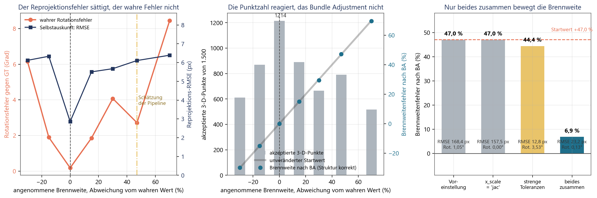

**Fig. 19:** Ergebnis des Experiments. Links der wahre Rotationsfehler gegen die
angenommene Brennweite, dazu die Selbstauskunft der Pipeline. Der Rotationsfehler ist bei
der wahren Brennweite minimal und wächst nach beiden Seiten. Der Reprojektionsfehler
springt zwar von 2,86 px auf über 5 px, sobald die Brennweite falsch ist, sättigt dann
aber: Zwischen −30 % und +70 % bewegt er sich nur zwischen 5,50 px und 6,39 px, während
der Rotationsfehler um den Faktor 4,6 auseinanderläuft. In der Mitte die Zahl der
akzeptierten Punkte, die deutlich reagiert und bei der wahren Brennweite ihr Maximum
erreicht, dazu das Ergebnis der Reihe B: Selbst wenn Struktur und Posen exakt vorgegeben
sind, bleibt die vom Bundle Adjustment zurückgelieferte Brennweite auf der Diagonalen,
ändert sich also nicht. Rechts das Ergebnis der Reihe C, in der dieselbe Aufgabe mit
verschiedenen Einstellungen des Lösers gerechnet wird. Erst die Kombination aus
skaliertem Parametervektor und Abbruchkriterien, die nicht sofort greifen, holt die
Brennweite von +47,0 % auf +6,9 % zurück und senkt den Rotationsfehler auf 0,13°.

Drei Befunde folgen daraus.

**Erstens ist der Reprojektionsfehler als Auswahlkriterium untauglich.** Er trennt richtig
von falsch, aber er trennt nicht falsch von falscher. Bei −30 % und bei +47 % misst die
Pipeline denselben Wert von 6,1 px, während der wahre Rotationsfehler um den Faktor 2,3
auseinanderliegt. Wer die Brennweite über den Reprojektionsfehler suchte, fände auf diesem
Datensatz kein brauchbares Minimum.

**Zweitens ist die Punktzahl das bessere Signal.** Bei der wahren Brennweite überstehen
1.214 der 1.500 Punkte die Annahmekriterien, bei +47 % nur 790 und bei +70 % nur 517. Der
Grund ist die Schwelle von 4 px in der Triangulation: Sie entfernt genau jene
Beobachtungen, die den Widerspruch sichtbar machen würden. Die Rekonstruktion erhält ihre
Selbstkonsistenz also dadurch, dass sie die Gegenbeweise verwirft. Damit ist die eingangs
gebliebene Vermutung bestätigt, aber auch präzisiert: Die Konsistenz ist nicht einfach
vorhanden, sie wird durch die Filter hergestellt.

**Drittens korrigiert das Bundle Adjustment die Brennweite in seiner voreingestellten
Konfiguration auch dann nicht, wenn es einen starken Anreiz dazu hätte.** In Reihe B des
Experiments werden Kameraposen und 3D-Punkte exakt auf ihre wahren Werte gesetzt und
allein die Brennweite falsch gestartet. Der Anfangsfehler beträgt dann 189,5 px, es gibt
also viel zu gewinnen. Das BA senkt ihn auf 119,6 px, indem es Posen und Punkte verbiegt,
und bewegt die Brennweite dabei um 3,7 px, das sind 0,4 % des Fehlers von 875 px. In allen
sieben Startwerten bleibt der Brennweitenfehler praktisch unverändert, und jeder Lauf endet
mit derselben Meldung wie im Produktivbetrieb: Abbruch auf dem Schrittweitenkriterium
`xtol`, bei einem Restfehler von über hundert Pixeln. Der Löser hört also nicht auf, weil
er ein Minimum gefunden hätte.

Diese Spur führt zur Ursache. Reihe C wiederholt dieselbe Aufgabe bei +47,0 % mit
veränderten Einstellungen des Lösers, ohne eine Zeile am Modell zu ändern.

| Einstellung des Lösers | Brennweite nachher | Fehler nachher | RMSE 189,5 px wird zu | Rotationsfehler | Abbruch | Rechenzeit |
|---|---:|---:|---:|---:|---|---:|
| Voreinstellung | 2.735,8 px | +47,0 % | 168,4 px | 1,05° | `xtol` | 0,1 s |
| `x_scale="jac"` | 2.736,0 px | +47,0 % | 157,5 px | 0,00° | `xtol` | 0,4 s |
| Toleranzen 1e−12 | 2.687,6 px | +44,4 % | 12,8 px | 3,53° | Budget erschöpft | 257,4 s |
| beides zusammen | 1.989,1 px | +6,9 % | 23,2 px | 0,13° | Budget erschöpft | 280,6 s |

**Tab. 8:** Reihe C des Experiments. Startwert ist in allen Zeilen 2.736,0 px bei exakt
vorgegebener Struktur; der wahre Wert beträgt 1.860,9 px. Das Budget umfasst rund 4.500
Funktionsauswertungen. Die Rotationsfehler beziehen sich auf die Posen nach der
Optimierung.

Das Ergebnis ist eindeutig, und es widerlegt die Erklärung, die die Kurzfassung als
verbliebene übernommen hatte. Die Brennweite ist aus diesen Daten sehr wohl bestimmbar:
Sobald der Parametervektor skaliert wird und die Abbruchkriterien den Löser nicht nach
einer Zehntelsekunde stoppen, wandert sie von +47,0 % auf +6,9 %, und der Rotationsfehler
fällt auf 0,13°, also in dieselbe Größenordnung, die COLMAP auf den echten Bildern
erreicht. Keine der beiden Änderungen genügt für sich: Die Skalierung allein bewegt die
Brennweite überhaupt nicht, die Toleranzen allein nur um 2,6 Prozentpunkte.

Der Grund für die Wirkungslosigkeit der Voreinstellung liegt in den Größenordnungen des
Parametervektors. Er mischt Rotationskomponenten und Punktkoordinaten der Größenordnung 1
mit einer Brennweite der Größenordnung 2.736. Bei einer relativen Schrittweitentoleranz
von 1e−4 gilt ein Schritt bereits als vernachlässigbar, wenn er die Brennweite um weniger
als etwa 0,3 px verschiebt, während 875 px zu überbrücken wären. Der Löser bricht ab,
bevor er nennenswert vorangekommen ist.

Die dritte Zeile der Tabelle verdient eine eigene Bemerkung, weil sie die These aus
Abschnitt 6.6 ein weiteres Mal bestätigt: Sie erreicht mit 12,8 px den kleinsten
Reprojektionsfehler der ganzen Reihe und zugleich mit 3,53° den größten Posenfehler. Wer
diese vier Varianten am Reprojektionsfehler misst, wählt die schlechteste aus.

Der Preis der wirksamen Einstellung ist Rechenzeit: 280,6 s statt 0,1 s für ein Problem
mit 23 Kameras und 1.500 Punkten. Eine praktikable Abhilfe wird deshalb nicht einfach die
Toleranzen absenken, sondern die Brennweite besser initialisieren, etwa durch eine Suche
beim Startpaar, wie COLMAP sie durchführt, und den Parametervektor dauerhaft skalieren.
Beides ist im vorhandenen Code an je einer Stelle möglich.

### 6.6  Selbstauskunft gegen Wahrheit

Der Befund aus dem Experiment lässt sich an den realen Läufen wiederfinden.

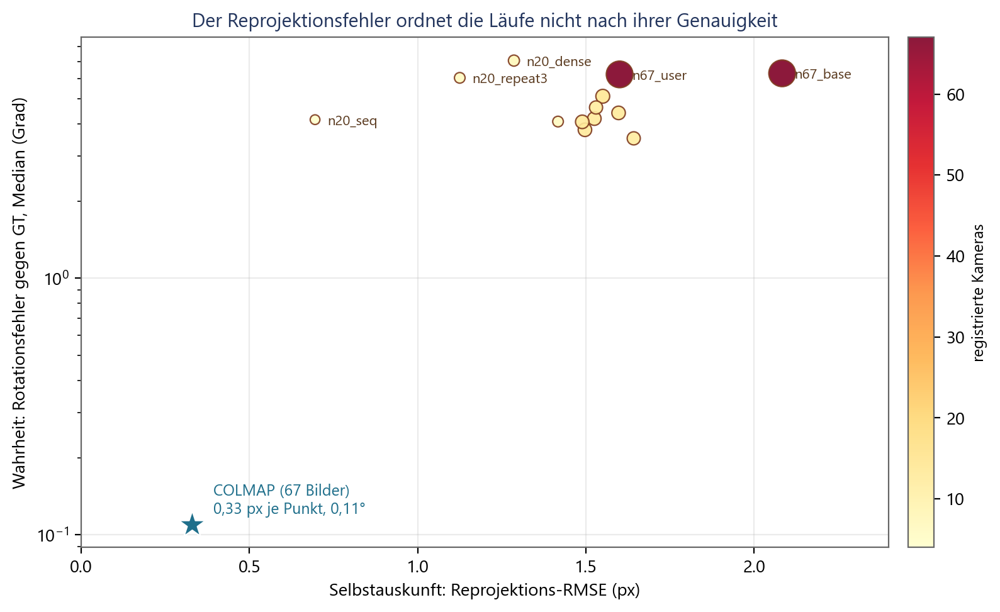

**Fig. 20:** Jeder Punkt ist ein Lauf der Messreihe, aufgetragen nach dem selbst
berichteten Reprojektions-RMSE und dem gegen die Ground Truth gemessenen Rotationsfehler.
Ein brauchbares Qualitätsmaß müsste eine steigende Punktwolke ergeben. Tatsächlich liegt
der genaueste Lauf nicht beim kleinsten Reprojektionsfehler, und `n20_seq` erreicht mit
0,70 px den besten Wert der gesamten Reihe, obwohl er nur 4 von 20 Kameras registriert hat
und 4,15° danebenliegt. Der Stern markiert COLMAP; sein Fehler je Punkt ist mit dem RMSE
der eigenen Läufe nicht direkt verrechenbar, seine Lage in der senkrechten Achse dagegen
schon.

Daraus folgt die methodisch wichtigste Aussage dieses Beitrags. Die pipeline-eigene
Qualitätskennzahl sieht mit 2,08 px genau dann gut aus, wenn die Geometrie um mehr als 6°
verdreht ist. Fig. 12 zeigt denselben Sachverhalt von der anderen Seite, denn dort meldet
das BA Konvergenz, während der Fehler steigt. Wer allein gegen den Reprojektionsfehler
optimiert, optimiert gegen eine Metrik, die diesen Fehlermodus prinzipiell nicht sehen
kann. Zwei Auswege haben sich in dieser Arbeit bewährt: der Vergleich gegen eine Referenz,
und die Beobachtung der Punktzahl, die auf eine falsche Intrinsik empfindlich reagiert.

### 6.7  Tracks: der Unterschied in der Buchführung

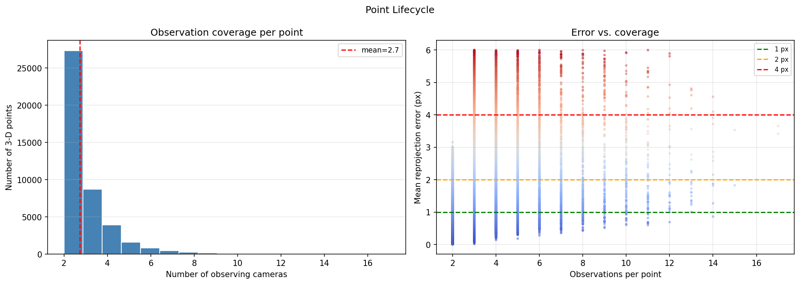

**Fig. 21:** Bildlauf B. Links die Zahl der Beobachtungen je 3D-Punkt bei einer mittleren
Tracklänge von 2,7, mit einem deutlichen Übergewicht bei genau zwei Beobachtungen. Mehr
als 27.000 der rund 40.000 Punkte stammen also aus einem einzigen Bildpaar und sind
geometrisch kaum abgesichert. Rechts der mittlere Reprojektionsfehler über der
Beobachtungszahl: Punkte mit vielen Beobachtungen bleiben zuverlässig unter 4 px, während
die Zweifach-Punkte die gesamte Fehlerspanne ausfüllen.

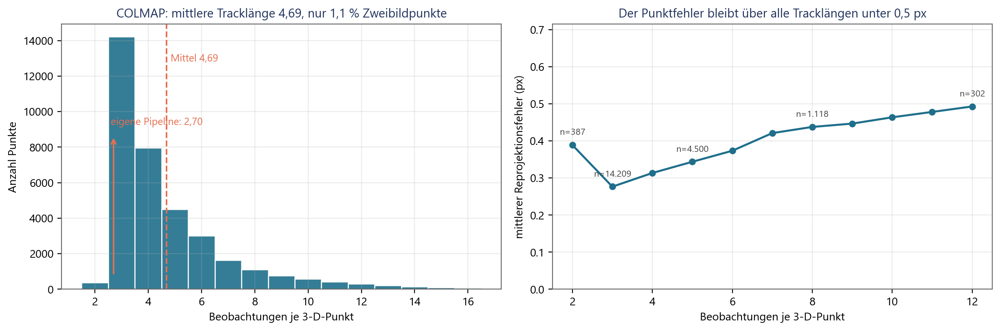

**Fig. 22:** Dieselbe Auswertung für COLMAP auf denselben 67 Bildern, gerechnet aus der
exportierten Modelldatei. Die Verteilung ist um mehrere Positionen nach rechts verschoben:
Der Median liegt bei 4 Beobachtungen, nur 1,1 % der Punkte stammen aus genau zwei
Ansichten, und 36,5 % aus mindestens fünf. Der mittlere Fehler je Punkt bleibt dabei über
alle gezeigten Tracklängen unter 0,5 px und steigt von 0,28 px bei drei Beobachtungen auf
0,49 px bei zwölf nur leicht an, was zu erwarten ist, denn längere Tracks müssen mehr
Bedingungen gleichzeitig erfüllen.

Der Unterschied entsteht nicht beim Detektor, denn beide Systeme verwenden SIFT mit
8.000 Merkmalen. Er entsteht in der Buchführung: Wo Korrespondenzen über mehrere Bilder
hinweg zu einem Track verschmelzen, stützt jeder Punkt mehrere Kameras gleichzeitig. Dazu
passt, dass 8,14 % der eigenen Punkte exakte Duplikate sind (Tab. 5), also Tracks, die
hätten verschmelzen müssen. Die dafür vorgesehene Option `--track-merge` zeigt im Test
keinen messbaren Nutzen: Der Duplikatanteil steigt von 10,68 % auf 10,87 %, bei einer
Kamera weniger. Angesichts der Streuung zwischen identischen Läufen (Abschnitt 6.9) ist
das kein Effekt, sondern Rauschen.

### 6.8  Laufzeit und Skalierung

| Bilder | Paare | Matching (s) | s je Paar | Gesamt (s) | s je Bild | Spitzenspeicher (MB) |
|---:|---:|---:|---:|---:|---:|---:|
| 6 | 15 | 7,6 | 0,505 | 13,1 | 2,2 | 1.134 |
| 20 | 190 | 94,4 | 0,497 | 113,0 | 5,6 | 1.184 |
| 67 | 2.211 | 1.036,6 | 0,469 | 1.135,5 | 16,9 | 1.470 |

**Tab. 9:** Skalierung mit der Bildzahl, Messreihe mit identischer Konfiguration.

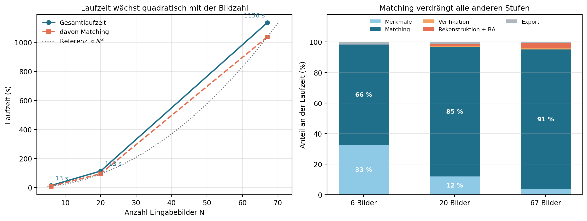

**Fig. 23:** Links die Gesamtlaufzeit und der Matching-Anteil über der Bildzahl, verglichen
mit einer quadratischen Referenzkurve. Rechts der Anteil der einzelnen Stufen an der
Gesamtlaufzeit. Die Kosten je Bildpaar bleiben mit 0,505 s, 0,497 s und 0,469 s praktisch
konstant, weshalb die Gesamtzeit exakt der quadratisch wachsenden Paarzahl folgt. Der
Anteil des Matchings steigt von 66 % bei 6 Bildern auf 91 % bei 67 Bildern, während das
Bundle Adjustment mit 38,2 s nicht ins Gewicht fällt.

Dieses Ergebnis widerspricht der Erwartung, mit der das Projekt in die Messung gegangen
ist. Die Vermutung lautete, das globale Bundle Adjustment werde zum Engpass, weil der
voreingestellte SciPy-Löser das Schur-Komplement nicht ausnutzt. Der Code-Befund stimmt,
die daraus abgeleitete Erwartung an die Laufzeit jedoch nicht. Das Bundle Adjustment
wächst zwar deutlich schneller als linear, nämlich von 1,2 s bei 13 registrierten Kameras
auf 38,2 s bei 67, also um etwa das Zweiunddreißigfache bei gut fünffacher Kamerazahl. Es
startet aber von einem so kleinen Betrag, dass es selbst am oberen Ende nur 3,4 % der
Laufzeit ausmacht, während das erschöpfende Matching bei 91 % liegt. Hochgerechnet
bräuchten 200 Bilder allein für das Matching etwa 2,6 Stunden.

Der Vergleich mit COLMAP zeigt, wie viel davon der Strategie und wie viel der Umsetzung
zuzuschreiben ist.

| Stufe | Eigene Pipeline | COLMAP | Verhältnis |
|---|---:|---:|---:|
| Merkmalsextraktion | 41,8 s | 37,3 s | 1,1 |
| Matching, erschöpfend | 1.036,6 s | 212,7 s | 4,9 |
| Verifikation und Rekonstruktion | 46,9 s | 41,6 s | 1,1 |
| Export | 8,0 s | in obigen Zeiten enthalten | |
| Gesamt | 1.135,5 s | 293,4 s | 3,9 |

**Tab. 10:** Laufzeit je Stufe, beide Systeme auf derselben CPU, mit 8.000 Merkmalen je
Bild, erschöpfendem Matching und ohne GPU.

Das Ergebnis ist deutlicher, als es die Gesamtzahl vermuten lässt. Merkmalsextraktion und
Rekonstruktion liegen praktisch gleichauf; der gesamte Rückstand entsteht im Matching.
Beide Systeme vergleichen dieselbe Zahl von Paaren mit derselben Zahl von Deskriptoren.
Der Unterschied ist damit weder algorithmisch noch sprachbedingt im engeren Sinne: Die
Paarschleife der eigenen Pipeline läuft seriell, während COLMAP alle Kerne beschäftigt.
Die naheliegendste Beschleunigung dieser Arbeit ist deshalb kein anderer Algorithmus,
sondern eine parallele Paarschleife.

### 6.9  Reproduzierbarkeit und Checkpointing

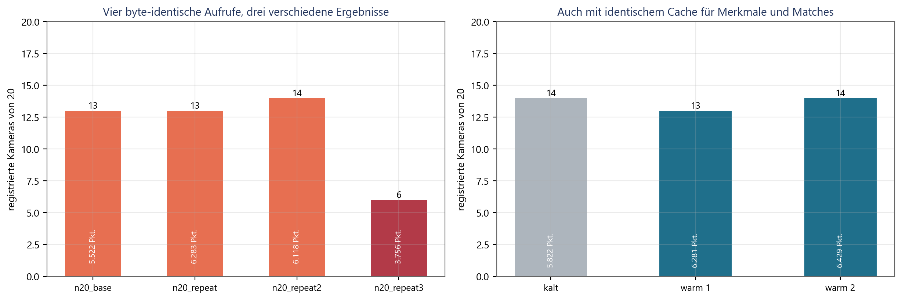

**Fig. 24:** Links vier byte-identische Aufrufe auf denselben 20 Bildern: Sie registrieren
13, 13, 14 und 6 Kameras und liefern zwischen 3.756 und 6.283 Punkte, eine Streuung von
57 % in der Kamerazahl. Rechts derselbe Effekt bei aktivem Checkpoint: Der kalte Lauf und
zwei Wiederaufnahmen laden identische Merkmale und identische Matches und kommen dennoch
zu verschiedenen Ergebnissen. Die Streuung entsteht also nachweislich hinter dem Matching.

Die Ursache ließ sich eindeutig lokalisieren: `cv2.setRNGSeed` wird nirgends im Projekt
aufgerufen, so dass `USAC_MAGSAC` und `solvePnPRansac` aus dem prozessglobalen
Zufallszahlengenerator von OpenCV ziehen. Die NumPy-Seeds sind dagegen an allen vier
relevanten Stellen fest gesetzt, weshalb nur die OpenCV-Seite betroffen ist. Das
Brennweitenexperiment in Abschnitt 6.5 setzt beide Generatoren und ist deshalb
wiederholbar; die Pipeline selbst ist es nicht.

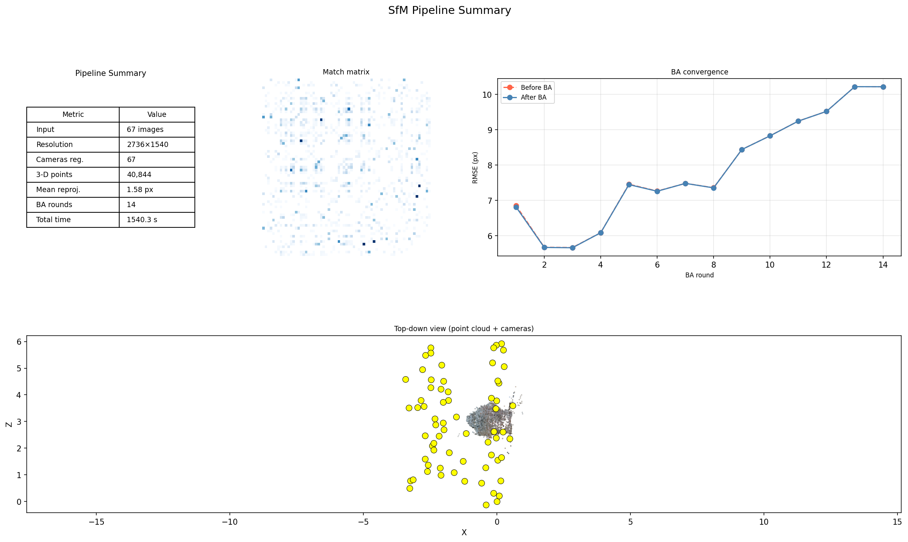

**Fig. 25:** Zusammenfassung von Lauf A, also identischer Befehl auf identischen Bildern,
einen Tag vor Lauf B ausgeführt: Kennzahlentabelle, Match-Matrix, BA-Konvergenz und
Draufsicht auf Punktwolke und Kamerazentren.

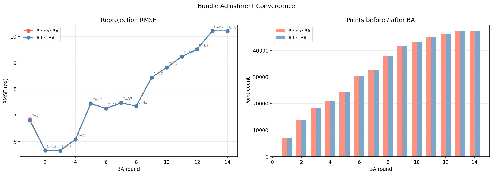

**Fig. 26:** Die BA-Konvergenz desselben Laufs A im Detail, zum direkten Vergleich mit
Fig. 12. Beide Läufe zeigen denselben Verlauf, nämlich ein frühes Minimum bei 12 bis 17
Kameras und danach einen stetigen Anstieg, enden aber bei 10,2 px statt bei 10,9 px. Bei
67 Bildern ist der Zufallseinfluss also gedämpft, aber nicht verschwunden, und er trifft
genau die Größe, die die Pipeline als Qualitätsnachweis ausgibt.

Das Checkpointing selbst arbeitet wirksam. Ein Wiederaufnahmelauf ist 19,9-mal schneller,
die Zwischenstände belegen 71,4 MB, und die Invalidierung greift korrekt, wenn sich
Parameter oder Bildmenge ändern. Der Schlüssel berücksichtigt allerdings nur Dateiname und
Dateigröße. Ein Testfall mit zwei verschiedenen Szenen gleicher Dateigröße zeigt, dass die
Wiederaufnahme die Merkmale der ersten Szene für die zweite verwendet, ohne zu warnen.

### 6.10  Robustheit

| Fall | Ergebnis | Beobachtung |
|---|---|---|
| fehlendes Verzeichnis | bestanden | verständliche Fehlermeldung |
| leeres Verzeichnis | bestanden | verständliche Fehlermeldung |
| einzelnes Bild | bestanden | verständliche Fehlermeldung |
| identische Bilder | bestanden | „keine Paare" |
| ohne Überlappung | bestanden | „keine Paare" |
| beschädigtes Bild | **gescheitert** | Abbruch des gesamten Laufs |
| Backend SuperPoint, DISK, LoFTR, DINOv2 | **gescheitert** | roher Traceback statt Installationshinweis |
| Backend COLMAP nicht installiert | bestanden | Vorabprüfung mit klarer Meldung |
| pyceres und poselib nicht installiert | bestanden | angekündigter Rückfall auf den Standardpfad |

**Tab. 11:** Verhalten bei dreizehn geprüften Fehlersituationen, davon acht bestanden. Die
Eingabeprüfung ist gründlich; die Behandlung fehlender optionaler Abhängigkeiten ist es
nur an drei von sieben Stellen.

### 6.11  Diagnosebilder als Werkzeug

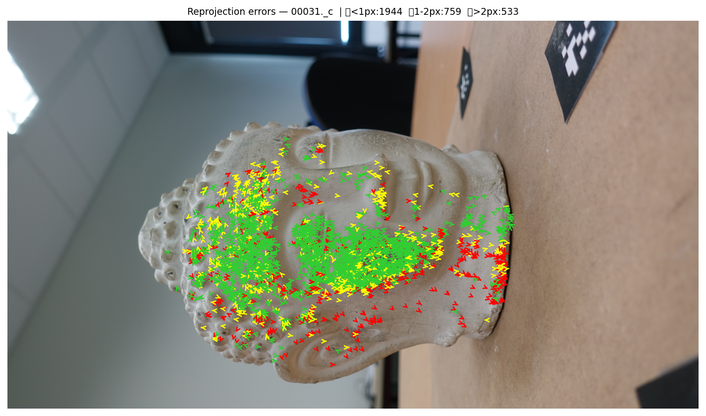

**Fig. 27:** Reprojektionsfehler als überhöhte Pfeile auf Bild 00031, mit 1.944 Punkten
unter 1 px (grün), 759 Punkten zwischen 1 px und 2 px (gelb) und 533 Punkten über 2 px
(rot). Die grünen Pfeile häufen sich im gut texturierten Zentrum der Statue, die roten am
Silhouettenrand und an der Kante zum Sockel. Der Fehler ist damit räumlich strukturiert und
nicht zufällig verteilt, was auf Kanten und Verdeckungen als Quelle hinweist, nicht auf
zufälliges Messrauschen.

Für die Fehlersuche war dieser Zugang entscheidend. Die steigende Kurve in Fig. 12 und das
Übergewicht der Zweifach-Tracks in Fig. 21 haben die in Abschnitt 6.4 vermessenen Defekte
überhaupt erst sichtbar gemacht, lange bevor eine Ground-Truth-Auswertung vorlag.

## 7  Diskussion

Auf dicht abgetasteten, gut texturierten Szenen arbeitet die Pipeline zuverlässig. Sie
registriert alle Kameras, erzeugt eine formtreue und korrekt kolorierte Punktwolke mit
weniger als einem Prozent Ausreißern und bleibt dabei mit 1,5 GB Spitzenspeicher im Rahmen
eines gewöhnlichen Laptops. Ebenso deutlich sind die Grenzen, und für jede lässt sich die
Ursache im Code benennen.

**Die Intrinsik ist die gravierendste Schwäche.** Ohne EXIF-Daten rät die Pipeline
f = max(W, H) und liegt damit 47 % daneben. Neu an dieser Fassung ist die Diagnose, warum
das Bundle Adjustment den Wert nicht korrigiert: Es ist nicht in einem konsistenten
Minimum gefangen, sondern bricht auf dem Schrittweitenkriterium ab, während der Restfehler
noch über hundert Pixel beträgt. Mit skaliertem Parametervektor und abgesenkten Toleranzen
findet dasselbe Bundle Adjustment auf denselben Daten eine Lösung mit 6,9 %
Brennweitenfehler und 0,13° Posenfehler (Tab. 8). Damit ändert sich die Rangfolge der
Abhilfen: Eine Option zur Vorgabe der Kalibrierung bleibt der schnellste Weg zu besseren
Ergebnissen, der eigentliche Defekt aber ist die Konfiguration des Lösers.

**Die eigene Qualitätskennzahl ist blind für den wichtigsten Fehlermodus.** Der
Reprojektionsfehler trennt eine richtige von einer falschen Brennweite, ordnet falsche
Werte untereinander aber nicht (Fig. 19), und er wird zudem erst nach dem Ausreißerfilter
berichtet, der genau die widersprüchlichen Beobachtungen entfernt (Fig. 13). Die
Punktzahl reagiert empfindlicher und wäre als ergänzendes Signal geeignet.

**Die Ergebnisse sind nicht reproduzierbar.** Weil der Zufallszahlengenerator von OpenCV
nie gesetzt wird, schwankt die Zahl registrierter Kameras zwischen identischen Läufen um
bis zu 57 %. Solange dieser Punkt offen ist, lässt sich der Nutzen jeder weiteren
Verbesserung nicht sauber messen, denn jede Änderung verschwindet im Rauschen zwischen
zwei Läufen. Das Brennweitenexperiment zeigt zugleich, dass die Behebung trivial ist: Zwei
gesetzte Seeds genügen, damit dieselbe Rechnung wiederholbar wird.

**Die Skalierungsgrenze liegt beim Matching, und zwar aus zwei getrennten Gründen.** Der
erste ist die Strategie: Erschöpfendes Matching kostet quadratisch viele Paarvergleiche.
Der zweite ist die Umsetzung: Die Paarschleife läuft seriell, während COLMAP dieselbe
Aufgabe mit allen Kernen in einem Fünftel der Zeit erledigt (Tab. 10). Die naheliegende
Abhilfe über sequenzielles Matching halbiert zwar die Zeit, lässt die Rekonstruktion auf
diesem Datensatz aber auf 4 von 20 Kameras zusammenbrechen. Der Grund dafür ist mit
Fig. 14 nun geometrisch belegt und nicht mehr nur aus der Match-Matrix abgelesen: Die
Rangkorrelation zwischen Dateinamen und Azimut beträgt 0,02, aufeinanderfolgende Bilder
sind also keine Nachbarn. Die inhaltsbasierten Alternativen über Bildretrieval benötigen
PyTorch, das auf der Messmaschine fehlt.

**Die Tracks sind zu kurz.** Bei einer mittleren Tracklänge von 2,70 stammt die Mehrzahl
der Punkte aus nur zwei Bildern und ist geometrisch schwach abgesichert, was Fig. 21 als
Hauptquelle der Fehlerstreuung ausweist. COLMAP erreicht auf denselben Bildern 4,69
Beobachtungen je Punkt und insgesamt 56 % mehr Beobachtungen, und zwar bei weniger Punkten
(Fig. 22). Passend dazu sind 8,14 % der eigenen Punkte exakte Duplikate; die dafür
vorgesehene Option zeigt im Test keinen messbaren Nutzen.

**Ohne Schleifenschluss akkumuliert die Rekonstruktion Spannung.** Die Registrierung hängt
jede neue Kamera an den bestehenden Verbund an, so dass sich kleine Posenfehler
aufsummieren. Genau dieses Verhalten zeigt die steigende Kurve in Fig. 10 und Fig. 12: Der
Fehler wächst mit der Zahl der eingefügten Kameras, statt sich zu stabilisieren. Zu
beachten ist dabei, dass sich der Zuwachs nicht als Drift entlang einer Aufnahmebahn
lesen lässt, denn eine solche Bahn gibt es in diesem Datensatz nicht (Fig. 14 und
Fig. 18); es handelt sich um wachsende Spannung im gesamten Verbund. Eine
Schleifenschluss-Erkennung ist zwar vorgesehen, setzt aber inhaltsbasiertes Retrieval oder
den Vokabularbaum voraus.

**Texturarme und planare Szenen** bleiben die theoretisch erwartete Grenze. SIFT findet
dort zu wenige Merkmale, wobei Fig. 5 die leeren Regionen bereits auf einer gutmütigen
Szene zeigt. Bei einer dominanten Ebene lässt sich die Korrespondenz ebenso gut durch eine
Homographie erklären, weshalb die daraus abgeleitete Essential-Matrix keine belastbare
Rotation mehr liefert. Die Implementierung erkennt diesen Fall über die
Homographiekonkurrenz und verwirft das Paar. Ein falsches Ergebnis wird dadurch vermieden,
der Bildgraph verliert aber Kanten und zerfällt im Extremfall, statt die Ebene über die
Homographie zu behandeln.

**Die Reife der Randfälle bleibt hinter der Kernfunktion zurück.** Ein einzelnes unlesbares
Bild bricht den gesamten Lauf ab, nachdem die Merkmalsextraktion bereits bezahlt ist, und
vier nicht installierte optionale Backends melden sich mit einem rohen Traceback statt mit
einem Installationshinweis. Beides ist an anderer Stelle im Projekt bereits richtig gelöst,
etwa bei der Vorabprüfung des COLMAP-Backends, und müsste lediglich übertragen werden.

### 7.1  Was der Vergleich mit COLMAP zeigt und was nicht

Die Grundstruktur ist in beiden Systemen ähnlich, und beide liefen hier auf derselben CPU,
mit denselben Bildern und derselben Merkmalszahl. Trotzdem trennen sie Größenordnungen:
0,11° gegenüber 6,29° Orientierungsfehler, 0,2 % gegenüber 47 % Brennweitenfehler, dazu
293 s gegenüber 1.136 s Laufzeit. Nach allem Gemessenen verteilt sich dieser Unterschied
auf drei klar benennbare Stellen und nicht auf die Wahl der Algorithmen: die
Initialisierung der Intrinsik samt Löserkonfiguration, die Verwaltung der Tracks, und die
Parallelisierung des Matchings. In den Stufen, in denen beide Systeme dasselbe tun, also
Merkmalsextraktion und eigentliche Rekonstruktion, liegen sie in der Laufzeit gleichauf.

Bemerkenswert ist dabei, dass die eigene Pipeline mehr Punkte erzeugt als COLMAP und
trotzdem deutlich ungenauer ist. Punktzahl allein ist als Qualitätsmaß wertlos; die Zahl
der Beobachtungen je Punkt sagt mehr.

### 7.2  Gültigkeit der Aussagen

Die Ergebnisse beruhen auf einem einzigen Datensatz. Er ist gutmütig, denn er ist dicht
abgetastet und stark texturiert; die gemessenen Grenzen sind daher eher eine untere
Schranke für die Probleme, die auf schwierigerem Material zu erwarten sind. Alle Läufe
liefen auf einer Maschine ohne CUDA, weshalb die GPU-Pfade der Pipeline ungeprüft bleiben.

Die Streuung zwischen identischen Läufen begrenzt die Aussagekraft aller Einzelvergleiche
in der Messreihe mit 20 Bildern; Unterschiede unterhalb von etwa 10 % in der Punktzahl
sind dort nicht interpretierbar. Die Läufe mit 67 Bildern sind davon deutlich weniger
betroffen, wie der Vergleich der Läufe A und B zeigt, aber nicht frei davon.

Das Brennweitenexperiment arbeitet mit synthetischen Korrespondenzen. Es zeigt damit das
Verhalten der Geometrie- und Optimierungsstufen unter idealen Eingangsdaten und trennt
deren Beitrag sauber von Merkmalsextraktion und Matching. Übertragbar auf den
Produktivbetrieb ist die Aussage über das Verhalten des Lösers, nicht die absolute Höhe
der berichteten Fehler, denn reale Korrespondenzen enthalten Ausreißer, die im Experiment
fehlen.

Der COLMAP-Vergleich ist bewusst auf gleiche Bedingungen gestellt, misst aber ein System
mit vielen Voreinstellungen gegen ein anderes. Insbesondere ist COLMAPs Matching
mehrfädig und nutzt zusätzliche Filter, so dass das Verhältnis von 4,9 in Tab. 10 nicht
allein den Fädigkeitsunterschied misst.

## 8  Fazit und Ausblick

Eine vollständig in Python geschriebene SfM-Pipeline rekonstruiert einen gut abgetasteten,
texturreichen Datensatz aus 67 Bildern vollständig und formtreu, auf einem handelsüblichen
Laptop, in rund 19 Minuten und mit 1,5 GB Spitzenspeicher. Der didaktische Ertrag ist
erheblich, denn jede Stufe ist als Bild inspizierbar, und genau diese Bilder haben die
Schwächen der Implementierung aufgedeckt.

Das wichtigste Ergebnis ist methodisch und war so nicht geplant: Die Selbstauskunft der
Pipeline über ihre eigene Qualität ist unzuverlässig. Ein Reprojektionsfehler von 2,08 px
signalisiert eine saubere Rekonstruktion, während die Brennweite 47 % danebenliegt und die
Kameraorientierungen im Median um mehr als 6° verdreht sind. Das kontrollierte Experiment
dieser Fassung zeigt darüber hinaus, dass dieser Fehler nicht am Modell liegt: Dasselbe
Bundle Adjustment findet auf denselben Daten eine Lösung mit 6,9 % statt 47 %
Brennweitenfehler, sobald der Parametervektor skaliert und der Abbruch nicht nach einer
Zehntelsekunde ausgelöst wird. Der Reprojektionsfehler ist zudem eine gefilterte Größe; er
wird über jene Beobachtungen gerechnet, die die Schwellen überstanden haben.

COLMAP auf denselben Bildern liefert die Gegenprobe. Mit 0,11° Orientierungsfehler und
0,2 % Brennweitenfehler in einem Viertel der Laufzeit zeigt es, dass die Daten die
Genauigkeit hergeben und die Lücke in der eigenen Umsetzung liegt. Genau das ist für ein
Lernprojekt die nützlichste Form eines Ergebnisses, denn sie benennt nicht nur eine
Grenze, sondern belegt, dass sie überwindbar ist.

Für die Weiterarbeit ergibt sich daraus eine klare Reihenfolge.

1. **Zufallszahlen setzen.** Ein Aufruf von `cv2.setRNGSeed` und ein `--seed` auf der
   Kommandozeile. Ohne Reproduzierbarkeit ist keine weitere Verbesserung messbar.
2. **Intrinsik in den Griff bekommen.** Eine Option zur Vorgabe einer bekannten
   Kalibrierung, eine Brennweitensuche beim Startpaar und, als eigentlicher Defekt, eine
   Löserkonfiguration, die die Brennweite tatsächlich bewegt: Skalierung des
   Parametervektors und Abbruchkriterien, die nicht bei einem Restfehler von über hundert
   Pixeln auslösen. Tab. 8 beziffert, was dabei zu holen ist, und zugleich den Preis in
   Rechenzeit, weshalb die bessere Initialisierung vor der schärferen Toleranz kommen
   sollte.
3. **Selbstauskunft ehrlich machen.** Den Reprojektionsfehler vor und nach dem
   Ausreißerfilter ausgeben und die Zahl akzeptierter Punkte als zweites Signal führen.
4. **Tracks verschmelzen.** Die Duplikatquote von 8 % ist ein direkter Hinweis; das Ziel
   ist die Beobachtungszahl je Punkt, nicht die Punktzahl.
5. **Bildinhalt in den Cache-Schlüssel** und **unlesbare Bilder überspringen**, beides
   kleine Änderungen mit großer Wirkung auf die Verlässlichkeit.
6. **Matching parallelisieren**, bevor über andere Matching-Verfahren nachgedacht wird.
   Der Vergleich in Tab. 10 zeigt, dass hier ein Faktor von etwa fünf ohne jeden
   algorithmischen Eingriff erreichbar ist.

Erst danach lohnen sich die weiter reichenden Themen, also inhaltsbasierte Vorauswahl der
Bildpaare, Schleifenschluss und lernbasierte Matching-Verfahren für schwierige
Aufnahmesituationen.

## Literatur

[1] R. Hartley and A. Zisserman, *Multiple View Geometry in Computer Vision*, 2nd ed.
Cambridge, U.K.: Cambridge University Press, 2003.

[2] J. L. Schönberger and J.-M. Frahm, "Structure-from-motion revisited," in *Proc. IEEE
Conf. Computer Vision and Pattern Recognition (CVPR)*, 2016, pp. 4104-4113.

[3] Q.-Y. Zhou, J. Park, and V. Koltun, "Open3D: A modern library for 3D data processing,"
arXiv:1801.09847, 2018.

[4] D. G. Lowe, "Distinctive image features from scale-invariant keypoints," *International
Journal of Computer Vision*, vol. 60, no. 2, pp. 91-110, 2004.

[5] D. Barath, J. Noskova, M. Ivashechkin, and J. Matas, "MAGSAC++, a fast, reliable and
accurate robust estimator," in *Proc. IEEE/CVF Conf. Computer Vision and Pattern
Recognition (CVPR)*, 2020, pp. 1304-1312.

[10] M. A. Fischler and R. C. Bolles, "Random sample consensus: A paradigm for model
fitting with applications to image analysis and automated cartography," *Communications of
the ACM*, vol. 24, no. 6, pp. 381-395, 1981.

[11] B. Triggs, P. F. McLauchlan, R. I. Hartley, and A. W. Fitzgibbon, "Bundle adjustment:
A modern synthesis," in *Vision Algorithms: Theory and Practice*, LNCS 1883, Berlin:
Springer, 2000, pp. 298-372.

[12] N. Snavely, S. M. Seitz, and R. Szeliski, "Photo tourism: Exploring photo collections
in 3D," *ACM Transactions on Graphics*, vol. 25, no. 3, pp. 835-846, 2006.

[13] M. Muja and D. G. Lowe, "Fast approximate nearest neighbors with automatic algorithm
configuration," in *Proc. Int. Conf. Computer Vision Theory and Applications (VISAPP)*,
2009, pp. 331-340.

[14] R. I. Hartley, "In defense of the eight-point algorithm," *IEEE Transactions on
Pattern Analysis and Machine Intelligence*, vol. 19, no. 6, pp. 580-593, 1997.

[15] P. H. S. Torr and A. Zisserman, "MLESAC: A new robust estimator with application to
estimating image geometry," *Computer Vision and Image Understanding*, vol. 78, no. 1,
pp. 138-156, 2000.

[16] H. Hirschmüller, "Stereo processing by semiglobal matching and mutual information,"
*IEEE Transactions on Pattern Analysis and Machine Intelligence*, vol. 30, no. 2,
pp. 328-341, 2008.

[17] M. Kazhdan and H. Hoppe, "Screened Poisson surface reconstruction," *ACM Transactions
on Graphics*, vol. 32, no. 3, article 29, 2013.

[18] S. Umeyama, "Least-squares estimation of transformation parameters between two point
patterns," *IEEE Transactions on Pattern Analysis and Machine Intelligence*, vol. 13,
no. 4, pp. 376-380, 1991.

---

## Anhang A  Ergänzende Abbildungen

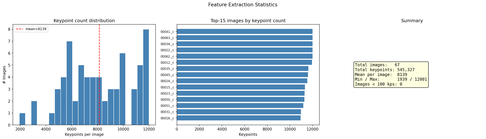

**Fig. A1:** Verteilung der Merkmalszahl über alle 67 Bilder des Bildlaufs B mit insgesamt
545.327 Keypoints, im Mittel 8.139 pro Bild bei einem Minimum von 1.939 und einem Maximum
von 12.001. Das Maximum liegt exakt am gesetzten Limit; bei sechs Bildern begrenzt also der
Parameter und nicht die Szene.

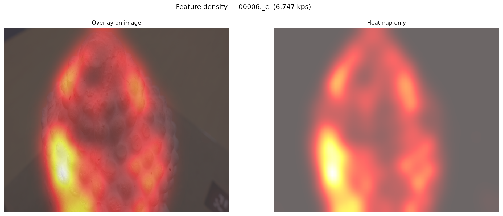

**Fig. A2:** Dichte-Heatmap von Bild 00006 als Gegenstück zu Fig. 5. Die Statue füllt hier
fast das ganze Bild, und die Dichte ist entsprechend gleichmäßiger verteilt; die
merkmalsfreien Bereiche beschränken sich auf die glatte Tischplatte.

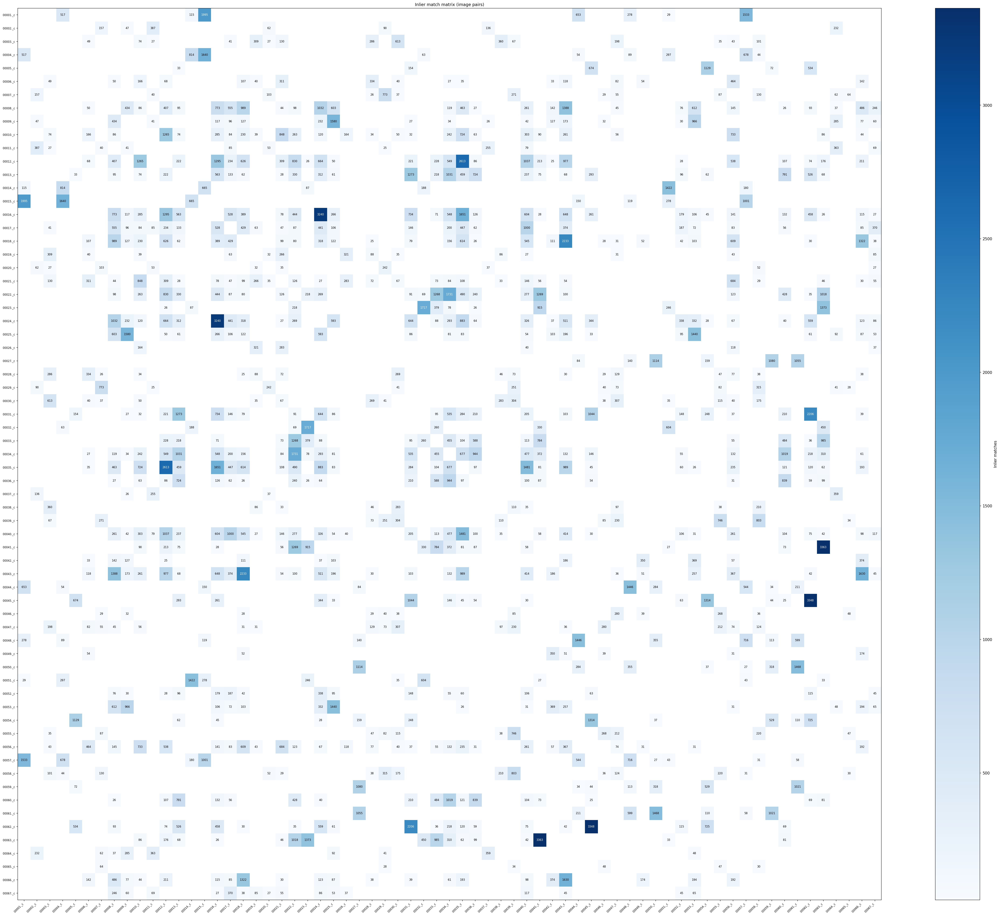

**Fig. A3:** Inlier-Matrix aller Bildpaare des Bildlaufs B. Die Matrix ist dünn besetzt,
einzelne Paare erreichen über 3.000 Inlier. Die Struktur ist nicht bandförmig, was die in
Fig. 14 geometrisch belegte Unordnung der Dateinamen widerspiegelt und erklärt, weshalb
sequenzielles Matching auf diesem Datensatz scheitert.

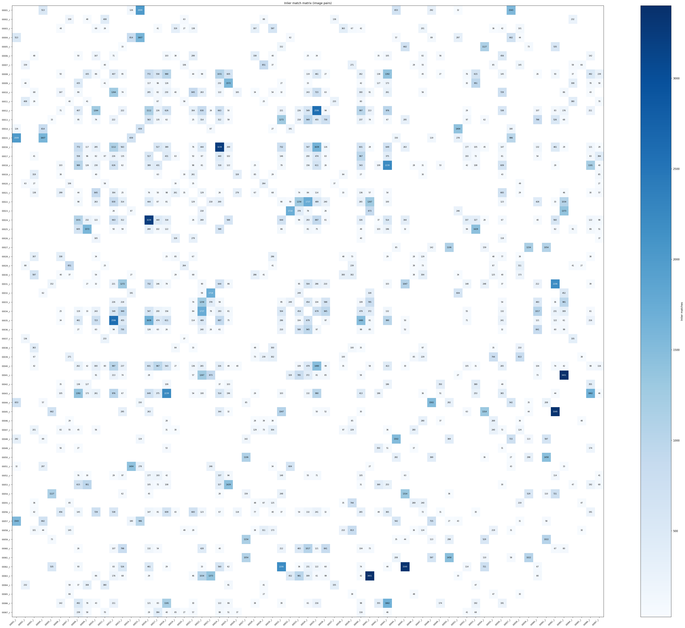

**Fig. A4:** Dieselbe Matrix für Lauf A. Das Muster ist bis auf Details identisch, was
belegt, dass die Streuung zwischen identischen Läufen nicht im Matching entsteht.

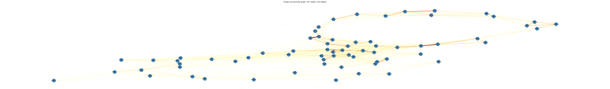

**Fig. A5:** Szenengraph mit 67 Knoten und 524 Kanten, eingefärbt nach Inlier-Zahl. Alle
Bilder liegen in einer einzigen Zusammenhangskomponente.

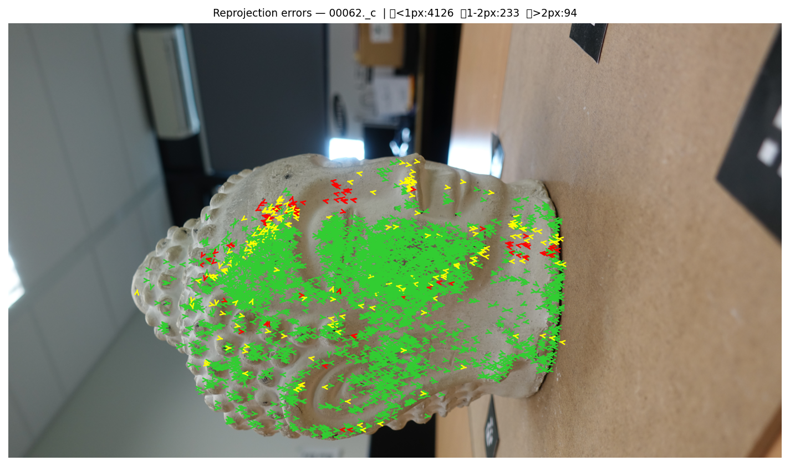

**Fig. A6:** Fehlerpfeile auf einem weiteren Bild desselben Laufs. Die räumliche Struktur
aus Fig. 27 wiederholt sich: große Fehler am Silhouettenrand, kleine im texturierten
Zentrum.

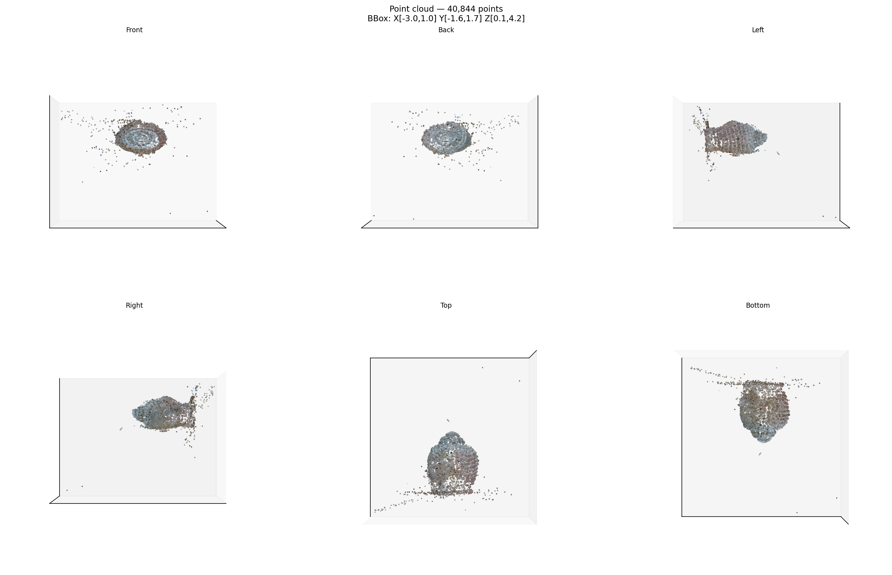

**Fig. A7:** Punktwolke des Laufs A in denselben sechs Ansichten wie Fig. 15. Form,
Färbung und Ausreißerstruktur stimmen überein; die Streuung zwischen zwei Läufen ist auf
dem vollständigen Datensatz visuell nicht zu erkennen und nur in den Kennzahlen messbar.

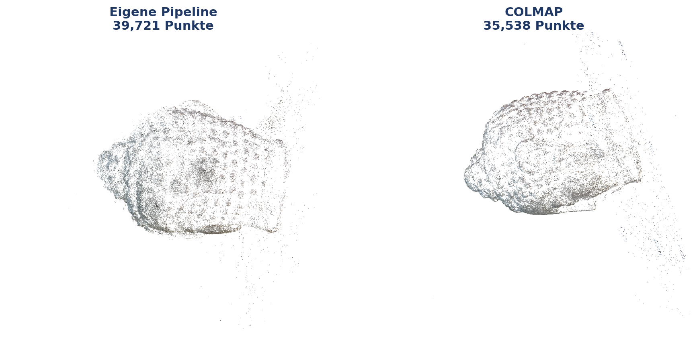

**Fig. A8:** Derselbe Vergleich wie in Fig. 16, hier ohne gemeinsame Ausrichtung, also
jede Wolke in ihrem eigenen Koordinatensystem und auf ihre eigene Ausdehnung normiert. Der
Vergleich zeigt, wie wenig zwei Rekonstruktionen derselben Szene ohne Ausrichtung
miteinander zu tun haben, und begründet den Zwischenschritt aus Abschnitt 5.4.

## Anhang B  Vollständige Laufmatrix

| Lauf | Bilder | Registriert | Punkte | Tracklänge | RMSE (px) | Rotationsfehler Median | Positionsfehler Median | Laufzeit (s) |
|---|---:|---:|---:|---:|---:|---:|---:|---:|
| `n06_base` | 6 | 2 | 137 | 2,00 | 0,35 | nicht bestimmbar | nicht bestimmbar | 13,1 |
| `n06_mini` | 6 | 6 | 3.851 | 2,27 | 1,42 | 4,08° | 1,73 % | 14,6 |
| `n20_base` | 20 | 13 | 5.522 | 2,33 | 1,53 | 4,19° | 0,79 % | 113,0 |
| `n20_dense` | 20 | 7 | 3.769 | 2,43 | 1,29 | 7,05° | 1,77 % | 158,7 |
| `n20_feat4k` | 20 | 12 | 3.073 | 2,34 | 1,64 | 3,51° | 0,73 % | 61,7 |
| `n20_feat12k` | 20 | 13 | 6.644 | 2,30 | 1,50 | 3,79° | 0,99 % | 130,7 |
| `n20_localba` | 20 | 13 | 5.979 | 2,31 | 1,60 | 4,41° | 1,23 % | 113,5 |
| `n20_repeat` | 20 | 13 | 6.283 | 2,31 | 1,49 | 4,07° | 0,98 % | 111,9 |
| `n20_repeat2` | 20 | 14 | 6.118 | 2,31 | 1,55 | 5,12° | 1,38 % | 115,0 |
| `n20_repeat3` | 20 | 6 | 3.756 | 2,42 | 1,13 | 6,04° | 1,56 % | 101,2 |
| `n20_seq` | 20 | 4 | 2.818 | 2,21 | 0,70 | 4,15° | 0,15 % | 57,1 |
| `n20_trackmerge` | 20 | 12 | 5.372 | 2,33 | 1,53 | 4,63° | 0,94 % | 112,5 |
| `n67_base` | 67 | 67 | 39.721 | 2,70 | 2,08 | 6,29° | 2,06 % | 1.135,5 |
| `n67_user` | 67 | 67 | 40.232 | 2,61 | 1,60 | 6,23° | 2,24 % | 1.761,3 |

**Tab. B1:** Alle Läufe der Messreihe. `n06_base` registriert nur zwei Kameras, weshalb
sich keine Sim(3)-Ausrichtung bestimmen lässt. Die vier Zeilen `n20_base`, `n20_repeat`,
`n20_repeat2` und `n20_repeat3` sind byte-identische Aufrufe.

## Anhang C  Herkunft der Abbildungen

Alle Bilddateien liegen versioniert unter `paper/figures/`. Die Originalverzeichnisse
`sfm_visualization_*` sind über `.gitignore` ausgeschlossen und werden nicht direkt
referenziert; `paper/scripts/collect_run_images.py` übernimmt die verwendeten Bilder.

**Bildlauf B**, 67 Bilder, SIFT auf der CPU, 12.000 Merkmale je Bild, Ratio 0,70,
erschöpfendes Matching, dichte Rekonstruktion aktiviert, Quelle
`sfm_visualization_20260803_102114`:

| Fig. | Datei unter `figures/run_b/` | Original |
|---|---|---|
| 4 links | `abb03a_sift_keypoints.png` | `01_features/features_00044._c.png` |
| 4 rechts | `abb03d_sift_keypoints_00006.png` | `01_features/features_00006._c.png` |
| 5 | `abb03b_feature_density.png` | `01_features/density_00044._c.png` |
| 6 links | `abb04a_matches.png` | `02_matching/matches_038_057.png` |
| 6 rechts | `abb04d_matches_005_009.png` | `02_matching/matches_005_009.png` |
| 7 links | `abb05_epipolar.png` | `02_matching/epipolar_038_057.png` |
| 7 rechts | `abb05b_epipolar_005_009.png` | `02_matching/epipolar_005_009.png` |
| 8 | `abb06a_step001_seed_crop.png` bis `abb06h_step050_crop.png`, auf die linke Teilansicht zugeschnitten | `03_reconstruction/step_001_seed_pair.png` sowie `step_003`, `step_010`, `step_020`, `step_035`, `step_050` |
| 9 | `abb06e_camera_poses_final.png` | `03_reconstruction/camera_poses_final.png` |
| 12 | `abb07a_ba_convergence.png` | `03_reconstruction/bundle_adjustment_convergence.png` |
| 15 | `abb09_pointcloud_6views.png` | `04_pointcloud/pointcloud_6views.png` |
| 21 | `abb07b_point_lifecycle.png` | `03_reconstruction/point_lifecycle.png` |
| 27 | `abb07d_reprojection_errors_00031.png` | `03_reconstruction/reprojection_errors_00031._c.png` |
| A1 | `abb03c_feature_statistics.png` | `01_features/feature_statistics.png` |
| A2 | `abb03e_feature_density_00006.png` | `01_features/density_00006._c.png` |
| A3 | `abb04b_match_matrix.png` | `02_matching/match_matrix.png` |
| A5 | `abb04c_connectivity_graph.png` | `02_matching/connectivity_graph.png` |
| A6 | `abb07e_reprojection_errors_00062.png` | `03_reconstruction/reprojection_errors_00062._c.png` |

**Bildlauf A**, identische Konfiguration, einen Tag zuvor, Quelle
`sfm_visualization_20260802_153526`: Fig. 25 aus `00_summary/pipeline_summary.png`,
Fig. 26 aus `03_reconstruction/bundle_adjustment_convergence.png`, Fig. A4 aus
`02_matching/match_matrix.png`, Fig. A7 aus `04_pointcloud/pointcloud_6views.png`.

**Eigens erzeugt.** Fig. 1 als Vektorgrafik (`figures/pipeline_overview.svg`), Fig. 3 als
Vektorgrafik (`figures/l/fig_l01_pipeline_farbcodiert.svg`). Die Abbildungen 2, 10, 11,
13, 14, 17, 18, 20, 22 und 24 entstehen mit `paper/scripts/make_figures_l.py` aus dem
Protokoll und den exportierten Dateien des Referenzlaufs, aus der COLMAP-Modelldatei und
aus den Kennzahlen der Messreihe. Fig. 19 entsteht aus dem Ergebnis von
`paper/scripts/focal_experiment.py`. Fig. 16 und Fig. A8 entstehen mit
`paper/scripts/compare_ply.py` und `paper/scripts/align_ply.py`, Fig. 23 mit
`paper/scripts/plot_scaling.py`.

**COLMAP-Vergleich.** COLMAP 4.1.1 ohne CUDA, aufgerufen als `run_sfm.py --backend colmap`
auf denselben 67 Bildern mit 8.000 Merkmalen und erschöpfendem Matching. Die Kameraposen
wurden mit `paper/scripts/colmap_to_cameras.py` in das Format von `--export-cameras`
überführt und anschließend mit demselben Skript (`eval/gt_pose_eval.py`) und derselben
Sim(3)-Ausrichtung gegen die Ground Truth bewertet wie die eigenen Läufe. Tracklängen und
Punktfehler stammen aus `paper_out/colmap_txt/points3D.txt`. Das vollständige Vorgehen
steht in `paper/COLMAP_HOWTO.md`.

## Anhang D  Reproduktion

| Ergebnis | Befehl |
|---|---|
| Referenzlauf | `python run_sfm.py --image_dir <buddha67> --output out.ply --export-cameras out.cameras.json --n_features 8000` |
| Bildlauf mit Diagnosebildern | `python run_sfm.py --image_dir <buddha67> --n_features 12000 --ratio 0.7 --min_inliers 25 --max_reproj_error 3.0 --dense --visualize` |
| COLMAP-Vergleich | `python run_sfm.py --image_dir <buddha67> --backend colmap --n_features 8000` |
| Bewertung gegen Ground Truth | `python eval/gt_pose_eval.py out.cameras.json --gt-dir <buddha>` |
| Messreihe und Bericht | `python eval/run_matrix.py`, danach `python eval/report.py` |
| Brennweitenexperiment | `python paper/scripts/focal_experiment.py --gt-dir <buddha>` |
| Neue Abbildungen | `python paper/scripts/make_figures_l.py --all --gt-dir <buddha>` |
| Diese Fassung als PDF | `python paper/scripts/build_paper.py --md paper/paper_l.md --pdf` |

**Tab. D1:** Befehle zur Reproduktion. `<buddha67>` bezeichnet das Verzeichnis mit den
67 Bildern, `<buddha>` das Verzeichnis des Originaldatensatzes mit den
Ground-Truth-Dateien `*_P.txt`.

## Anhang E  Umsetzung des Style Guide und offene Punkte

**Layout.** Das Layout folgt `abstract/workshop_book_styleguide_2026/main.tex`: A4 mit
2,5 cm Rand, Segoe UI, Fließtext 9 pt bei 14,4 pt Zeilenabstand im Blocksatz, Titel 12 pt
fett zentriert, Autorenblock 10 pt zentriert, Überschriften zentriert in Fett und in
GFaI-Blau, ebenso die Marken „Abstract:" und „Keywords:", Abbildungen zentriert auf
Satzspiegelbreite mit Bildunterschrift darunter, Tabellen im booktabs-Stil ohne
Vertikallinien, Literatur im IEEE-Format und keine Seitenzahlen. Zwei bewusste
Abweichungen: Die Bildhöhe ist auf 112 mm begrenzt, damit einzelne quadratische Diagramme
keine ganze Seite belegen, und die Kapitelüberschrift der Literatur lautet „Literatur"
statt „References", weil der Beitrag deutschsprachig ist. Die Langfassung überschreitet
die Seitenbegrenzung des Tagungsbandes bewusst; die dort einzureichende Fassung ist
`paper/paper_6p.md`. Der gemessene Umfang dieser Fassung beträgt 39 Seiten bei 35
Abbildungen und 13 Tabellen; die Abbildungen belegen etwa die Hälfte davon.

**Prüfung der Zahlen.** Alle Kennzahlen dieser Fassung lassen sich mit
`python paper/scripts/check_numbers_l.py` gegen die Artefakte im Repository nachrechnen.
Das Skript prüft fünfzig Werte aus Protokoll, Laufzusammenfassung, COLMAP-Modelldatei und
dem Brennweitenexperiment sowie die durchgehende Nummerierung der Abbildungen.

**Offene Punkte.** Offen bleibt eine eigene Aufnahmeserie für den planaren oder
texturarmen Grenzfall aus Abschnitt 7, die der Buddha-Datensatz nicht abbilden kann.
Ebenfalls offen ist ein Speichervergleich, da für COLMAP kein Spitzenspeicher gemessen
wurde. Nicht gemessen sind alle Pfade, die torch, kornia, pyceres oder poselib
voraussetzen. Der in Abschnitt 6.5 lokalisierte Löserdefekt ist diagnostiziert, aber nicht
behoben; die Wirkung einer Korrektur ist damit noch nicht gemessen.

**Abweichungen gegenüber der Kurzfassung.** Drei Aussagen der Kurzfassung wurden für diese
Fassung korrigiert. Erstens beschreibt sie den Datensatz als Drehtelleraufnahme und die
rekonstruierte Kameraverteilung als Abweichung von einer Ringaufnahme; Fig. 14 zeigt, dass
die Ground Truth selbst keine Ringaufnahme ist, so dass die flächige Verteilung in Fig. 9
korrekt ist. Zweitens führt die Kurzfassung die unbewegte Brennweite auf ein konsistentes
lokales Minimum zurück; das Experiment in Abschnitt 6.5 weist stattdessen einen
vorzeitigen Abbruch des Lösers nach und zeigt, dass dasselbe Bundle Adjustment die
Brennweite mit anderer Löserkonfiguration weitgehend zurückholt. Drittens zitiert die
Kurzfassung Reprojektionsfehler und Median aus zwei verschiedenen Läufen in einem Satz;
hier stammen alle Werte einer Aussage aus demselben Lauf.

**Hinweise für die Druckfassung.** Die eingebundenen Bilder stammen aus Läufen mit
Standardauflösung. Für den Druck lässt sich derselbe Lauf mit `--viz-format pdf` und
`--viz-dpi 300` wiederholen, wobei die Dateinamen gleich bleiben. Wegen der fehlenden
Reproduzierbarkeit ändern sich dabei die Zahlenwerte in den Bildern leicht, so dass die
Bildunterschriften nachzuziehen sind. Fig. 5 ist nicht seitenverhältnistreu, Fig. A5 hat
mit 8025 × 1185 Pixel ein für den Satzspiegel ungünstiges Format, und Fig. 15 trägt viel
Weißraum zwischen den sechs Teilansichten; alle drei gewinnen durch eine Nachbearbeitung
im Visualizer.
