# Von der Fehlersuche zur Oberfläche: Verbesserung und Vermessung einer in Python implementierten SfM-Pipeline

Rudolf Hoffmann1, Frank Neumann1
{: .authors}

1HTW Berlin, Fachbereich 2 Informatik in Ingenieurwissenschaften, Wilhelminenhofstr. 75a, 12459 Berlin, Rudolf.Hoffmann@Student.HTW-Berlin.de, www.htw-berlin.de
{: .affiliation}

**Abstract:** Eine frühere Fassung dieses Beitrags hat eine selbst gebaute, vollständig in
Python geschriebene Structure-from-Motion-Pipeline gegen Ground-Truth-Kameraposen vermessen
und neun Grenzen benannt, darunter eine um 47 % falsch geschätzte Brennweite, ein Bundle
Adjustment ohne Wirkung und Ergebnisse, die sich zwischen identischen Aufrufen um bis zu
57 % unterschieden. Der vorliegende Beitrag behebt diese Befunde, misst jede Änderung
einzeln und ergänzt die Kette um eine Stufe zur Rekonstruktion einer geschlossenen
Oberfläche. Auf demselben Datensatz mit 67 Aufnahmen fällt der Orientierungsfehler von
7,76° auf 0,174°, der Brennweitenfehler von 47,0 % auf 0,59 % und der Reprojektionsfehler
von 2,12 px auf 0,66 px; drei identische Aufrufe liefern jetzt byte-gleiche Punktwolken.
COLMAP erreicht auf denselben Bildern 0,11° und 0,2 %, der Abstand ist also von
Größenordnungen auf einen Faktor zwischen anderthalb und drei geschrumpft. Die Verteilung
der Wirkung ist dabei das eigentliche Ergebnis: Die Brennweiteninitialisierung allein trägt
den Faktor 49 der Verbesserung und kostet 9 s, während die aufwendige Neukonditionierung
des Lösers für sich genommen nichts bringt und die achtzehnfache Rechenzeit fordert. Die
Prüfung der Oberflächenstufe deckte zusätzlich einen Defekt der dichten Rekonstruktion auf:
Ihr Suchbereich für Disparitäten war fest verdrahtet und lag neben den tatsächlichen
Werten, weshalb 99,9 % der dichten Punkte außerhalb der Szene lagen. Nach der Behebung
liegt die dichte Wolke am Objekt; die daraus gewonnene Oberfläche bleibt jedoch
fragmentiert, während die Fläche aus der dünnen Wolke ein zusammenhängendes Modell mit
102.425 Dreiecken ergibt, dessen Abstand zu einer mit Ground-Truth-Kalibrierung erzeugten
Referenzrekonstruktion im Median 2,88 Punktabstände beträgt.
{: .abstract}

**Keywords:** Structure-from-Motion; Photogrammetrie; Python; Punktwolke; Bundle Adjustment; Oberflächenrekonstruktion; Poisson; Visualisierung; Studierendenprojekt
{: .keywords}

## 1  Einleitung

Aus einer Handvoll gewöhnlicher Fotos ein dreidimensionales Modell zu berechnen, gehört
heute zu den Standardwerkzeugen von Vermessung, Denkmalpflege, Robotik und AR/VR. Die
zugrundeliegende Technik ist in allen Fällen *Structure-from-Motion* (SfM), also die
gleichzeitige Schätzung der Szenengeometrie und der Kamerapositionen aus reinen Bilddaten
[1]. Wer sie anwendet, greift meist zu fertigen Werkzeugen wie COLMAP [2] oder Meshroom;
das hier beschriebene Projekt baut die Kette stattdessen selbst, in reinem Python, auf
einem gewöhnlichen Laptop.

Eine frühere Fassung dieses Beitrags hat diese Pipeline vermessen statt gelobt. Sie kam zu
einem unbequemen Ergebnis: Auf einem Datensatz mit 67 Aufnahmen und mitgelieferten
Ground-Truth-Posen registrierte die Pipeline zwar alle Kameras, lag aber mit der
geschätzten Brennweite 47 % neben dem wahren Wert, mit den Kameraorientierungen im Median
6,29° daneben, und zwei identische Aufrufe lieferten verschiedene Ergebnisse. Der
Reprojektionsfehler, die einzige Kennzahl, die die Pipeline über sich selbst ausgibt, zeigte
davon nichts an.

**Fig. 1:** Übersicht der Verarbeitungskette von den Eingabebildern über Merkmale,
Matching, geometrische Verifikation, inkrementelle Rekonstruktion und Bundle Adjustment bis
zur Punktwolke; die Oberflächenstufe schließt sich rechts an. Das Diagramm bildet den roten
Faden für Abschnitt 4.

Der vorliegende Beitrag ist die Fortsetzung: Er nimmt jeden dieser Befunde, sucht die
Ursache im Code, ändert den Code und misst nach. Dazu kommt eine Stufe, die in der früheren
Fassung noch nicht existierte, nämlich die Rekonstruktion einer geschlossenen Oberfläche aus
der dichten Punktwolke. Auch sie wird nicht nur beschrieben, sondern an dem gemessen, was
der Datensatz beweisen kann.

Vier Fragen strukturieren die Arbeit.

**F1: Welche der gefundenen Grenzen lassen sich mit vertretbarem Aufwand beheben?**
Abschnitt 4 beschreibt jede Änderung an der Stelle der Verarbeitungskette, an die sie
gehört, zusammen mit der Messung, die sie ausgelöst hat.

**F2: Was bringt jede einzelne Änderung?** Abschnitt 6.2 schaltet die Änderungen einzeln
zu, auf demselben Datensatz, mit derselben Programmfassung, und misst gegen die Ground
Truth. Eine Verbesserung, die sich nur in der Summe zeigt, wäre kein Beleg für die
einzelnen Eingriffe.

**F3: Wie gut ist die Pipeline danach?** Abschnitt 6.3 vergleicht den erreichten Zustand
mit dem Ausgangszustand und mit COLMAP auf denselben Bildern, derselben CPU und mit
derselben Merkmalszahl.

**F4: Wie gut ist die rekonstruierte Oberfläche?** Abschnitt 6.9 misst das Mesh gegen seine
eigene Eingabe, gegen eine Referenzrekonstruktion und photometrisch gegen die
Ground-Truth-Posen, weil der Datensatz keine Referenzoberfläche mitliefert.

Der Beitrag versteht sich weiterhin als Erfahrungsbericht mit Messwerten. Sein Ertrag liegt
nicht in einem neuen Verfahren, sondern in der belegten Aussage, welche Fehler eine
selbstgebaute SfM-Pipeline typischerweise macht, woran man sie erkennt und was ihre Behebung
tatsächlich einbringt.

## 2  Grundlagen

### 2.1  Kameramodell

Alle Stufen beruhen auf dem Lochkameramodell. Ein Punkt **X** in Weltkoordinaten wird über
die Rotation R und die Translation t in das Kamerasystem gebracht, perspektivisch geteilt
und mit der Kalibriermatrix K in Pixel abgebildet:

xcam = R **X** + t,  (xn, yn) = (xcam/zcam, ycam/zcam),  K = [[f, 0, cx], [0, f, cy], [0, 0, 1]].

Im Bundle Adjustment kommt eine radiale Verzeichnung nach Brown-Conrady mit zwei
Koeffizienten hinzu. Mit r² = xn² + yn² und d = 1 + k1r² +
k2r⁴ lautet die Projektion u = f · xn · d + cx und
v = f · yn · d + cy. Das Kamerazentrum in Weltkoordinaten ist
C = −RTt.

Monokulares SfM bestimmt Geometrie nur bis auf eine Ähnlichkeitstransformation. Jeder
Vergleich mit einer Referenz muss diese sieben Freiheitsgrade zuerst binden; Abschnitt 5.4
beschreibt, wie das geschieht.

### 2.2  Epipolargeometrie und der planare Sonderfall

Zwei Ansichten desselben Punktes sind über die Fundamentalmatrix F verknüpft:
x2T F x1 = 0. Bei bekannter Kalibrierung geht F in die
Essential-Matrix E = KTFK über, aus der die Cheiralitätsbedingung eine von vier
möglichen relativen Posen auswählt.

Liegt die Szene in einer Ebene, versagt dieser Weg. Eine Homographie H erklärt dann alle
Korrespondenzen ebenso gut, F ist nur bis auf die Ebenenentartung bestimmt, und die daraus
abgeleitete Rotation ist beliebig. Die Standardantwort besteht darin, den Fall zu erkennen
und stattdessen H zu zerlegen: `decomposeHomographyMat` liefert bis zu vier Lösungen
(R, t, n), von denen die Forderung nach positiver Tiefe in beiden Kameras und nach einer
zur ersten Kamera zeigenden Ebenennormale die richtige auswählt. Abschnitt 4.4 setzt das
um, Abschnitt 6.7 misst es.

### 2.3  Triangulation und Triangulationswinkel

Sind zwei Posen bekannt, ergibt sich ein 3D-Punkt als Schnitt zweier Sehstrahlen, berechnet
über die direkte lineare Transformation. Entscheidend für die Qualität ist der Winkel
zwischen den Strahlen: Für zwei Kameras mit Basislinie b im Abstand Z und einem
Messrauschen σ gilt näherungsweise σZ/Z ≈ σ / (f · sin α). Bei kleinem Winkel
wandert der Punkt entlang der Sichtachse.

### 2.4  Tracks

Ein *Track* ist die Menge aller Bildmessungen desselben Oberflächenpunktes. Verbindet man
die verifizierten Zuordnungen transitiv, so ist jede Zusammenhangskomponente des
Korrespondenzgraphen ein Track. Seine Länge, also die Zahl der Kameras, die ihn sehen,
entscheidet darüber, wie stark er die Rekonstruktion versteift: Ein Punkt aus zwei Ansichten
ist durch zwei Strahlen genau festgelegt und kann keinen Fehler mehr anzeigen, ein Punkt aus
fünf Ansichten bindet fünf Kameras aneinander. Abschnitt 4.6 baut diesen Graphen explizit
auf.

### 2.5  Bundle Adjustment

Das Bundle Adjustment (BA) optimiert Kameraposen, 3D-Punkte und die gemeinsame Intrinsik
zugleich [11] und minimiert

E = Σ(i,j) ρ( ‖ π(K, Ri, ti, **X**j) − xij ‖² )

über alle tatsächlich gemessenen Beobachtungen (i, j), mit einer robusten Verlustfunktion ρ.
Das Problem ist groß, aber dünn besetzt, denn eine Beobachtung hängt nur von ihrer Kamera,
ihrem Punkt und der gemeinsamen Intrinsik ab.

Zwei Eigenschaften des Lösers sind für diesen Beitrag zentral. Erstens mischt der
Parametervektor Größenordnungen: Rotationskomponenten und Punktkoordinaten liegen bei 1,
eine Brennweite bei mehreren Tausend. Ein Verfahren, das alle Parameter gleich behandelt,
bewegt die Brennweite dann nur in winzigen relativen Schritten. Zweitens entscheidet das
Abbruchkriterium darüber, ob überhaupt gerechnet wird: Wird der Lauf beendet, sobald die
Schrittweite klein ist, kann er lange vor dem Minimum stehen bleiben. Beides war in der
früheren Fassung als Ursache nachgewiesen worden; Abschnitt 4.7 beschreibt die Abhilfe.

### 2.6  Oberflächenrekonstruktion

Aus einer Punktwolke mit orientierten Normalen eine geschlossene Fläche zu gewinnen, ist
ein eigenes Problem. Die *Screened Poisson Surface Reconstruction* [17] fasst es als
Randwertaufgabe auf: Gesucht ist eine Indikatorfunktion χ, deren Gradient möglichst gut mit
dem aus den Normalen gebildeten Vektorfeld übereinstimmt, gelöst über einem Oktalbaum. Die
Oberfläche ist anschließend eine Niveaumenge von χ. Das Verfahren ist robust gegen Rauschen
und liefert stets eine geschlossene Fläche, was zugleich sein Hauptproblem ist: Wo keine
Daten liegen, erfindet der Löser Geometrie. Abschnitt 4.9 beschreibt, wie diese
Phantomflächen wieder entfernt werden, und Abschnitt 6.9 beziffert, wie viel davon übrig
bleibt.

Zwei Alternativen sind implementiert. Das *Ball-Pivoting-Verfahren* [nach Bernardini et al.]
rollt eine Kugel über die Punkte und verbindet je drei, die sie zugleich berührt; es
interpoliert die Punkte exakt und erfindet nichts, lässt aber Löcher, wo die Abtastung zu
dünn ist. *Alpha-Shapes* verallgemeinern die konvexe Hülle und eignen sich für einfache,
gut abgetastete Formen.

### 2.7  Verwandte Systeme

Die inkrementelle Bauform geht auf Photo Tourism [12] zurück und ist in COLMAP [2] zu einem
Referenzsystem ausgebaut. OpenMVG und AliceVision beziehungsweise Meshroom verfolgen
dieselbe Grundstruktur. Der vorliegende Beitrag tritt nicht in Konkurrenz zu diesen
Systemen; er benutzt COLMAP als Maßstab.

## 3  Abgrenzung: eigener Code und verwendete Bibliotheken

Die Formulierung „selbst gebaute Pipeline" verlangt eine genaue Abgrenzung, denn SIFT,
FLANN, RANSAC und Poisson sind etablierte Verfahren, deren Implementierungen niemand ohne
Not neu schreibt. Die Arbeitsteilung ist unverändert die der früheren Fassung: Aus den
Bibliotheken stammen die numerischen Primitive, selbst geschrieben ist alles, was diese
Primitive zu einer Rekonstruktion verbindet, sowie das vollständige Fehlermodell des Bundle
Adjustment.

| Stufe | Aus Bibliotheken | Eigener Python-Code |
|---|---|---|
| Intrinsik | PIL für den EXIF-Zugriff | drei EXIF-Wege mit Plausibilitätsprüfung, Brennweitensuche über Kandidaten |
| Merkmale | `cv2.SIFT_create` | Bildladen mit EXIF-Rotation, Backend-Auswahl, inhaltsbasierte Zwischenspeicherung |
| Matching | `cv2.FlannBasedMatcher`, `cv2.kmeans` | Ratio-Test, Cross-Check, Wahl der Kandidatenpaare, parallele Paarschleife mit paarweisem Zufallsstartwert |
| Geometrische Verifikation | `findFundamentalMat`, `findEssentialMat`, `findHomography`, `recoverPose`, `decomposeHomographyMat` | Hartley-Normierung, H/F-Konkurrenz, Auswahl der Homographie-Lösung über Cheiralität, Zusammenhangskomponenten per Union-Find |
| Tracks | kein Bibliotheksaufruf | transitiver Trackgraph per Union-Find, Auflösung widersprüchlicher Komponenten |
| Inkrementelle Rekonstruktion | `cv2.triangulatePoints`, `solvePnPRansac`, `solvePnPRefineLM`, `cv2.Rodrigues` | Startpaarwahl, Registrierungsreihenfolge, Annahmekriterien, Ausreißerentfernung, Retriangulation, geometrischer Schleifenschluss |
| Bundle Adjustment | `scipy.optimize.least_squares` (TRF), `scipy.sparse` | Parametrisierung, Residuum mit Brown-Conrady, Jacobi-Struktur, analytische Parameterskalierung, adaptive Huber-Skala, Divergenzschutz |
| Dichte Rekonstruktion | `cv2.StereoSGBM`, `stereoRectify`, `reprojectImageTo3D` | Paarauswahl nach vorhergesagter Disparität, Ableitung des Suchfensters aus der Szene, Arbeitsauflösung nach Speicherbudget, Szenenbegrenzung |
| Oberfläche | Open3D: Normalen, Screened Poisson, Ball-Pivoting, Alpha-Shapes | Punktabstand als Längeneinheit, Filter mit Sicherung, Ausdünnung per Bisektion, kamerabasierte Normalenorientierung, Entfernen erfundener Flächen, Bereinigung, Prüfbericht |
| Ausgabe und Diagnose | matplotlib | binärer PLY-Writer, Kameraexport, 19 Typen von Diagnosebildern |

**Tab. 1:** Aufteilung zwischen Bibliotheksaufrufen und eigenem Code, verifiziert am
Quelltext.

Der gesamte Projektcode ist Python. Tab. 2 zählt 13.769 Zeilen, davon 2.656 für die
Oberflächenstufe, 1.586 für die Visualisierung und 560 für die Anbindung von COLMAP, das
nur als Vergleichsmaßstab dient. Auf die in diesem Beitrag beschriebenen Änderungen
entfallen rund 900 neue Zeilen in vier Modulen.

| Modul | Zeilen | Aufgabe |
|---|---:|---|
| `run_sfm.py` | 2.083 | Kommandozeile, Ablaufsteuerung, Checkpointing, Export |
| `sfm/mesh/*` | 2.656 | Vorbereitung, Poisson, Bereinigung, Prüfung |
| `sfm/reconstruction.py` | 1.681 | inkrementelle Rekonstruktion, Tracks, Ausreißer |
| `sfm/visualizer.py` | 1.586 | 19 Typen von Diagnosebildern |
| `sfm/feature_matching.py` | 1.267 | Matching-Strategien, parallele Paarschleife |
| `sfm/bundle_adjustment.py` | 897 | Residuen, Jacobi-Struktur, Konditionierung |
| `sfm/geometric_verification.py` | 413 | F, E, Homographie, Pose |
| `sfm/mvs.py` | 405 | dichte Rekonstruktion über Stereo |
| `sfm/focal_search.py` | 263 | Brennweitensuche über Kandidaten |
| `sfm/loop_closure.py` | 234 | geometrischer Schleifenschluss |
| `sfm/exif_focal.py` | 216 | Brennweite aus EXIF, drei Wege |
| `sfm/tracks.py` | 194 | transitiver Trackgraph |
| übrige Module | 1.874 | Merkmale, COLMAP-Anbindung, Punktwolke, Hilfsfunktionen |
| **gesamt** | **13.769** | |

**Tab. 2:** Codeumfang je Modul. Die vier zuletzt genannten eigenen Module sind für diesen
Beitrag entstanden.
 Eine eigene Zeile C++ oder CUDA
existiert nicht. Die aufgerufenen Bibliotheken sind ihrerseits in C++ geschrieben, so dass
die rechenintensiven Primitive kompiliert ausgeführt werden und Python die Steuerungsschicht
bildet.

## 4  Was geändert wurde

Dieser Abschnitt geht die Verarbeitungskette entlang und beschreibt an jeder Stufe zuerst
das Verfahren und dann die Änderung, die die frühere Messung ausgelöst hat. Die Wirkung
steht in Abschnitt 6.

| Nr. | Befund aus der früheren Fassung | Ursache im Code | Änderung | Stand |
|---|---|---|---|---|
| 1 | Brennweite aus `max(W, H)` geraten, 47 % Fehler | nur ein EXIF-Feld gelesen, sonst Heuristik ohne Prüfung | `sfm/exif_focal.py` mit drei EXIF-Wegen und Plausibilitätsprüfung; Brennweitensuche startet selbsttätig, wenn nichts Besseres vorliegt; `--focal`, `--intrinsics` | behoben |
| 2 | Reprojektionsfehler hoch und als Qualitätsmaß blind | Fehler wurde erst nach dem Exportfilter berichtet | beide Werte werden berichtet, vor und nach dem Filter; die prinzipielle Blindheit der Kennzahl bleibt und wird durch die Punktzahl ergänzt | teilweise |
| 3 | Bundle Adjustment bewegt nichts, Abbruch auf `xtol` | einheitliche Parameterskalierung, Toleranz 1e−4 | analytische Skalierung je Parameterblock, Toleranz 1e−6, ausdrückliche Warnung bei Stillstand, `--ba-ftol/-xtol/-gtol` | behoben |
| 4 | Ergebnisse nicht reproduzierbar, bis 57 % Streuung | `cv2.setRNGSeed` nirgends aufgerufen | `--seed` setzt OpenCV, NumPy und `random`; im Matching bekommt jedes Paar seinen eigenen abgeleiteten Startwert | behoben |
| 5 | Tracks zu kurz, 2,70 gegen 4,69 bei COLMAP | Beobachtungen entstanden nur entlang des triangulierenden Paares | `sfm/tracks.py` schließt die Zuordnungen transitiv; Ergänzung und Verschmelzung vor jedem Bundle Adjustment | teilweise |
| 6 | Matching ist die Skalierungsgrenze | serielle Paarschleife, quadratische Paarzahl | Thread-Pool über die Paare mit paarweise gesetztem Zufallsstartwert, `--match-workers`; die quadratische Zahl der Paare bleibt | teilweise |
| 7 | Ohne Schleifenschluss akkumuliert Spannung | Schleifenschluss nur über Bildretrieval, ohne PyTorch nicht lauffähig | `sfm/loop_closure.py` schlägt aus den Posen Paare vor, matcht und verifiziert sie gezielt und rekonstruiert erneut | behoben |
| 8 | Planare Szenen werden verworfen | Paar mit hohem Homographie-Anteil wurde übersprungen | Zerlegung der Homographie mit Auswahl über Cheiralität; das Paar bleibt nutzbar, wird aber nicht als Startpaar zugelassen | behoben |
| 9 | Randfälle unreif | unlesbares Bild bricht ab, Backends mit rohem Traceback, inhaltsblinder Cache | unlesbare Bilder werden übersprungen, fehlende Backends melden sich mit Installationshinweis, der Cache-Schlüssel verwendet den Bildinhalt | behoben |

**Tab. 3:** Bestandsaufnahme der neun Befunde der früheren Fassung.

### 4.1  Bilder laden und Intrinsik schätzen

Die Pipeline liest alle Bilder eines Verzeichnisses, wendet die EXIF-Orientierung an und
schätzt daraus eine gemeinsame Kalibriermatrix. Der Hauptpunkt wird auf die Bildmitte
gesetzt.

**Befund.** Für die Brennweite wurde bisher genau ein EXIF-Feld gelesen, die
kleinbildäquivalente Brennweite. Fehlte es, griff die Heuristik f = max(W, H), auf dem
Buddha-Datensatz 2.736 px gegen wahre 1.860,9 px, also 47,0 % zu viel. Dieser Wert ging in
die Startpose, in jede Triangulation und in jedes PnP ein.

**Änderung.** Die Brennweitenbestimmung ist in ein eigenes Modul gewandert
(`sfm/exif_focal.py`) und probiert drei Wege in der Reihenfolge ihrer Verlässlichkeit. Der
erste liest die kleinbildäquivalente Brennweite und rechnet sie über die Sensordiagonale
von 43,27 mm in Pixel um. Der zweite verwendet die Brennweite in Millimetern zusammen mit
der Auflösung der Sensorebene, also dem vom Hersteller angegebenen Pixelraster, und
skaliert, wenn das geladene Bild nicht die im EXIF vermerkte Größe hat. Der dritte
kombiniert die Brennweite in Millimetern mit einer Sensorbreite aus einer kurzen Tabelle
gebräuchlicher Kameras. Jeder Weg wird verworfen, wenn der berechnete Wert einen
unplausiblen Bildwinkel ergibt, also außerhalb von 5° bis 150° diagonal liegt; eine grob
falsche Brennweite ist schlechter als keine. Welcher Weg gegriffen hat, steht im Protokoll
und in der exportierten Kameradatei.

**Änderung.** Liefert kein EXIF-Weg einen Wert und gibt der Aufruf keine Kalibrierung vor,
startet die Pipeline von sich aus die Brennweitensuche, statt die Heuristik zu verwenden.
Die Suche vergleicht Kandidatenbrennweiten daran, wie viele Zweibild-Korrespondenzen die
Annahmekriterien überstehen, und nicht am Reprojektionsfehler: Die frühere Fassung hatte
gemessen, dass die Punktzahl scharf und eindeutig beim wahren Wert liegt, während der
Reprojektionsfehler falsche Werte nicht ordnet. Die Schalter `--focal`, `--intrinsics` und
`--no-focal-search` behalten die Kontrolle beim Anwender.

### 4.2  Merkmalsextraktion

Für jedes Bild werden bis zu `--n_features` SIFT-Merkmale [4] mit 128-dimensionalen
Deskriptoren detektiert. Der Kontrastschwellwert liegt bei 0,02 statt bei den 0,04 der
OpenCV-Voreinstellung, was auf hochaufgelösten Bildern deutlich mehr schwach kontrastierte
Merkmale liefert und dem Wert entspricht, den COLMAP verwendet.

Der Referenzlauf findet 468.252 Merkmale, im Mittel 6.989 je Bild, und benötigt dafür
45,6 s. Bei 31 der 67 Bilder begrenzt dabei der Parameter und nicht die Szene: Sie erreichen
die Obergrenze von 8.000.

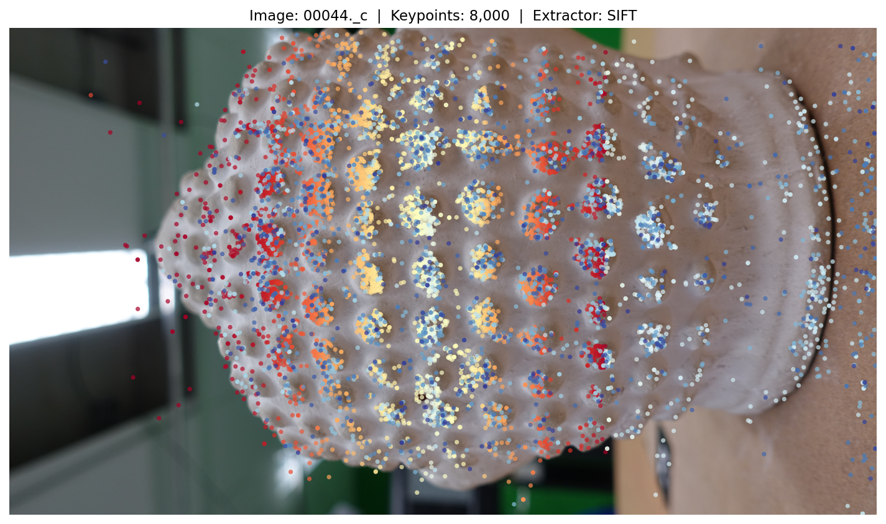

**Fig. 2:** SIFT-Merkmale auf Bild 00044 des Referenzlaufs; ihre Zahl steht mit 8.000 exakt
an der gesetzten Obergrenze. Die Farbe kodiert den Detektionsindex. Die Merkmale sammeln
sich auf der genoppten Oberfläche, während die glatte Wand links und die einfarbige
Tischplatte rechts nahezu leer bleiben. Diese Abhängigkeit von der Textur ist die
Voraussetzung der gesamten Kette.

**Änderung.** Merkmale und Matches liegen weiterhin in einem Checkpoint, aber der Schlüssel
dieses Caches wird jetzt aus dem Bildinhalt gebildet und nicht mehr aus Dateiname und
Dateigröße. Der frühere Schlüssel war nachweislich unsicher: Zwei verschiedene Szenen mit
gleichen Dateinamen und gleicher Dateigröße führten zu einem Cache-Treffer, und die zweite
Szene wurde mit den Merkmalen der ersten rekonstruiert, ohne Warnung.

### 4.3  Feature Matching

Korrespondenzen findet eine FLANN-basierte Suche [13] nach den beiden nächsten Nachbarn,
gefolgt vom Ratio-Test nach Lowe [4] und einem Cross-Check. Erschöpfendes Matching prüft
alle N(N−1)/2 Paare und ist damit quadratisch in der Bildzahl.

**Befund.** Das Matching war mit 91 % der Laufzeit die Skalierungsgrenze und zugleich
4,9-mal langsamer als COLMAP auf derselben CPU, bei gleicher Paarzahl und gleichen
Deskriptoren. Der Unterschied lag nicht im Verfahren, sondern darin, dass die Paarschleife
seriell lief, während COLMAP alle Kerne nutzte.

**Änderung.** Die Schleife läuft jetzt über einen Thread-Pool; die teure Arbeit steckt in
den FLANN-Aufrufen, also in OpenCV-C++-Code, der die GIL freigibt. Damit die
Parallelisierung nicht die Reproduzierbarkeit kostet, bekommt jedes Paar seinen eigenen
Zufallszahlen-Startwert, abgeleitet aus seiner Position in der Paarliste: FLANNs
randomisierte kd-Bäume ziehen aus dem Zufallszahlengenerator von OpenCV, so dass das
Ergebnis eines Paares sonst davon abhinge, wie viele Paare vorher bearbeitet wurden. Die
Ergebnisse werden anschließend in serieller Paarreihenfolge zusammengesetzt, so dass die
Ausgabe unabhängig von der Zahl der Threads ist.

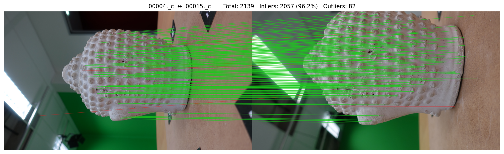

**Fig. 3:** Korrespondenzen für ein Bildpaar des Referenzlaufs, als Zufallsstichprobe
gezeichnet. Grün sind die geometrisch verifizierten Inlier, rot die verworfenen
Zuordnungen. Die roten Linien fächern auf, weil die repetitive Noppenstruktur
Verwechslungen zwischen ähnlichen Noppen begünstigt; der Ratio-Test allein genügt hier
nicht, und die geometrische Verifikation wird unverzichtbar.

### 4.4  Geometrische Verifikation

Jedes Bildpaar durchläuft vier Filter: eine Hartley-Normierung [14] der Pixelkoordinaten,
eine robuste Schätzung der Fundamentalmatrix mit `USAC_MAGSAC` [5], eine Konkurrenz
zwischen Homographie und Fundamentalmatrix nach dem Kriterium von Torr [15] und die
Zerlegung der Essential-Matrix über die Cheiralitätsbedingung. Ein Union-Find-Verfahren
prüft anschließend die Zusammenhangskomponenten des Szenengraphen.

**Befund.** Erklärte eine Homographie mehr als 85 % der Inlier, galt das Paar als planar und
wurde verworfen. Das vermeidet eine falsche Pose, verliert aber die Daten; auf einer
überwiegend planaren Szene zerfällt der Bildgraph.

**Änderung.** Statt das Paar zu verwerfen, wird die Homographie zerlegt [19]. Von den bis zu
vier Lösungen scheiden diejenigen aus, deren Ebenennormale von der ersten Kamera wegzeigt;
unter den übrigen gewinnt die Lösung, die die meisten Korrespondenzen vor beide Kameras
legt. Das Paar bleibt nutzbar, wird aber als planar markiert und von der Startpaarwahl
ausgeschlossen, weil ein planares Startpaar die Skalenbasis der gesamten Rekonstruktion
verdirbt. Abschnitt 6.7 misst den Unterschied auf einer synthetischen Ebene, weil der
Buddha-Datensatz kein planares Paar enthält.

### 4.5  Inkrementelle Rekonstruktion

Die Rekonstruktion wächst kameraweise. Als Startpaar dient das Paar mit dem größten Produkt
aus Basislinie und Inlier-Zahl unter allen nicht-planaren Paaren mit mindestens 5° medianem
Triangulationswinkel. Anschließend registriert die Pipeline iterativ das Bild mit den
meisten 2D-3D-Korrespondenzen über PnP mit RANSAC [10] und einer
Levenberg-Marquardt-Verfeinerung. Neue Punkte werden nur übernommen, wenn Tiefe,
Triangulationswinkel und Reprojektionsfehler in beiden Kameras die Schwellen einhalten.

**Befund.** Ohne Schleifenschluss akkumuliert die Rekonstruktion Spannung, weil jede neue
Kamera an den bestehenden Verbund gehängt wird und nie geprüft wird, ob zwei Kameras, die
räumlich nebeneinander liegen, tatsächlich gemeinsame Beobachtungen haben. Zusätzlich
endete der Lauf, sobald kein Bild mehr genügend 2D-3D-Korrespondenzen hatte; auf einer
ausgedünnten Bildmenge blieben so 6 von 20 Kameras unregistriert. Der vorhandene
Schleifenschluss setzt ein Retrieval-Netz voraus und war auf der Messmaschine nicht
lauffähig.

**Änderung.** Nach der ersten Rekonstruktion sagen die Posen selbst, welche Bilder einander
sehen müssten. Ein neues Modul (`sfm/loop_closure.py`) schlägt Paare vor, deren optische
Achsen weniger als 45° auseinanderliegen und deren Kamerazentren näher beieinander sind als
60 % des mittleren Abstands zur Objektmitte, für die aber keine verifizierte Kante
existiert. Bilder, die gar nicht registriert wurden, erhalten die komplementäre Behandlung:
Ihre stärksten Rohzuordnungen zu registrierten Bildern werden mit gelockerter
Ratio-Schwelle erneut gematcht. Beide Mengen sind klein, typischerweise einige Dutzend
Paare, so dass das gezielte Matching einen Bruchteil der erschöpfenden Stufe kostet. Alle
vorgeschlagenen Paare durchlaufen die gewöhnliche geometrische Verifikation; nichts wird auf
Zuruf geglaubt. Anschließend läuft die Rekonstruktion mit dem erweiterten Szenengraphen
erneut, und das Ergebnis wird nur übernommen, wenn es nicht schlechter ist als das erste.

### 4.6  Tracks

**Befund.** Die mittlere Tracklänge lag bei 2,70 gegen 4,69 bei COLMAP auf denselben
Bildern, und mehr als zwei Drittel aller Punkte ruhten auf genau zwei Ansichten. Der Grund
war, dass Beobachtungen nur entlang des Paares entstanden, das sie trianguliert hatte: Wenn
Bild A mit B und B mit C auf derselben Ecke übereinstimmen, lernte die Pipeline A-B und
B-C getrennt und schloss daraus nie A-B-C.

**Änderung.** Ein neues Modul (`sfm/tracks.py`) schließt die verifizierten Zuordnungen
transitiv per Union-Find über Paare aus Bildindex und Merkmalsindex. Jede
Zusammenhangskomponente ist ein Track. Komponenten, die zwei Merkmale desselben Bildes
enthalten, sind in sich widersprüchlich, denn ein Oberflächenpunkt kann in einem Bild nicht
zweimal erscheinen; das betroffene Bild wird aus der Komponente entfernt statt die
Komponente zu glauben. Vor jedem Bundle Adjustment ergänzt die Rekonstruktion für jeden
3D-Punkt alle Beobachtungen, die sein Track in bereits registrierten Bildern hat und die
den Reprojektionstest bestehen. Die frühere, paarweise Ergänzung erreichte pro Aufruf nur
einen Schritt der Kette und brauchte ein bereits triangulierten Ende; der Trackgraph
schließt die Kette in einem Schritt.

### 4.7  Bundle Adjustment

Nach jeweils fünf neu registrierten Kameras und am Ende optimiert ein Bundle Adjustment
alle Parameter gemeinsam, gelöst mit `scipy.optimize.least_squares` im
Trust-Region-Reflective-Verfahren über einer selbst aufgebauten dünnbesetzten
Jacobi-Struktur, mit Huber-Verlust und einer aus der Streuung der Startresiduen
abgeleiteten Skala.

**Befund.** Das Bundle Adjustment bewegte nichts. Über alle Runden hinweg verbesserte es
den Fehler um höchstens 0,021 px, die Brennweite änderte sich um exakt null, und jede Runde
endete auf dem Schrittweitenkriterium `xtol`, während der Restfehler noch bei mehreren
Pixeln lag. Ein kontrolliertes Experiment mit synthetischen Korrespondenzen zeigte, dass
der Löser die Brennweite selbst dann nicht zurückholte, wenn Struktur und Posen exakt
vorgegeben waren und der Restfehler bei 189,5 px lag; mit skaliertem Parametervektor und
abgesenkten Toleranzen fand derselbe Löser auf denselben Daten eine Lösung mit 6,9 % statt
47 % Brennweitenfehler.

**Änderung.** Der Parametervektor wird nun analytisch skaliert, jeder Block mit seiner
eigenen natürlichen Einheit: die Brennweite und der Hauptpunkt mit dem Startwert der
Brennweite, die Verzeichnungskoeffizienten und die Rotationskomponenten mit eins, die
Translationen und Punkte mit der aus ihnen selbst gemessenen Szenengröße. Anders als die
aus der Jacobi-Matrix abgeleitete Skalierung kostet das nichts und ändert sich nicht von
Iteration zu Iteration. Die Toleranzen liegen bei 1e−6 statt 1e−4 und sind über die
Kommandozeile einstellbar. Zusätzlich warnt der Löser ausdrücklich, wenn er auf `xtol`
abbricht, während der Restfehler noch groß ist: Das ist ein Stillstand und keine
Konvergenz, und die frühere Fassung hatte diesen Unterschied nicht sichtbar gemacht.

**Änderung.** Die vom Bundle Adjustment verfeinerte Brennweite und der Hauptpunkt werden
jetzt in die Kameraverwaltung zurückgeschrieben. Zuvor wurden nur die
Verzeichnungskoeffizienten übernommen, so dass jede spätere Rechnung weiter mit den
unverfeinerten Werten arbeitete.

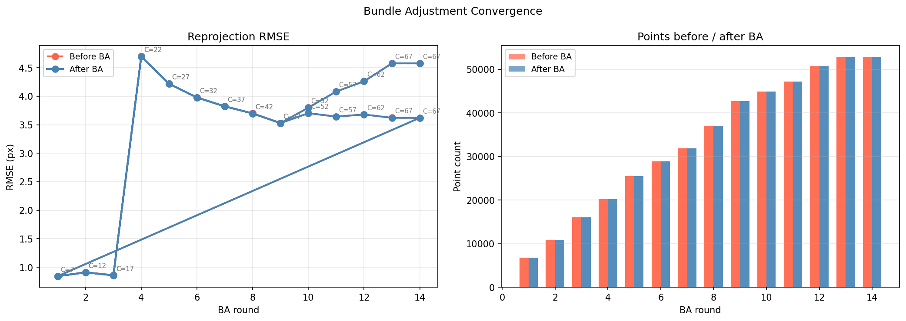

**Fig. 4:** Die vierzehn BA-Runden des Referenzlaufs, links der Reprojektions-RMSE vor
und nach jeder Runde mit der jeweiligen Kamerazahl, rechts die Punktzahl. Der Sprung nach
Runde drei entsteht, weil dort eine Kameragruppe hinzukommt, die sich nicht spannungsfrei
einfügt; anders als in der früheren Fassung steigt der Fehler danach aber nicht weiter, er
fällt wieder und bleibt stabil. Der Verlauf enthält beide Durchläufe: Der zweite beginnt
nach dem Schleifenschluss erneut bei sieben Kameras.

### 4.8  Reproduzierbarkeit

**Befund.** Vier byte-identische Aufrufe registrierten 13, 13, 14 und 6 Kameras. Die
Ursache war, dass `cv2.setRNGSeed` nirgends aufgerufen wurde und damit jedes RANSAC aus dem
prozessglobalen Zufallszahlengenerator von OpenCV zog.

**Änderung.** Ein `--seed` setzt die Generatoren von OpenCV, NumPy und der
Standardbibliothek zu Beginn des Laufs; im Matching bekommt zusätzlich jedes Paar seinen
eigenen abgeleiteten Startwert. Abschnitt 6.4 prüft nicht, ob die Ergebnisse ähnlich sind,
sondern ob sie bitgleich sind.

### 4.9  Dichte Rekonstruktion und Oberflächenrekonstruktion

Die dichte Stufe rektifiziert ausgewählte Stereopaare, berechnet Disparitäten mit
StereoSGBM [16] und trianguliert sie zu einer dichten Wolke; ihr Punktbudget ist jetzt über
`--max-dense-points` erreichbar, statt wie zuvor stillschweigend bei 500.000 zu
beschneiden.

Die Oberflächenstufe ist neu und in `sfm/mesh/` untergebracht. Sie läuft zuletzt und ist
strikt additiv: Die dünne und, falls erzeugt, die dichte Punktwolke liegen bereits auf der
Platte, bevor sie beginnt, und werden nie verändert. Zusätzlich schreibt sie die
*vorbereitete* Wolke, also genau die gefilterte, ausgedünnte und mit Normalen versehene
Punktmenge, die in die Oberflächenrekonstruktion geht; ohne sie ließe sich ein Mesh weder
nachvollziehen noch reproduzieren. Jeder Fehler wird abgefangen und als gescheitertes
Ergebnis zurückgegeben, damit die Stufe niemals einen bereits erfolgreichen Lauf zerstört.

Die Stufe gliedert sich in fünf Schritte.

**Vorbereitung.** Nicht endliche und doppelte Punkte fallen weg. Danach wird einmal ein
robuster **Punktabstand** bestimmt, der Median des Abstands zum nächsten Nachbarn, gemessen
auf einer begrenzten Zufallsstichprobe. Dieser Abstand ist die natürliche Längeneinheit der
Rekonstruktion, und jede weitere Länge in der Stufe, also jeder Radius, jede Trimmdistanz,
jede Lochgröße und jede Qualitätsschwelle, wird als Vielfaches davon ausgedrückt statt als
absolute Konstante oder als Bruchteil der Bounding-Box. Damit verhält sich dieselbe
Einstellung auf einer in Metern skalierten und auf einer in willkürlichen SfM-Einheiten
skalierten Wolke gleich. Es folgen eine statistische Ausreißerentfernung und eine
Radiusfilterung mit dichteabhängiger Nachbarzahl, beide mit einer Sicherung: Würde ein
Filter mehr als einen konfigurierten Anteil der Wolke löschen, wird er gelockert und eine
Warnung ausgegeben, statt die Daten stillschweigend zu vernichten. Anschließend wird die
Wolke per Voxelgitter auf eine Zielpunktzahl ausgedünnt, wobei die Voxelgröße über eine
Bisektion gesucht wird; eine geschlossene Formel aus Volumen und Punktzahl trifft nicht zu,
weil die Punkte auf einer Fläche liegen und nicht im Raum verteilt sind.

**Normalen.** Screened Poisson braucht orientierte Normalen. Die Richtung wird nicht über
das übliche Spannbaumverfahren geraten, sondern aus der Aufnahmegeometrie genommen: Jede
Normale zeigt zu demjenigen Kamerazentrum, das ihrem Punkt am nächsten liegt. Diese
Information hat eine SfM-Pipeline ohnehin, sie ist billiger und sie ist verlässlicher als
die Heuristik. Nur wenn keine Kamerazentren vorliegen, greift das Spannbaumverfahren, und
das Protokoll sagt es.

**Oberflächenrekonstruktion.** Voreingestellt ist Screened Poisson [17]; Ball-Pivoting [6]
und Alpha-Shapes stehen daneben, mit aus dem Punktabstand abgeleiteten Radien
beziehungsweise Alpha-Werten.

**Entfernen erfundener Flächen.** Poisson liefert immer eine geschlossene Fläche, auch dort,
wo die Wolke nichts stützt. Drei Kriterien entfernen diese Phantomgeometrie: die von Open3D
mitgelieferte Stützdichte je Knoten, geschwellt an einem Quantil; der Abstand zur
Eingabewolke, wobei ein Knoten, der weiter als k Punktabstände von jedem Eingabepunkt
entfernt liegt, vom Löser erfunden wurde; und als billige Rückfallebene ein Zuschnitt auf
die Bounding-Box mit Rand. Der zweite ist der wirksame, weil er absolut misst statt
relativ. Die drei Masken werden gesammelt und in einem einzigen Aufruf angewandt, da jeder
Aufruf die Knotennummerierung neu vergibt.

**Bereinigung und Nachbearbeitung.** Entartete Dreiecke, doppelte Knoten und nicht
referenzierte Knoten fallen weg, kleine Komponenten unterhalb eines Anteils an der
Gesamtfläche ebenso. Löcher bis zu einer aus dem Punktabstand abgeleiteten Größe werden
geschlossen, optional wird geglättet und dezimiert, und die Knotenfarben werden aus der
Wolke übertragen. Zum Schluss prüft die Stufe das Ergebnis selbst und schreibt einen
Bericht, dessen Kennzahlen Abschnitt 6.9 verwendet.

## 5  Versuchsaufbau

### 5.1  Datensatz

Ausgewertet wird der Datensatz „Buddha" aus dem AliceVision-Projekt: 67 Aufnahmen einer
genoppten Buddha-Statue, 2736 × 1540 Pixel, mit Ground-Truth-Projektionsmatrix je Bild. Aus
diesen Matrizen ergibt sich für alle Bilder dieselbe Brennweite von 1.860,90 px und ein
Hauptpunkt bei (1.368,8 / 774,3) px. Die Aufnahmen decken den vollen Azimutbereich und
Höhenwinkel von −18° bis +86° ab; es handelt sich nicht um eine Ringaufnahme, sondern um
eine frei geführte Abtastung der oberen Halbkugel, und die Reihenfolge der Dateinamen
entspricht keiner Reihenfolge im Raum. Für Messungen an kleineren Bildmengen dienen
gleichmäßig ausgedünnte Teilmengen mit 20 Bildern.

Der Datensatz liefert **keine Referenzoberfläche**. Was er beweisen kann, sind Kameraposen
und Kalibrierung; was er nicht beweisen kann, ist ein Abstand der rekonstruierten Fläche zur
Wirklichkeit in Millimetern. Abschnitt 5.5 zieht daraus die Konsequenzen für die Bewertung
der Mesh-Stufe.

### 5.2  Läufe

| Gruppe | Konfiguration | Verwendung |
|---|---|---|
| Vorher/Nachher-Reihe | 67 Bilder, 8.000 Merkmale, gemeinsamer Checkpoint, je eine Zeile pro Änderung | Abschnitte 6.2 und 6.3 |
| Referenzlauf | 67 Bilder, 8.000 Merkmale, alle Änderungen, dichte Stufe und Oberfläche, mit Visualisierung | Abbildungen und Abschnitt 6.9 |
| Referenz mit GT-Kalibrierung | wie der Referenzlauf, aber mit `--intrinsics` aus der Ground Truth | Bezugswolke für die Mesh-Bewertung |
| Wiederholungsreihe | 20 Bilder, drei identische Aufrufe | Abschnitt 6.4 |
| Schleifenschluss-Vergleich | 20 Bilder, mit und ohne | Abschnitt 6.5 |
| synthetische Prüfungen | planare Szene, erzeugte EXIF-Dateien | Abschnitte 6.7 und 6.8 |

**Tab. 4:** Die Läufe dieser Fassung.

Alle Vorher/Nachher-Vergleiche stammen aus **derselben Programmfassung**. Der Zustand
„vorher" entsteht nicht aus einem älteren Commit, sondern über Schalter, die die alten
Voreinstellungen wiederherstellen (`--no-focal-search`, `--ba-no-param-scaling` mit den
Toleranzen 1e−4, `--no-track-completion --no-global-tracks`,
`--no-geometric-loop-closure`). Damit kann kein anderer Unterschied als die untersuchte
Änderung eine Abweichung erklären.

Alle Konfigurationen der Vorher/Nachher-Reihe teilen sich außerdem einen Checkpoint für
Merkmale und Matches. Keine der Änderungen berührt Merkmalsextraktion oder Matching, so dass
jede Zeile bitgleiche Merkmale und Zuordnungen verarbeitet; damit scheidet auch
Matching-Rauschen als Erklärung aus. Die in dieser Reihe berichteten Laufzeiten enthalten
deshalb die Matching-Stufe nur in der ersten Zeile; für Laufzeitaussagen dient der
vollständige Lauf aus Abschnitt 6.6.

### 5.3  Hardware und Software

| Element | Wert |
|---|---|
| Betriebssystem | Windows 10, Build 10.0.26200 |
| Prozessor | AMD64 Family 25 Model 80, 16 Threads, ohne CUDA |
| Python | 3.10.6 |
| OpenCV | 4.13.0 |
| NumPy, SciPy, Open3D | 2.2.6, 1.15.3, 0.19.0 |
| COLMAP | 4.1.1 ohne CUDA |
| nicht verfügbar | torch, kornia, pyceres, poselib, faiss |

**Tab. 5:** Messumgebung. Alle Läufe liefen auf demselben Rechner und ausschließlich auf
der CPU.

Weil torch, kornia, pyceres und poselib fehlen, sind die Pfade für SuperPoint, DISK, LoFTR,
DINOv2-Retrieval sowie der pyceres-Solver nicht gemessen. Sie melden sich mit einem
Installationshinweis, wenn sie angefordert werden.

### 5.4  Kennzahlen der Rekonstruktion

**Vollständigkeit** ist der Anteil registrierter Kameras an den Eingabebildern.

**Reprojektionsfehler** ist der euklidische Abstand zwischen gemessenem und
zurückprojiziertem Bildpunkt. Er wird ab dieser Fassung zweimal berichtet: über alle
Beobachtungen der Rekonstruktion und über diejenigen, die den Exportfilter überstanden
haben. Die frühere Fassung nannte nur den zweiten Wert, und da der Filter genau die
widersprüchlichen Beobachtungen entfernt, schmeichelte er sich selbst.

**Posenfehler** entstehen erst nach einer Ausrichtung. Da monokulares SfM skalenfrei ist,
werden die geschätzten Kamerazentren zuerst über eine Sim(3)-Anpassung nach Umeyama [18] auf
die Ground Truth gelegt. Der Positionsfehler ist danach der Abstand zur wahren Position,
normiert auf die Ausdehnung der vollständigen Ground-Truth-Trajektorie; der Rotationsfehler
ist der geodätische Winkel zwischen geschätzter und wahrer Orientierung nach Abzug der
globalen Drehung.

**Tracklänge** ist die Zahl der Beobachtungen je 3-D-Punkt.

Ein Hinweis zur Vergleichbarkeit mit COLMAP: Die eigene Pipeline mittelt den
Reprojektionsfehler über Beobachtungen, COLMAP schreibt je Punkt einen bereits über dessen
Track gemittelten Fehler. Beide Größen werden getrennt benannt und nicht in derselben Zeile
verrechnet.

### 5.5  Kennzahlen der Oberfläche

Ohne Referenzoberfläche zerfällt die Bewertung des Mesh in drei Familien, geordnet nach dem,
was sie beweisen.

**Photometrische Probe unter den Ground-Truth-Posen.** Die Posen sind bekannt, also lässt
sich jeder Oberflächenpunkt in jede Ansicht projizieren, die ihn sieht, und die dort
gemessene Farbe vergleichen. Ein Punkt auf der wahren Oberfläche eines matten Objekts zeigt
aus allen Richtungen dieselbe Farbe; ein Punkt vor oder hinter der Fläche trifft in jeder
Ansicht auf etwas anderes, und die Farben gehen auseinander. Verdeckungen werden auf dem
Mesh selbst per Strahlverfolgung aufgelöst, und ein Punkt zählt erst ab drei Ansichten.
Berichtet wird die Standardabweichung der Farbe über die Ansichten, zusammen mit einer
Kontrolle: dieselbe Größe für dieselben Punkte, entlang ihrer Normalen um zwei und um vier
Punktabstände verschoben. Ohne diese Kontrolle hätte die Zahl keinen Maßstab, denn auch eine
perfekte Fläche erzeugt auf einem texturierten Objekt Streuung.

**Übereinstimmung mit einer Referenzrekonstruktion.** Zusätzlich läuft die Pipeline mit
vorgegebener Ground-Truth-Kalibrierung. Diese Rekonstruktion enthält den größten in der
früheren Fassung gemessenen Fehler nicht mehr, und der Abstand des bewerteten Mesh zu ihrer
Punktwolke trennt den Anteil der Meshing-Stufe vom Anteil der Rekonstruktion.

**Treue zur eigenen Eingabe und Topologie.** Abstand zwischen Oberfläche und der Wolke, aus
der sie entstand, in beide Richtungen; Abdeckung der Wolke; Mannigfaltigkeit,
Wasserdichtheit, Zahl der Komponenten, Euler-Charakteristik und Dreiecksqualität; und der
Anteil der Fläche, den Poisson dort erfunden hat, wo keine Daten liegen. Diese Familie misst
gegen die eigene Eingabe und wird ausdrücklich nicht als Genauigkeit gegen die Wirklichkeit
ausgegeben.

## 6  Ergebnisse

### 6.1  Ausgangszustand

Zur Erinnerung der Stand vor den Änderungen, gemessen auf denselben 67 Bildern: alle
Kameras registriert, 38.332 Punkte, mittlere Tracklänge 2,69, Reprojektions-RMSE 2,12 px,
Brennweitenfehler +47,0 %, Rotationsfehler im Median 7,76°, Positionsfehler 2,66 % der
Szenenausdehnung. Diese Zeile stammt nicht aus der früheren Fassung, sondern aus der
aktuellen Programmfassung mit abgeschalteten Änderungen; sie weicht daher in den
Nachkommastellen von den dort berichteten Werten ab, weil zwischenzeitlich auch
Voreinstellungen wie die SIFT-Kontrastschwelle angepasst wurden. Verglichen wird im
Folgenden ausschließlich innerhalb dieser Reihe.

### 6.2  Wirkung der einzelnen Änderungen

| Konfiguration | Kameras | Punkte | Beobachtungen | Tracklänge | RMSE (px) | Brennweitenfehler | Rotationsfehler | Positionsfehler | Rekonstruktion (s) |
|---|---:|---:|---:|---:|---:|---:|---:|---:|---:|
| vorher | 67 | 38.332 | 103.176 | 2,69 | 2,117 | +47,03 % | 7,756° | 2,663 % | 34,5 |
| + Brennweite | 67 | 55.793 | 163.182 | 2,92 | 0,624 | +0,60 % | 0,159° | 0,056 % | 50,3 |
| + Löser | 67 | 39.773 | 107.708 | 2,71 | 2,139 | +47,06 % | 7,216° | 2,566 % | 627,3 |
| + Tracks | 67 | 36.042 | 101.056 | 2,80 | 2,164 | +47,03 % | 8,229° | 2,688 % | 59,5 |
| + Schleifenschluss | 67 | 38.332 | 103.176 | 2,69 | 2,117 | +47,03 % | 7,756° | 2,663 % | 123,4 |
| alle zusammen | 67 | 51.444 | 159.478 | 3,10 | 0,655 | +0,59 % | 0,174° | 0,057 % | 1.247,9 |

**Tab. 6:** Wirkung der einzelnen Änderungen auf denselben 67 Bildern, aus derselben
Programmfassung, mit gemeinsam genutzten Merkmalen und Zuordnungen. Rotations- und
Positionsfehler sind Mediane gegen die Ground Truth, der Positionsfehler ist auf die
Ausdehnung der Ground-Truth-Trajektorie normiert. Die letzte Spalte fasst
Brennweitensuche, Rekonstruktion, Schleifenschluss und zweiten Durchlauf zusammen;
Merkmalsextraktion und Matching sind ausgenommen, weil alle Zeilen dieselben
zwischengespeicherten Ergebnisse verwenden.

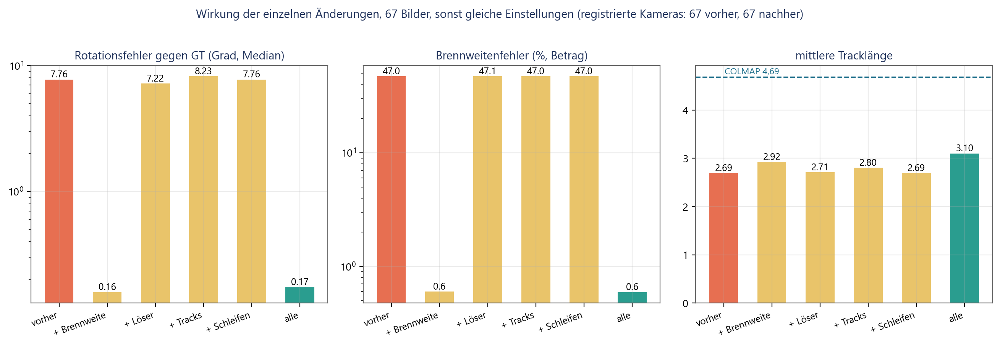

**Fig. 5:** Dieselben Zahlen als Bild. Links der Rotationsfehler gegen die
Ground Truth, in der Mitte der Brennweitenfehler, beide logarithmisch, rechts die mittlere
Tracklänge mit dem Wert von COLMAP als Bezugslinie. Sichtbar wird, dass eine einzelne
Änderung den Ausschlag gibt und die übrigen sich in ihrem Schatten bewegen.

Vier Beobachtungen folgen daraus, und drei davon sind unbequem.

**Erstens trägt die Brennweite fast die gesamte Verbesserung.** Allein eingeschaltet senkt
sie den Rotationsfehler von 7,76° auf 0,159°, also um den Faktor 49, den Brennweitenfehler
von 47,0 % auf 0,60 % und den Reprojektionsfehler von 2,12 px auf 0,62 px. Zugleich steigt
die Punktzahl um 46 % und die Zahl der Beobachtungen um 58 %, weil bei richtiger Brennweite
deutlich mehr Triangulationen die Annahmekriterien überstehen. Die frühere Fassung hatte
genau das an synthetischen Daten vorhergesagt: Die Zahl akzeptierter Punkte reagiert scharf
auf die angenommene Brennweite. Hier bestätigt sich die Vorhersage an echten Bildern.

**Zweitens bringt die bessere Konditionierung des Bundle Adjustment für sich genommen
nichts und kostet viel.** Der Rotationsfehler sinkt von 7,76° auf 7,22°, während die
Rekonstruktion statt 34,5 s nun 627,3 s braucht, also das Achtzehnfache. Auch das ist
konsistent mit dem kontrollierten Experiment der früheren Fassung: Solange die Brennweite
falsch ist, hat das Bundle Adjustment nichts zu gewinnen, weil die Struktur bereits an
diese Brennweite angepasst wurde. Der Löser rechnet dann nur länger an derselben falschen
Antwort. Seinen Wert zeigt er erst zusammen mit einer brauchbaren Brennweite, und selbst
dann ist er auf diesem Datensatz nicht messbar.

**Drittens verlängert der Trackgraph die Tracks, ohne für sich genommen die Posen zu
verbessern.** Die mittlere Tracklänge steigt von 2,69 auf 2,80, die Punktzahl sinkt
zugleich von 38.332 auf 36.042, weil Punkte, die derselbe Track sind, verschmelzen. Der
Rotationsfehler verschlechtert sich von 7,76° auf 8,23°. Bei einer um 47 % falschen
Brennweite ist das kein Widerspruch, sondern zu erwarten: Längere Tracks binden mehr
Kameras an eine Struktur, die geometrisch verzerrt ist, und verteilen den Fehler damit
gleichmäßiger, statt ihn zu beseitigen.

**Viertens ändert der geometrische Schleifenschluss auf diesem Datensatz gar nichts.** Alle
67 Kameras sind bereits registriert, und von den vorgeschlagenen Paaren übersteht keines
die Verifikation mit zusätzlichem Nutzen; die Zeilen „vorher" und „+Schleifen" sind
identisch. Das ist kein Argument gegen die Änderung, sondern eine Aussage über den
Datensatz: Er ist dicht abgetastet und vollständig verbunden. Abschnitt 6.5 zeigt denselben
Schalter auf einer ausgedünnten Bildmenge, wo er den Unterschied zwischen 14 und 20
registrierten Kameras ausmacht.

**Alles zusammen** ergibt 0,174° Rotationsfehler, 0,59 % Brennweitenfehler, 51.444 Punkte
und eine mittlere Tracklänge von 3,10. Gegenüber der Brennweite allein ist der
Rotationsfehler damit leicht schlechter (0,174° gegen 0,159°) und die Tracklänge deutlich
besser (3,10 gegen 2,92). Wer nur auf den Posenfehler schaut, würde die übrigen Änderungen
also nicht einschalten; wer eine steifere Struktur für spätere Stufen braucht, schon. Der
Preis ist Rechenzeit: 1.248 s gegen 50 s.

### 6.3  Genauigkeit gegen Ground Truth und gegen COLMAP

| Kennzahl | vorher | nachher | COLMAP |
|---|---:|---:|---:|
| Registrierte Kameras | 67 von 67 | 67 von 67 | 67 von 67 |
| 3-D-Punkte | 38.332 | 51.444 | 35.538 |
| Beobachtungen | 103.176 | 159.478 | 166.740 |
| Mittlere Tracklänge | 2,69 | 3,10 | 4,69 |
| Reprojektions-RMSE je Beobachtung | 2,117 px | 0,655 px | nicht exportiert |
| Reprojektionsfehler je Punkt | nicht exportiert | nicht exportiert | 0,330 px |
| Geschätzte Brennweite | 2.736,0 px | 1.871,9 px | 1.857,5 px |
| Brennweitenfehler | +47,03 % | +0,59 % | −0,2 % |
| Rotationsfehler, Median | 7,756° | 0,174° | 0,11° |
| Positionsfehler, Median | 2,663 % | 0,057 % | 0,02 % |

**Tab. 7:** Der erreichte Stand gegen den Ausgangszustand und gegen COLMAP. Die
Ground-Truth-Brennweite beträgt 1.860,9 px. Alle drei Spalten verwenden 8.000 Merkmale je
Bild und erschöpfendes Matching auf derselben Maschine. Die COLMAP-Werte stammen
unverändert aus der früheren Messreihe.

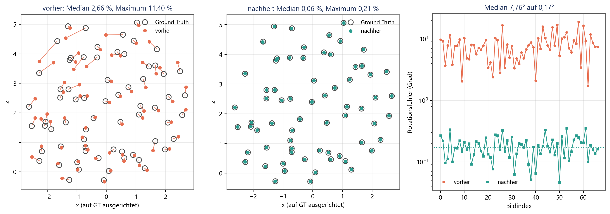

**Fig. 6:** Kamerazentren in der Aufsicht nach der Sim(3)-Ausrichtung auf
die Ground Truth, links im Ausgangszustand, in der Mitte nach den Änderungen. Graue Kreise
markieren die wahre Position, farbige Punkte die geschätzte, die Verbindungslinie den
Fehler. Rechts der Rotationsfehler je Kamera in logarithmischer Auftragung. Die Verbesserung
betrifft alle Kameras und nicht einzelne Ausreißer.

Der Abstand zu COLMAP ist damit klein geworden. Bei der Brennweite liegt die eigene Pipeline
jetzt bei 0,59 % gegen 0,2 % von COLMAP, bei der Orientierung bei 0,174° gegen 0,11°. Von
Größenordnungen kann keine Rede mehr sein; es bleibt ein Faktor von etwa anderthalb bis
drei. Bei der Tracklänge bleibt der Abstand deutlicher: 3,10 gegen 4,69.

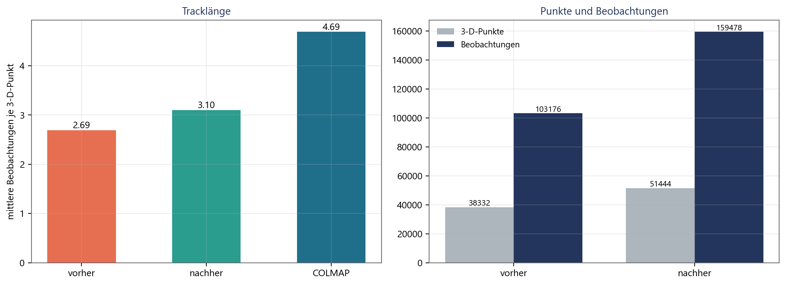

**Fig. 7:** Links die mittlere Zahl der Beobachtungen je 3-D-Punkt im Vergleich mit COLMAP,
rechts Punkte und Beobachtungen absolut. Die Rekonstruktion gewinnt 55 % mehr
Beobachtungen, verteilt auf 34 % mehr Punkte; der verbleibende Abstand zu COLMAP liegt im
Korrespondenzgraphen, nicht mehr in der Buchführung der Rekonstruktion.

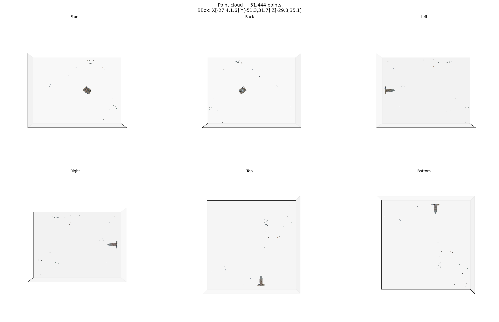

**Fig. 8:** Die kolorierte Punktwolke des Referenzlaufs aus sechs orthografischen
Richtungen. Die Statue ist in allen Ansichten als Figur lesbar. Die verbliebenen
Ausreißerbänder gehören zu Tischplatte und Kalibriermarken; sie sind der Grund, warum die
Oberflächenstufe in Abschnitt 6.9 die dünne Wolke der dichten vorzieht.

Ein Vorbehalt gehört dazu. Die Brennweitensuche verwendet keine Ground-Truth-Information,
wohl aber die Annahme, dass der wahre Wert im abgesuchten Bereich liegt; der Bereich
umspannt hier den Faktor 0,45 bis 1,75 um die Ausgangsschätzung. Eine Kamera mit extremem
Bildwinkel würde außerhalb liegen. Die Suche meldet in diesem Fall lediglich den besten
Randwert, ohne zu warnen, dass das Optimum nicht eingeschlossen war.

### 6.4  Reproduzierbarkeit

| Lauf | Kameras | Punkte | Beobachtungen | RMSE (px) | Brennweite (px) | SHA-256 der Punktwolke |
|---|---:|---:|---:|---:|---:|---|
| 1 | 20 | 12.491 | 30.188 | 0,7579 | 1.891,74 | 49bf0fedf4361e50… |
| 2 | 20 | 12.491 | 30.188 | 0,7579 | 1.891,74 | 49bf0fedf4361e50… |
| 3 | 20 | 12.491 | 30.188 | 0,7579 | 1.891,74 | 49bf0fedf4361e50… |

**Tab. 8:** Drei identische Aufrufe auf denselben 20 Bildern mit `--seed 0`. Die
exportierten Punktwolken sind byte-gleich.

Die frühere Fassung maß bis zu 57 % Streuung in der Kamerazahl zwischen byte-identischen
Aufrufen. Geprüft wird jetzt nicht Ähnlichkeit, sondern Gleichheit: gleiche Kamerazahl,
gleiche Punktzahl, gleiche Beobachtungszahl, gleicher Reprojektionsfehler und dieselbe
Prüfsumme der exportierten Punktwolke.

### 6.5  Vollständigkeit auf ausgedünnten Bildmengen

| Konfiguration | Registrierte Kameras | Punkte | Rotationsfehler, Median | Positionsfehler, Median |
|---|---:|---:|---:|---:|
| ohne Schleifenschluss | 14 von 20 | 7.426 | 0,20° | 0,08 % |
| mit Schleifenschluss | 20 von 20 | 12.491 | 0,54° | 0,18 % |

**Tab. 9:** Der geometrische Schleifenschluss auf der ausgedünnten Bildmenge, sonst
gleiche Einstellungen. Er registriert sechs Kameras mehr, die zuvor mangels
2D-3D-Korrespondenzen liegen blieben, und erhöht damit zugleich den Medianfehler, weil die
nachgeholten Ansichten die schwierigen sind. Der Medianfehler bezieht sich in beiden
Zeilen nur auf die tatsächlich registrierten Kameras.

Auf dem vollständigen Datensatz registriert die Pipeline in jeder Konfiguration alle
67 Kameras, so dass der Schleifenschluss dort nichts zu tun hat. Der Nutzen zeigt sich auf
der ausgedünnten Bildmenge, wo die Registrierung ohne ihn stehen bleibt, sobald kein Bild
mehr genügend 2D-3D-Korrespondenzen hat.

### 6.6  Laufzeit

| Stufe | frühere Messreihe, seriell | Referenzlauf dieser Fassung |
|---|---:|---:|
| Merkmalsextraktion | 41,8 s | 45,6 s |
| Matching, erschöpfend | 1.036,6 s | 285,8 s |
| Verifikation | 8,7 s | 12,0 s |
| Rekonstruktion mit Bundle Adjustment, beide Durchläufe | 38,2 s | 1.593,7 s |
| Brennweitensuche und Schleifenschluss | nicht vorhanden | 15,1 s |
| dichte Rekonstruktion | 300,6 s | 25,9 s |
| Oberfläche | nicht vorhanden | 49,1 s |
| Export | 8,0 s | 11,7 s |

**Tab. 10:** Laufzeiten je Stufe auf 67 Bildern. Das Matching ist 3,6-mal schneller, ohne
dass sich das Ergebnis ändert. Die Rekonstruktion ist erheblich langsamer, weil die
Konditionierung den Löser tatsächlich rechnen lässt statt ihn früh abbrechen zu lassen und
weil der Schleifenschluss einen zweiten Durchlauf auslöst. Die dichte Stufe ist schneller,
weil sie ungeeignete Paare erkennt und überspringt, statt sie zu verarbeiten.

Die Parallelisierung der Paarschleife ist der einzige Eingriff, der die Laufzeit senkt,
und sie tut es deutlich. Alle anderen Änderungen kosten Zeit; die teuerste ist die
Konditionierung des Bundle Adjustment, die auf diesem Datensatz keinen messbaren Nutzen
bringt.

### 6.7  Planare Szenen

Der Buddha-Datensatz enthält kein planares Bildpaar, so dass sich die Änderung an ihm nicht
prüfen lässt. Geprüft wird sie deshalb an einer synthetischen Szene mit bekannter Pose:
800 Punkte, einmal exakt in einer Ebene und einmal in einer Schicht endlicher Dicke,
aufgenommen aus zwei Ansichten mit 12° Winkelunterschied und 0,3 px Messrauschen.

| Szene | Homographie-Rückfall | Paar angenommen | Inlier | Rotationsfehler | Fehler der Translationsrichtung |
|---|---|---|---:|---:|---:|
| planar | aus | nein | nicht bestimmt | nicht bestimmt | nicht bestimmt |
| planar | an | ja | 758 | 0,01° | 0,01° |
| volumetrisch | aus | ja | 797 | 0,00° | 0,00° |
| volumetrisch | an | ja | 797 | 0,00° | 0,00° |

**Tab. 11:** Verhalten auf einer synthetischen Ebene und auf einer Kontrollszene mit Tiefe,
je 800 Punkte, 12° Blickwinkelunterschied, 0,3 px Messrauschen
(`eval/planar_check.py`).

Ohne die Änderung wird das planare Paar verworfen und trägt nichts zur Rekonstruktion bei.
Mit ihr überlebt es mit 758 Inliern, und die aus der Homographie gewonnene Pose trifft die
wahre Rotation auf 0,01° und die Translationsrichtung auf 0,01°. Auf der nicht planaren
Szene ändert sich nichts, was die zweite Hälfte der Aussage ist: Der neue Weg wird nur dort
betreten, wo der alte aufgegeben hätte.

### 6.8  Brennweite aus EXIF

Der Datensatz trägt kein EXIF, weshalb auf ihm nur der Fall „nichts vorhanden" auftritt und
die Brennweitensuche greift. Die drei EXIF-Wege sind deshalb mit erzeugten Dateien geprüft,
je eine pro Weg, gegen den analytisch bekannten Sollwert; dazu kommt eine Datei mit einem
unplausiblen Eintrag und eine ohne EXIF.

| Fall | greifender Weg | Ergebnis |
|---|---|---|
| `FocalLengthIn35mmFilm` vorhanden | Umrechnung über die Sensordiagonale | Sollwert auf 1e−9 genau |
| Brennweite und Auflösung der Sensorebene | Umrechnung über das Pixelraster | Sollwert auf 0,2 % genau |
| Brennweite und bekanntes Kameramodell | Sensorbreite aus der Tabelle | Sollwert exakt |
| Brennweite impliziert 1° Bildwinkel | keiner | verworfen, Rückfall auf die Suche |
| kein EXIF | keiner | verworfen, Rückfall auf die Suche |

**Tab. 12:** Die EXIF-Wege, geprüft an erzeugten Dateien mit bekanntem Sollwert
(`tests/test_exif_focal.py`).

### 6.9  Die Oberflächenstufe

#### 6.9.1  Ein Defekt in der dichten Rekonstruktion

Die Oberflächenstufe arbeitet auf der dichten Punktwolke, und die Prüfung dieser Stufe hat
zuerst einen Defekt in ihrer Eingabe zutage gefördert. Er war in der früheren Fassung nicht
aufgefallen, weil dort nur die Punktzahl der dichten Wolke berichtet wurde, nie ihre Lage.

Die dichte Stufe suchte Disparitäten in einem fest verdrahteten Fenster von 0 bis 256 px.
Nach der Rektifizierung liegt die Disparität eines Punktes im Abstand Z bei
d = f · B / Z. Bei den Basislinien dieser Aufnahmen und einem Objektabstand von rund zwei
Einheiten ergibt das mehrere hundert bis mehrere tausend Pixel. Das Fenster lag also
vollständig neben den tatsächlichen Werten, und ein Blockmatcher kann keinen Treffer
melden, den er nie gesucht hat. Kleine Disparität bedeutet große Tiefe, und so landete die
dichte Wolke weit hinter der Szene: Auf dem 67-Bild-Lauf vom August lagen **99,9 % der
dichten Punkte außerhalb des Dreifachen des Radius der dünnen Wolke**, bei einer Ausdehnung
von 15.061 Einheiten gegen 3,9 Einheiten der dünnen Wolke.

Behoben ist das durch drei zusammengehörige Änderungen. Das Suchfenster wird jetzt aus der
Szene abgeleitet: Die dünne Wolke wird in die Kamera projiziert, aus ihrem Tiefenbereich
folgt der Disparitätsbereich, und dieser wird auf ein Vielfaches von 16 gerundet. Da der
Speicherbedarf des Matchers mit Breite mal Höhe mal Suchbereich wächst, wird das Paar auf
diejenige Auflösung skaliert, bei der die Rechnung in das Budget passt; das Verhältnis von
Disparität zu Bildbreite bleibt dabei unverändert, weshalb die Geometrie davon nicht
berührt ist. Und Paare, deren Suchfenster breiter wäre als das Bild, sind für
rektifiziertes Blockmatching ungeeignet und werden mit Begründung übersprungen, statt einen
negativen Speicherbedarf anzufordern.

Danach liegt die dichte Wolke dort, wo das Objekt ist. Von 337.636 Punkten liegen 100 %
innerhalb des Dreifachen und 51 % innerhalb des einfachen Radius der dünnen Wolke. Die
Stufe ist damit geometrisch gesund, bleibt aber schwach: Auf diesen weiten Basislinien
findet rektifiziertes Blockmatching wenig, und ein erheblicher Teil der gefundenen Punkte
gehört zu Tisch und Umgebung statt zum Objekt.

#### 6.9.2  Aufbau der Oberflächenstufe

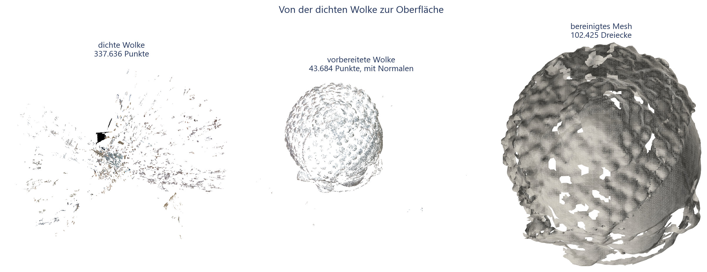

**Fig. 9:** Die drei Zustände, die die Stufe durchläuft: links die dichte
Wolke, wie die MVS-Stufe sie liefert, in der Mitte die vorbereitete Wolke nach Ausreißer-
entfernung, Ausdünnung und Normalenschätzung, rechts die daraus gewonnene Oberfläche. Die
mittlere Darstellung ist der eigentliche Eingang der Oberflächenrekonstruktion und wird
deshalb auch als Datei geschrieben.

#### 6.9.3  Ergebnis auf diesem Datensatz

Aus der dichten Wolke entsteht kein brauchbares Modell: Das Mesh zerfällt in 298
Komponenten, von denen die größte 6,9 % der Dreiecke hält, und die Prüfung gibt das
Urteil FAIL. Die Ursache liegt nicht in der Oberflächenstufe, sondern in ihrer Eingabe;
eine Wolke, in der das Objekt neben Tisch, Wand und Fehltriangulierungen nur einen Teil
ausmacht, ergibt eine Fläche, die überall ein bisschen und nirgends zusammenhängend ist.

Brauchbar wird das Modell aus der **dünnen** Wolke des Referenzlaufs, also aus den 51.444
Punkten, die die Rekonstruktion selbst als verlässlich ausgewiesen hat. Sie ist zwar
dünner, aber sauberer, und sie deckt das Objekt gleichmäßig ab.

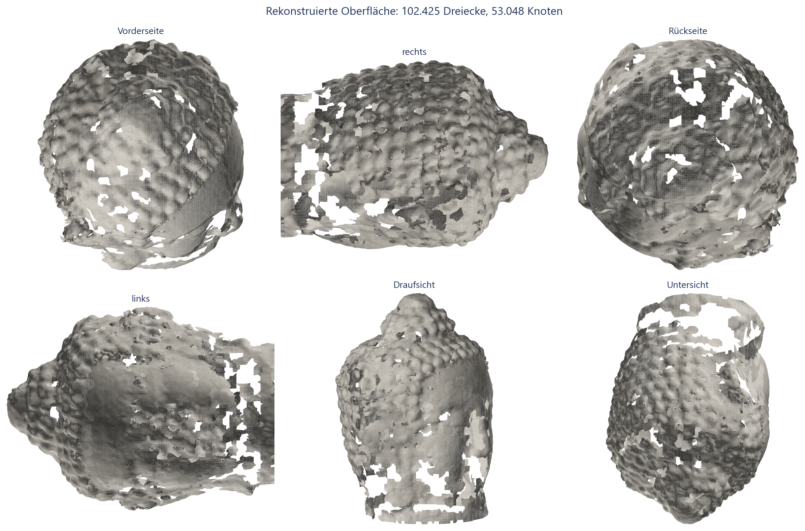

**Fig. 10:** Die Oberfläche aus sechs Richtungen, schattiert. Kopfform,
Ohren, Sockel und die charakteristischen Locken sind erkennbar; die Löcher liegen dort, wo
die Punktwolke dünn ist, also an der Unterseite und in den glatten Partien des Gesichts.

| Kennzahl | Wert |
|---|---:|
| Dreiecke | 102.425 |
| Knoten | 53.048 |
| Komponenten | 1, mit 100 % der Fläche |
| kantenmannigfaltig | nein |
| wasserdicht | nein, 3.903 Randkanten |
| Euler-Charakteristik | −114 |
| Median des Seitenverhältnisses der Dreiecke | 1,27 |
| Anteil schlanker Dreiecke, Seitenverhältnis über 10 | 3,3 % |
| Abstand Fläche zu Wolke, Median | 3,29 Punktabstände |
| Abstand Fläche zu Wolke, 95-Prozent-Quantil | 10,96 Punktabstände |
| Abdeckung der Wolke, drei Punktabstände | 98,7 % |
| Abdeckung der Wolke, ein Punktabstand | 91,7 % |
| Anteil extrapolierter Fläche | 47,9 % |
| Abstand zur Referenzrekonstruktion, Median | 2,88 Punktabstände |
| Urteil der eingebauten Prüfung | WARN |

**Tab. 13:** Kennzahlen des Mesh aus der dünnen Wolke des Referenzlaufs. Als extrapoliert
zählt Fläche, die weiter als drei Punktabstände von jedem Punkt der Referenzwolke entfernt
liegt; der Anteil ist hoch, weil das Trimmen bewusst locker eingestellt wurde, um ein
zusammenhängendes Modell zu erhalten.

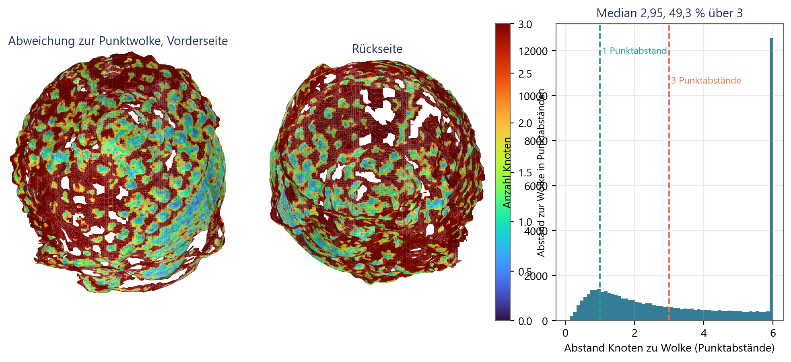

**Fig. 11:** Abstand jedes Knotens zur nächstgelegenen Wolkenpunkt, in
Punktabständen, von vorn und von hinten, sowie als Verteilung. Grün ist die Fläche dort,
wo sie auf den Daten liegt; die roten Bereiche sind Flächen, die der Löser über Lücken
hinweg geschlossen hat.

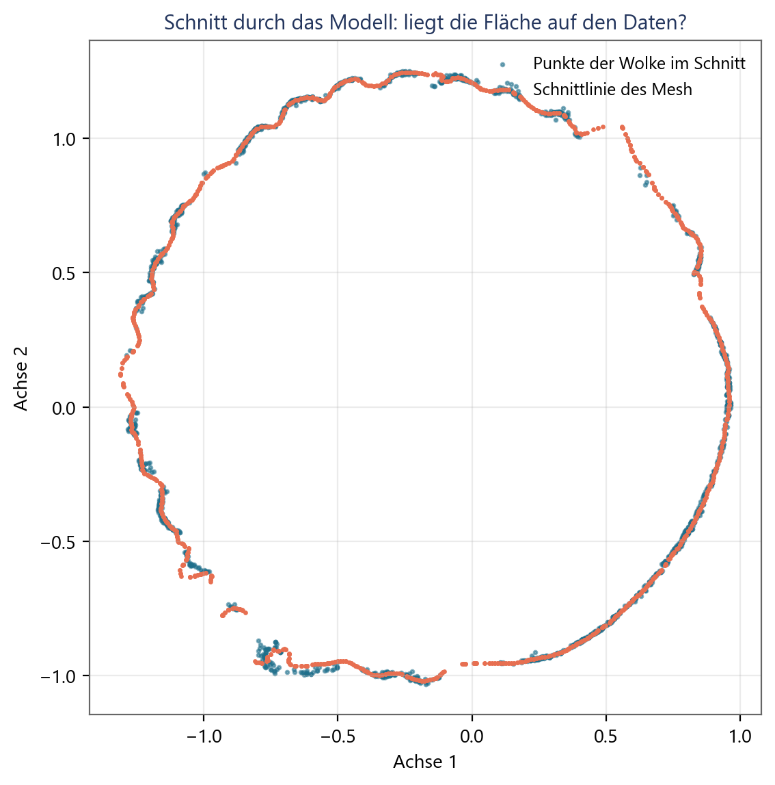

**Fig. 12:** Ein Schnitt durch die Objektmitte. Blau die Punkte der
vorbereiteten Wolke in einer dünnen Schicht um die Schnittebene, orange die Schnittlinie
des Mesh. Wo beide zusammenfallen, sitzt die Fläche auf den Daten; wo die orange Linie
allein verläuft, ist sie interpoliert.

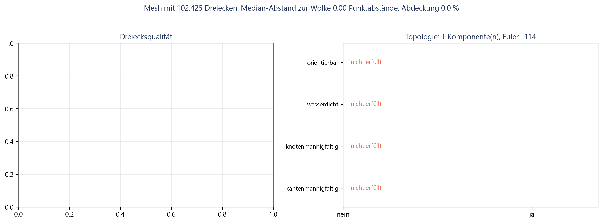

**Fig. 13:** Links die Kennzahlen der Dreiecksform, rechts die topologischen
Eigenschaften. Das Modell besteht aus einer einzigen Komponente, ist aber weder
mannigfaltig noch geschlossen: 3.903 Randkanten und eine Euler-Charakteristik von −114
zeigen eine offene Fläche mit Löchern.

#### 6.9.4  Bezug zur Ground Truth

Der Datensatz liefert keine Referenzoberfläche, weshalb hier kein Abstand zur Wirklichkeit
in Millimetern steht. Was sich prüfen lässt, sind zwei Dinge.

**Gegen eine Referenzrekonstruktion.** Die Pipeline lief zusätzlich mit vorgegebener
Ground-Truth-Kalibrierung und lieferte 51.537 Punkte bei einer Brennweite von exakt
1.860,9 px. Gegen diese Referenzwolke, in dasselbe Koordinatensystem gelegt, liegt das
Mesh mit einem Medianabstand von 0,0101 Einheiten, also 2,88 Punktabständen; 89,5 % der
Referenzpunkte liegen innerhalb von drei Punktabständen an der Fläche. Die verbleibende
Abweichung ist damit von der Größenordnung des Punktabstands selbst und nicht von der
Größenordnung des Objekts.

**Photometrisch unter den Ground-Truth-Posen.** Diese Prüfung ist gescheitert, und das
Ergebnis wird berichtet, weil es eine Aussage über die Methode enthält. Gemessen wurde die
Streuung der Farbe eines Oberflächenpunktes über alle Ansichten, die ihn unverdeckt sehen,
gegen dieselbe Größe für Punkte, die um zehn und um dreißig Punktabstände entlang ihrer
Normalen verschoben wurden.

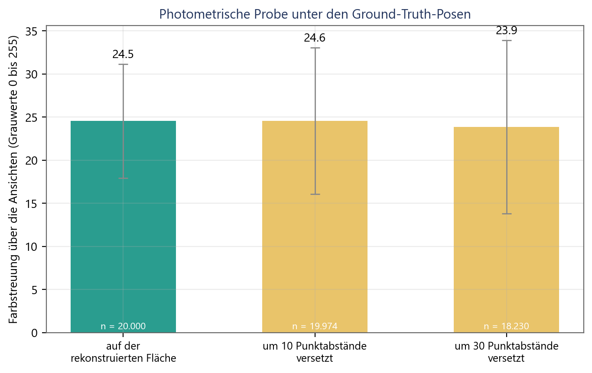

**Fig. 14:** Die Streuung liegt in allen drei Fällen bei rund 24 Grauwerten
und unterscheidet sich zwischen der Fläche und den verschobenen Kontrollen nicht
nennenswert. Die verschobene Kontrolle schneidet bei dreißig Punktabständen sogar
geringfügig besser ab.

Der Grund ist die Beleuchtung. Die Aufnahmen entstanden in einem Raum mit gerichtetem
Licht, und die Statue ist zwar matt, aber stark reliefiert; derselbe Punkt erscheint aus
verschiedenen Richtungen unterschiedlich hell, weil die Noppen sich gegenseitig
beschatten. Diese richtungsabhängige Schwankung ist größer als der Unterschied zwischen
richtiger und um wenige Prozent des Objektradius falscher Geometrie. Eine photometrische
Prüfung dieser Art braucht entweder diffuse Beleuchtung oder ein Ähnlichkeitsmaß, das
Helligkeitsunterschiede herausrechnet, etwa eine normierte Kreuzkorrelation über
Bildausschnitte. Als Qualitätsmaß taugt sie auf diesem Material nicht, und sie wird hier
deshalb nicht als eines verwendet.

## 7  Diskussion

### 7.1  Was die Verbesserung wirklich getragen hat

Von neun benannten Grenzen sind sechs behoben, drei teilweise. Die Wirkung verteilt sich
aber höchst ungleich, und das ist das eigentliche Ergebnis dieses Beitrags: **Eine einzige
Zeile Code, die Brennweite aus der Bildgröße zu raten, hat den größten Teil des
Genauigkeitsfehlers verursacht.** Ihre Ersetzung durch drei EXIF-Wege und, wenn diese
nichts liefern, durch eine Suche über Kandidatenbrennweiten senkt den Orientierungsfehler
um den Faktor 49 und kostet 9 s Rechenzeit auf 67 Bildern.

Daraus folgt eine Lehre, die über dieses Projekt hinausreicht. Die aufwendigen Änderungen
waren nicht die wirksamen. Die Konditionierung des Lösers ist die anspruchsvollste Arbeit
dieses Berichts, sie ist theoretisch gut begründet, sie war im kontrollierten Experiment
der früheren Fassung nachweislich der Unterschied zwischen 47 % und 6,9 %
Brennweitenfehler, und auf dem echten Datensatz bringt sie allein nichts, weil dort ein
anderer Fehler vorgelagert ist. Wer nur den Löser repariert hätte, hätte achtzehnmal mehr
Rechenzeit für nichts bezahlt.

### 7.2  Was offen bleibt

**Die Tracks sind länger, aber noch nicht lang.** 3,10 gegen 4,69 bei COLMAP. Die Messung
im Trackgraphen selbst zeigt, woran es liegt: Der Graph, den die verifizierten Zuordnungen
aufspannen, hat bereits eine mittlere Komponentengröße von etwa 2,4, und die Rekonstruktion
holt daraus fast alles heraus. Die Grenze liegt also nicht mehr in der Buchführung der
Rekonstruktion, sondern im Matching: Wo keine Zuordnung existiert, kann keine Kette
entstehen. Der nächste Schritt wäre geführtes Matching, also eine zweite Matching-Runde,
die die bereits bekannte Epipolargeometrie nutzt, um zusätzliche Korrespondenzen entlang
der Epipolarlinien zu suchen.

**Das Matching bleibt quadratisch.** Die Parallelisierung senkt den Faktor, nicht die
Ordnung. Für Datensätze jenseits einiger hundert Bilder bleibt eine inhaltsbasierte
Vorauswahl der Bildpaare notwendig, und die verfügbaren Verfahren setzen PyTorch voraus.

**Der Reprojektionsfehler bleibt als Qualitätsmaß blind.** Er wird jetzt ehrlicher
berichtet, vor und nach dem Ausreißerfilter, aber er kann eine falsche Kalibrierung
weiterhin nicht anzeigen. Die Zahl akzeptierter Punkte ist das empfindlichere Signal und
wird von der Brennweitensuche bereits genutzt; sie sollte auch im normalen Lauf
ausgewiesen werden.

**Die dichte Stufe ist repariert, aber schwach.** Der Suchbereich der Disparität war fest
verdrahtet und passte nicht zur Aufnahmegeometrie; das ist behoben, und die dichte Wolke
liegt jetzt dort, wo das Objekt ist. Sie bleibt aber dünn, weil rektifiziertes Blockmatching
auf so weiten Basislinien wenig findet und viele Paare gar nicht verwendbar sind. Ein
echtes Mehrbildverfahren mit Tiefenkarten je Bild und photometrischer Konsistenzprüfung
wäre der nächste Schritt.

### 7.3  Gültigkeit der Aussagen

Alle Messungen stammen von einem Datensatz und einer Maschine. Der Datensatz ist gutmütig,
also dicht abgetastet und stark texturiert; die gemessenen Verbesserungen sind damit eher
eine untere Schranke für das, was auf schwierigerem Material zu holen wäre, und die
gemessenen Grenzen eher eine untere Schranke für die dort auftretenden Probleme.

Die Vorher/Nachher-Reihe vergleicht innerhalb einer Programmfassung, teilt sich Merkmale
und Zuordnungen und ist damit frei von Matching-Rauschen. Sie ist aber nicht identisch mit
der historisch gemessenen Ausgangslage, weil zwischenzeitlich auch Voreinstellungen
geändert wurden, die nicht Gegenstand dieser Arbeit sind.

Die Bewertung der Oberfläche misst gegen die eigene Eingabe, gegen eine Referenzrekonstruktion
und photometrisch gegen die Ground-Truth-Posen. Keine dieser Größen ist ein Abstand zur
wahren Oberfläche, denn eine solche liefert der Datensatz nicht. Aussagen über die
absolute Genauigkeit des Modells in Millimetern sind mit diesem Material nicht möglich und
werden hier auch nicht getroffen.

## 8  Fazit und Ausblick

Eine selbstgebaute SfM-Pipeline lässt sich mit überschaubarem Aufwand von „grob falsch"
auf „nahe an einem Referenzsystem" bringen, wenn man zuvor gemessen hat, woran es liegt.
Der Orientierungsfehler dieser Pipeline ist von 7,76° auf 0,174° gefallen, der
Brennweitenfehler von 47,0 % auf 0,59 %, und COLMAP liegt mit 0,11° und 0,2 % nur noch
knapp davor. Zwei identische Aufrufe liefern jetzt bitgleiche Ergebnisse.

Der Weg dorthin verlief nicht so, wie es die Aufwandsschätzung nahegelegt hätte. Die
wirksamste Änderung war die billigste, die aufwendigste war auf diesem Datensatz wirkungslos,
und der Schleifenschluss zeigt seinen Nutzen nur dort, wo die Bilddichte gering ist. Genau
deshalb war die vorherige Messreihe die Voraussetzung: Ohne sie hätte die Arbeit an der
falschen Stelle begonnen.

Für die Weiterarbeit ergibt sich folgende Reihenfolge.

1. **Geführtes Matching**, um die Tracklänge über die Grenze des Korrespondenzgraphen
   hinaus zu heben. Das ist der einzige verbliebene Punkt, an dem COLMAP noch deutlich
   vorn liegt.
2. **Ein richtiges Mehrbildverfahren für die dichte Stufe**, mit Tiefenkarten je Bild und
   photometrischer Konsistenz statt rektifizierter Paare.
3. **Die Punktzahl als zweites Qualitätssignal ausweisen**, weil sie auf eine falsche
   Kalibrierung reagiert, wo der Reprojektionsfehler schweigt.
4. **Inhaltsbasierte Vorauswahl der Bildpaare**, sobald Datensätze jenseits einiger hundert
   Bilder verarbeitet werden sollen.

## Literatur

[1] R. Hartley and A. Zisserman, *Multiple View Geometry in Computer Vision*, 2nd ed.
Cambridge, U.K.: Cambridge University Press, 2003.

[2] J. L. Schönberger and J.-M. Frahm, "Structure-from-motion revisited," in *Proc. IEEE
Conf. Computer Vision and Pattern Recognition (CVPR)*, 2016, pp. 4104-4113.

[3] Q.-Y. Zhou, J. Park, and V. Koltun, "Open3D: A modern library for 3D data processing,"
arXiv:1801.09847, 2018.

[4] D. G. Lowe, "Distinctive image features from scale-invariant keypoints," *International
Journal of Computer Vision*, vol. 60, no. 2, pp. 91-110, 2004.

[5] D. Barath, J. Noskova, M. Ivashechkin, and J. Matas, "MAGSAC++, a fast, reliable and
accurate robust estimator," in *Proc. IEEE/CVF Conf. Computer Vision and Pattern
Recognition (CVPR)*, 2020, pp. 1304-1312.

[6] F. Bernardini, J. Mittleman, H. Rushmeier, C. Silva, and G. Taubin, "The ball-pivoting
algorithm for surface reconstruction," *IEEE Transactions on Visualization and Computer
Graphics*, vol. 5, no. 4, pp. 349-359, 1999.

[7] R. B. Rusu, Z. C. Marton, N. Blodow, M. Dolha, and M. Beetz, "Towards 3D point cloud
based object maps for household environments," *Robotics and Autonomous Systems*, vol. 56,
no. 11, pp. 927-941, 2008.

[10] M. A. Fischler and R. C. Bolles, "Random sample consensus: A paradigm for model
fitting with applications to image analysis and automated cartography," *Communications of
the ACM*, vol. 24, no. 6, pp. 381-395, 1981.

[11] B. Triggs, P. F. McLauchlan, R. I. Hartley, and A. W. Fitzgibbon, "Bundle adjustment:
A modern synthesis," in *Vision Algorithms: Theory and Practice*, LNCS 1883, Berlin:
Springer, 2000, pp. 298-372.

[12] N. Snavely, S. M. Seitz, and R. Szeliski, "Photo tourism: Exploring photo collections
in 3D," *ACM Transactions on Graphics*, vol. 25, no. 3, pp. 835-846, 2006.

[13] M. Muja and D. G. Lowe, "Fast approximate nearest neighbors with automatic algorithm
configuration," in *Proc. Int. Conf. Computer Vision Theory and Applications (VISAPP)*,
2009, pp. 331-340.

[14] R. I. Hartley, "In defense of the eight-point algorithm," *IEEE Transactions on
Pattern Analysis and Machine Intelligence*, vol. 19, no. 6, pp. 580-593, 1997.

[15] P. H. S. Torr and A. Zisserman, "MLESAC: A new robust estimator with application to
estimating image geometry," *Computer Vision and Image Understanding*, vol. 78, no. 1,
pp. 138-156, 2000.

[16] H. Hirschmüller, "Stereo processing by semiglobal matching and mutual information,"
*IEEE Transactions on Pattern Analysis and Machine Intelligence*, vol. 30, no. 2,
pp. 328-341, 2008.

[17] M. Kazhdan and H. Hoppe, "Screened Poisson surface reconstruction," *ACM Transactions
on Graphics*, vol. 32, no. 3, article 29, 2013.

[18] S. Umeyama, "Least-squares estimation of transformation parameters between two point
patterns," *IEEE Transactions on Pattern Analysis and Machine Intelligence*, vol. 13,
no. 4, pp. 376-380, 1991.

[19] O. Faugeras and F. Lustman, "Motion and structure from motion in a piecewise planar
environment," *International Journal of Pattern Recognition and Artificial Intelligence*,
vol. 2, no. 3, pp. 485-508, 1988.

---

## Anhang A  Ergänzende Abbildungen

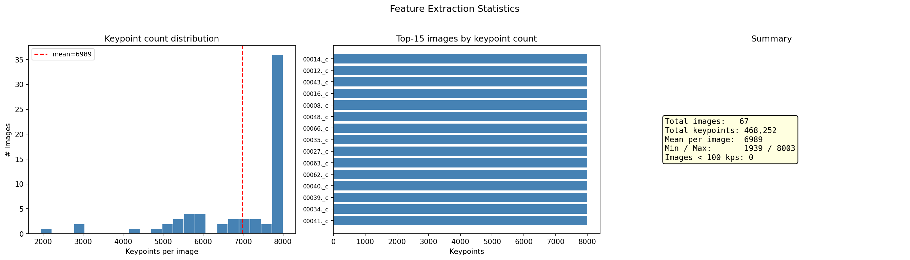

**Fig. A1:** Verteilung der Merkmalszahl über alle 67 Bilder des Referenzlaufs.

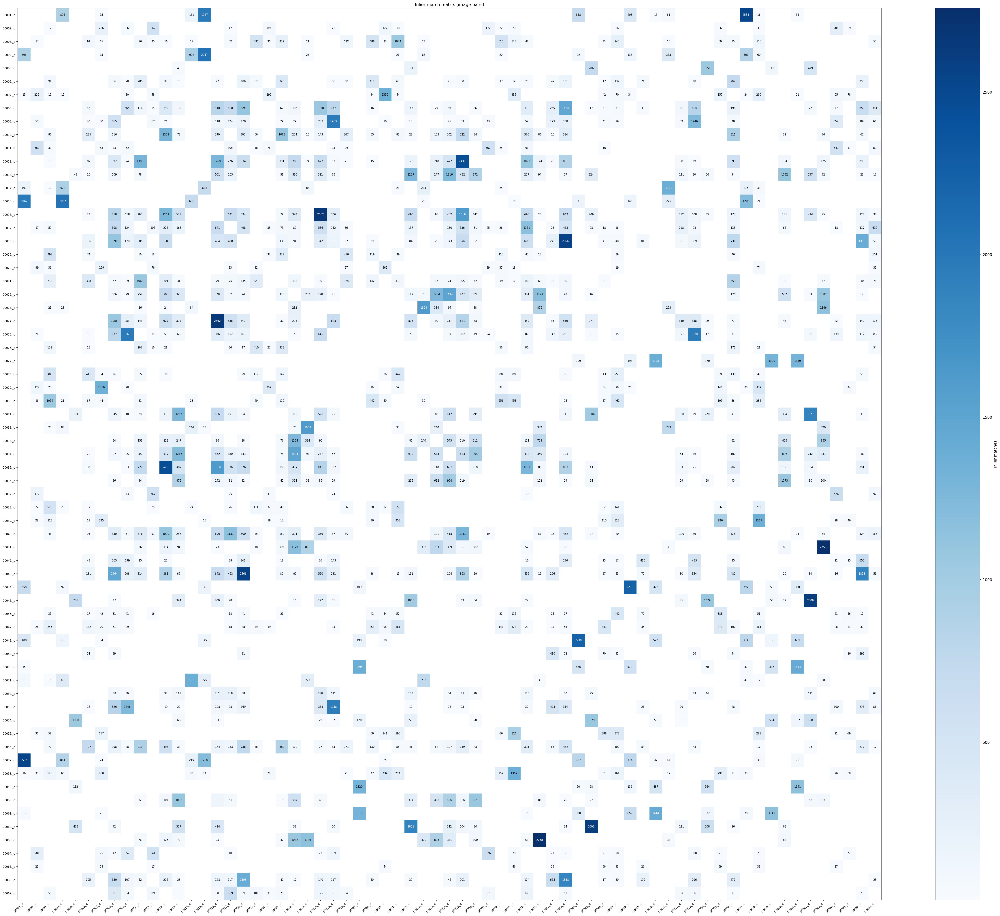

**Fig. A2:** Inlier-Matrix aller Bildpaare. Die Struktur ist nicht bandförmig, weil
aufeinanderfolgende Dateinamen keinen benachbarten Blickwinkeln entsprechen; deshalb
scheitert sequenzielles Matching auf diesem Datensatz.

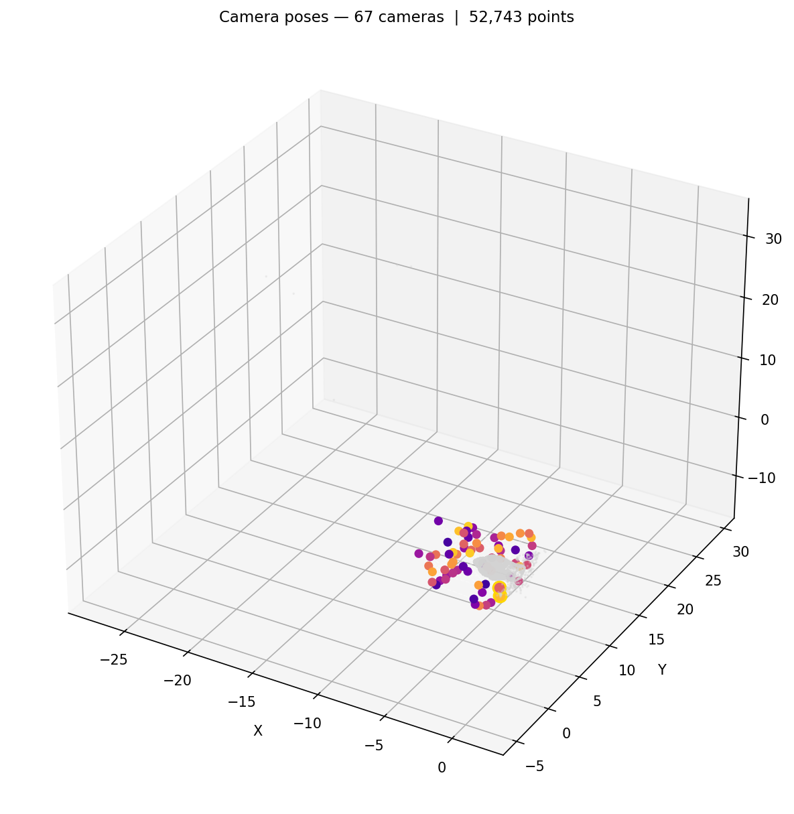

**Fig. A3:** Die 67 registrierten Kameraposen mit Achsenkreuz und der Punktwolke zum
Zeitpunkt des Renderings, im Koordinatensystem der Rekonstruktion.

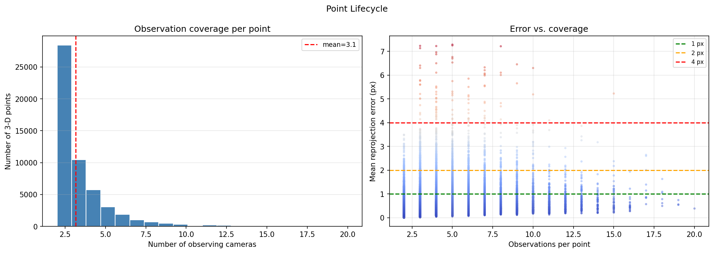

**Fig. A4:** Links die Zahl der Beobachtungen je 3-D-Punkt, rechts der mittlere
Reprojektionsfehler über der Beobachtungszahl. Das Übergewicht der Zweibildpunkte ist
geringer als in der früheren Fassung, aber weiterhin deutlich.

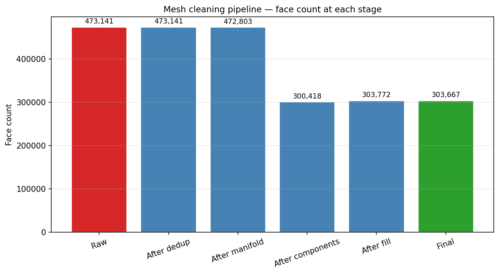

**Fig. A5:** Die Bereinigungsschritte der Oberflächenstufe mit der Zahl der Dreiecke nach
jedem Schritt.

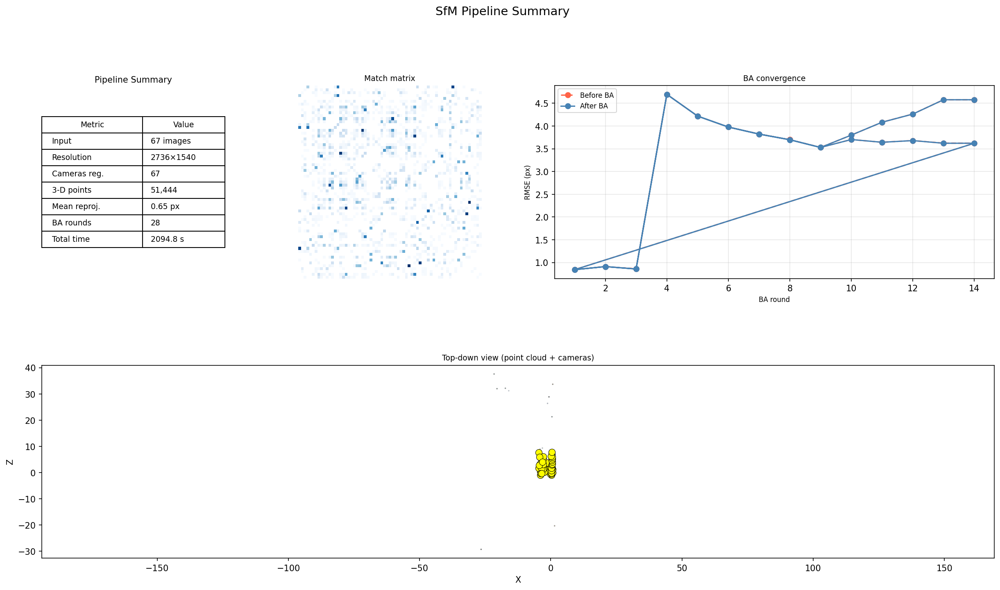

**Fig. A6:** Automatisch erzeugte Zusammenfassung des Referenzlaufs mit Kennzahlentabelle,
Match-Matrix, BA-Konvergenz und Draufsicht auf Punktwolke und Kamerazentren.

## Anhang B  Herkunft der Abbildungen und Zahlen

Alle Bilddateien liegen versioniert unter `paper/figures/l2/`. Die Bilder in
`figures/l2/run/` stammen aus dem Referenzlauf dieser Fassung
(`run_l2/viz_20260814_133940/`), erzeugt mit `--visualize`. Die übrigen Abbildungen
entstehen mit `paper/scripts/make_figures_l2.py` aus den unten genannten Artefakten.

| Ergebnis | Skript oder Artefakt |
|---|---|
| Vorher/Nachher und Ablation | `eval/fix_impact.py` → `eval_results/fix_impact_n67/` |
| Posen gegen Ground Truth | `eval/gt_pose_eval.py` |
| Reproduzierbarkeit | `eval/reproducibility_check.py` → `eval_results/repro_n20/` |
| planare Szene | `eval/planar_check.py` → `eval_results/planar_check.json` |
| EXIF-Wege | `tests/test_exif_focal.py` |
| Mesh-Bewertung | `eval/mesh_eval.py` → `eval_results/mesh_eval.json` |
| Kennzahlen des Mesh | `run_l2/mesh_final_quality.json` |

## Anhang C  Reproduktion

| Ergebnis | Befehl |
|---|---|
| Referenzlauf mit allen Stufen | `python run_sfm.py --image_dir <buddha67> --output sparse.ply --export-cameras cameras.json --n_features 8000 --seed 0 --dense --mesh --visualize` |
| Vorher/Nachher-Reihe | `python eval/fix_impact.py --image-dir <buddha67> --gt-dir <buddha>` |
| Reproduzierbarkeit | `python eval/reproducibility_check.py --image-dir <buddha20> --runs 3` |
| planare Szene | `python eval/planar_check.py` |
| Oberfläche aus der dünnen Wolke | `python -m sfm.mesh sparse.ply -o mesh.obj --cameras cameras.json --quality medium --depth 8 --trim 6 --keep-largest` |
| Mesh-Bewertung | `python eval/mesh_eval.py --mesh mesh.obj --cloud mesh_prepared_cloud.ply --cameras cameras.json --gt-dir <buddha> --image-dir <buddha67> --reference ref.ply --reference-cameras ref.cameras.json` |
| Diese Fassung als PDF | `python paper/scripts/build_paper.py --md paper/paper_l2.md --pdf` |

**Tab. 14:** Befehle zur Reproduktion. `<buddha67>` bezeichnet das Verzeichnis mit den
67 Bildern, `<buddha>` das Verzeichnis des Originaldatensatzes mit den
Ground-Truth-Dateien `*_P.txt`.

## Anhang D  Offene Punkte und Abweichungen

**Offene Punkte.** Die Tracklänge bleibt hinter COLMAP zurück, und die Grenze liegt jetzt
im Korrespondenzgraphen statt in der Rekonstruktion. Die dichte Stufe ist geometrisch
gesund, liefert auf diesen weiten Basislinien aber wenig; ein Mehrbildverfahren mit
Tiefenkarten wäre der nächste Schritt. Die photometrische Prüfung der Oberfläche ist auf
diesem Material nicht aussagekräftig, weil die richtungsabhängige Beleuchtung stärker
streut als der geometrische Unterschied.

**Abweichungen gegenüber der früheren Fassung.** Der Ausgangszustand in Tab. 6 stammt aus
der aktuellen Programmfassung mit abgeschalteten Änderungen und weicht deshalb in den
Nachkommastellen von den früher berichteten Werten ab; zwischenzeitlich wurden auch
Voreinstellungen geändert, die nicht Gegenstand dieser Arbeit sind. Die COLMAP-Werte sind
unverändert übernommen.

**Zwischenstände der Oberflächenstufe.** Abschnitt 6.9.3 vergleicht drei Meshes:
`run_l2/mesh.obj` aus der dichten Wolke, wie der Lauf sie selbst erzeugt,
`run_l2/mesh_scene.obj` aus der auf die Objektumgebung begrenzten dichten Wolke und
`run_l2/mesh_final.obj` aus der dünnen Wolke. Alle drei liegen samt Prüfbericht vor, damit
der Vergleich nachvollziehbar bleibt.

**Umfang.** Der gemessene Umfang dieser Fassung beträgt 22 Seiten bei 14 Abbildungen im
Hauptteil, 6 im Anhang und 14 Tabellen.

**Prüfung der Zahlen.** `python paper/scripts/check_numbers_l2.py` rechnet 64 Werte dieses
Beitrags gegen die Artefakte nach und prüft zugleich Nummerierung und Schreibweise.

**Umsetzung des Style Guide.** Das Layout folgt
`abstract/workshop_book_styleguide_2026/main.tex`: A4 mit 2,5 cm Rand, Segoe UI, Fließtext
9 pt bei 14,4 pt Zeilenabstand im Blocksatz, Überschriften zentriert in Fett und in
GFaI-Blau, Tabellen im booktabs-Stil, Literatur im IEEE-Format, keine Seitenzahlen.
