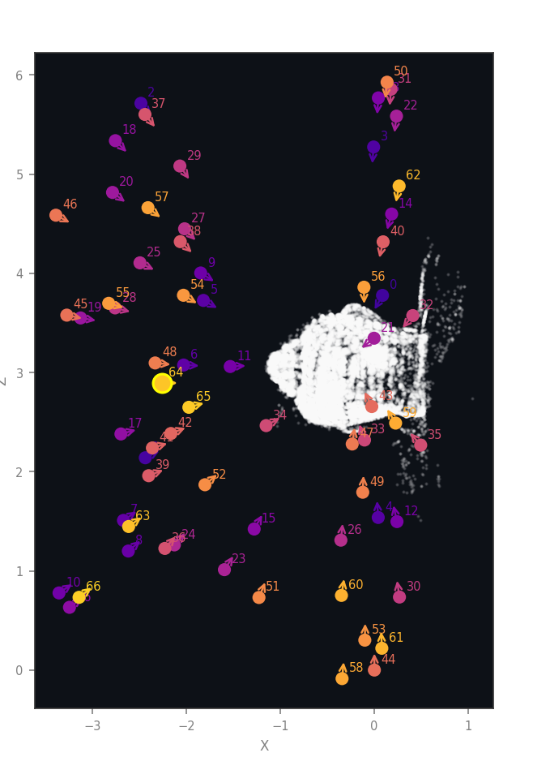
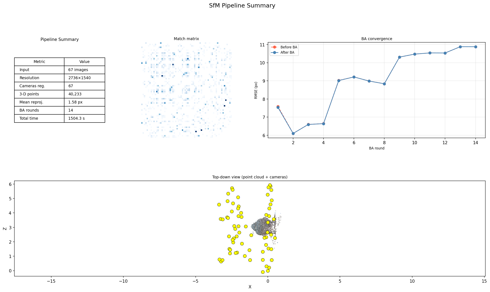
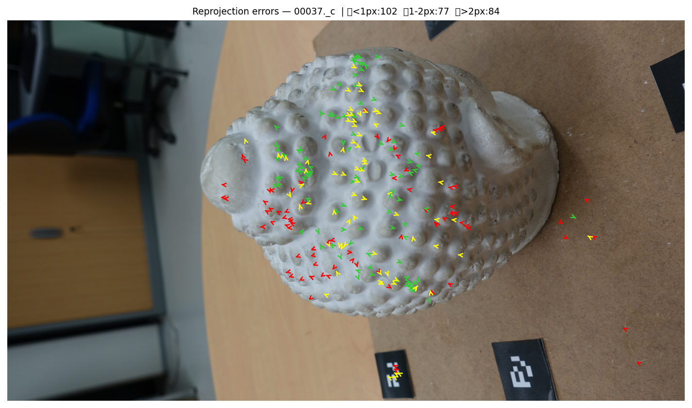

# Photogrammetrie auf dem Laptop: Möglichkeiten und Grenzen einer in Python implementierten 3D Rekonstruktions-Pipeline

Rudolf Hoffmann1, Frank Neumann1
{: .authors}

1HTW Berlin, Fachbereich 2 Informatik in Ingenieurwissenschaften, Wilhelminenhofstr. 75a, 12459 Berlin, Rudolf.Hoffmann@Student.HTW-Berlin.de, www.htw-berlin.de
{: .affiliation}

**Abstract:** Wie weit trägt eine selbst implementierte Photogrammetrie-Pipeline auf einem
handelsüblichen Laptop, ohne GPU-Cluster und ohne kommerzielle Software? Der Beitrag
beantwortet diese Frage anhand eines studentischen Implementierungsprojekts und grenzt
dabei bewusst genau ab, was „selbst implementiert" bedeutet. Etablierte Bausteine werden
aus Bibliotheken bezogen: SIFT-Merkmale, FLANN-Matching, die robusten Schätzer für
Fundamental-, Essential- und Homographiematrix sowie PnP stammen aus OpenCV, der
nichtlineare Least-Squares-Löser aus SciPy, die Poisson-Oberflächenrekonstruktion aus
Open3D. Eigenentwicklung ist die vollständige Rekonstruktionslogik, die diese Bausteine
erst zu einer Pipeline verbindet, samt Problemformulierung des Bundle Adjustment. Die
Antwort auf die Frage nach der Programmiersprache lautet daher differenziert: Die
Steuerungs- und Geometrielogik ist vollständig in Python und NumPy geschrieben, kein
Projektbestandteil in einer anderen Sprache, während die numerisch teuren Kernels in den
C++-Backends der genannten Bibliotheken laufen. Auf einem Datensatz mit 67 Aufnahmen und
mitgelieferten Ground-Truth-Posen registriert die Pipeline alle Kameras und liefert eine
formtreue Punktwolke aus 40.233 Punkten bei 1,58 px mittlerem Reprojektionsfehler. Der
Vergleich mit der Ground Truth zeigt jedoch Schwächen, die diese pipeline-eigene Kennzahl
nicht anzeigt: Die geschätzte Brennweite liegt 47 % neben dem wahren Wert, die
Kameraorientierungen weichen im Median um 6,2° ab, und zwei identische Aufrufe liefern
unterschiedliche Ergebnisse. COLMAP auf denselben Bildern, derselben CPU und mit derselben
Merkmalszahl erreicht dagegen 0,2 % Brennweiten- und 0,11° Orientierungsfehler in einem
Viertel der Laufzeit. Die Genauigkeit steckt also in den Daten, und die Lücke liegt in der
Umsetzung. Für jede der gefundenen Grenzen benennt der Beitrag die Ursache im Code.
{: .abstract}

**Keywords:** Structure-from-Motion; Photogrammetrie; Python; Punktwolke; Bundle Adjustment; Visualisierung; Studierendenprojekt
{: .keywords}

## 1  Einleitung

Aus einer Handvoll gewöhnlicher Fotos ein dreidimensionales Modell zu berechnen, gehört
heute zu den Standardwerkzeugen von Vermessung, Denkmalpflege, Robotik und AR/VR. Drohnen
kartieren Baustellen, Museen digitalisieren Exponate, autonome Systeme rekonstruieren ihre
Umgebung. Die zugrundeliegende Technik ist in allen Fällen *Structure-from-Motion* (SfM),
also die gleichzeitige Schätzung der Szenengeometrie und der Kamerapositionen aus reinen
Bilddaten.

**Fig. 1:** Übersicht der Verarbeitungskette von den Eingabebildern über Merkmale,
Matching, geometrische Verifikation, inkrementelle Rekonstruktion und Bundle Adjustment
bis zur Punktwolke und optional zum Mesh. Das Diagramm bildet den roten Faden für
Abschnitt 3.

In der Praxis greifen die meisten Anwender zu fertigen Werkzeugen wie COLMAP, Meshroom
oder RealityCapture. Diese liefern gute Ergebnisse, verbergen die zugrundeliegenden
Algorithmen aber als Blackbox. Das hier beschriebene Projekt geht den umgekehrten Weg und
baut die Verarbeitungskette selbst, mit frei verfügbaren Bibliotheken und ohne
spezialisierte Hardware.

Daraus ergeben sich zwei Ziele. Das erste ist didaktisch: Jede Verarbeitungsstufe soll
durch Zwischenergebnisse sichtbar werden, damit nachvollziehbar wird, was zwischen
Eingabebild und Punktwolke tatsächlich geschieht. Das zweite ist evaluativ: Die Ergebnisse
werden gegen Ground-Truth-Kameraposen vermessen, um Möglichkeiten und Grenzen einer reinen
Python-Umsetzung belastbar einzuordnen. Der Beitrag berichtet beides, einschließlich der
Fehler, die dabei sichtbar geworden sind.

## 2  Hintergrund

### 2.1  Structure-from-Motion in Kürze

SfM geht auf die Mehrbildgeometrie der 1980er- und 1990er-Jahre zurück und wurde von
Hartley und Zisserman [1] systematisiert. Moderne inkrementelle Systeme kulminieren in
COLMAP [2], das robuste Merkmalsverarbeitung, sorgfältige Ausreißerbehandlung und einen
effizienten C++-Kern für das Bundle Adjustment kombiniert und heute als Referenz für
quelloffene SfM-Software gilt.

### 2.2  Kernalgorithmen

Drei geometrische Grundideen tragen die gesamte Pipeline.

Die **Epipolargeometrie** verbindet zwei Bilder desselben Punktes über die
Fundamentalmatrix F. Ein Punkt im ersten Bild schränkt seinen Partner im zweiten Bild auf
eine Gerade ein, die Epipolarlinie. Diese Bedingung erlaubt es, falsche Korrespondenzen
rein geometrisch zu verwerfen.

Die **Triangulation** rekonstruiert einen 3D-Punkt als Schnitt zweier Sehstrahlen, sobald
zwei Kameraposen bekannt sind. Je größer der Winkel zwischen den Strahlen ausfällt, desto
stabiler wird die Tiefenschätzung. Der Datensatz in Abschnitt 4 zeigt, wie stark dieser
Zusammenhang das Ergebnis prägt.

Das **Bundle Adjustment** (BA) optimiert alle Kameraposen und alle 3D-Punkte gemeinsam so,
dass die Summe der Reprojektionsfehler minimal wird, also der Abstände zwischen gemessenem
und zurückprojiziertem Bildpunkt. Es ist das numerische Herz jeder präzisen Rekonstruktion
und zugleich die Stufe, an der sich in Abschnitt 4.3 ein grundlegendes Problem zeigt.

### 2.3  Eigener Code und verwendete Bibliotheken

Die Formulierung „selbst gebaute Pipeline" verlangt eine genaue Abgrenzung, denn SIFT,
FLANN und RANSAC sind etablierte Verfahren, deren Implementierungen niemand ohne Not neu
schreibt. Die Arbeitsteilung in diesem Projekt sieht wie folgt aus: Aus den Bibliotheken
stammen die numerischen Primitive, also einzelne, klar umrissene Rechenschritte. Selbst
geschrieben ist alles, was diese Primitive zu einer Rekonstruktion verbindet, sowie das
vollständige Fehlermodell des Bundle Adjustment.

| Stufe | Aus Bibliotheken | Eigener Python-Code |
|---|---|---|
| Merkmale | `cv2.SIFT_create`, optional kornia auf der GPU | Bildladen mit EXIF-Rotation, Schätzung der Intrinsik, Zwischenspeicherung der Merkmale |
| Matching | `cv2.FlannBasedMatcher` (k-nächste Nachbarn), `cv2.kmeans` für das visuelle Vokabular | Lowe-Ratio-Test, Cross-Check, Auswahl der Kandidatenpaare (erschöpfend, sequenziell, Vokabularbaum mit TF-IDF), blockweiser GPU-Matcher |
| Geometrische Verifikation | `cv2.findFundamentalMat` (USAC_MAGSAC), `findEssentialMat`, `recoverPose`, `findHomography` | Hartley-Normierung, Planaritätsprüfung, Inlier-Buchführung, Zusammenhangskomponenten des Szenengraphen per Union-Find |
| Inkrementelle Rekonstruktion | `cv2.triangulatePoints` (DLT), `cv2.solvePnPRansac`, `solvePnPRefineLM`, `cv2.Rodrigues` | Wahl des Startpaars, Reihenfolge der Registrierung, Verwaltung von Tracks und Beobachtungen, Akzeptanzkriterien für neue Punkte, Ausreißerentfernung, Track-Merging, Retriangulation nach BA |
| Bundle Adjustment | `scipy.optimize.least_squares` (Trust-Region-Reflective), `scipy.sparse` | Parametrisierung, Residuenfunktion inklusive Brown-Conrady-Verzeichnung, Aufbau der dünnbesetzten Jacobi-Struktur, adaptive Huber-Skala, Divergenzschutz, lokales BA-Fenster |
| Dichte Rekonstruktion | `cv2.StereoSGBM`, `stereoRectify`, `reprojectImageTo3D` | Auswahl der Stereopaare, Sichtbarkeitsfilter, Punktbudget |
| Mesh | Open3D (Normalenschätzung, Screened Poisson) [3] | Vorbereitung und Reinigung der Wolke, Farbübertragung, Export |
| Ausgabe und Diagnose | matplotlib | binärer PLY-Writer, Kameraexport, 19 Typen von Diagnosebildern |

**Tab. 1:** Aufteilung zwischen Bibliotheksaufrufen und eigenem Code.

Die Antwort auf die Frage, ob wirklich alles Python ist, lautet damit: Der gesamte
Projektcode ist Python, rund 9.700 Zeilen, davon etwa 1.600 für die Visualisierung. Eine
eigene Zeile C++ oder CUDA existiert nicht. Die aufgerufenen Bibliotheken sind ihrerseits
in C++ geschrieben, so dass die rechenintensiven Primitive kompiliert ausgeführt werden
und Python die Steuerungsschicht bildet. Für die Laufzeit ist diese Aufteilung günstiger,
als es zunächst klingt: Die in Abschnitt 4.5 gemessene Dominanz des Matchings entsteht
innerhalb der OpenCV-Aufrufe und nicht im Python-Code darum herum. Der Engpass liegt also
in der Strategie, nicht in der Sprache.

## 3  Methoden

Die Pipeline gliedert sich in die sechs Stufen aus Fig. 1. Alle Abbildungen dieses
Abschnitts stammen aus einem einzigen Lauf über 67 Bilder (Lauf B, siehe Abschnitt 4.1),
zeigen also durchgehend dieselbe Rekonstruktion.

### 3.1  Merkmalsextraktion

Für jedes Bild werden bis zu `--n_features` SIFT-Merkmale [4] mit 128-dimensionalen
Deskriptoren detektiert, im Referenzlauf 12.000. SIFT ist skalierungs-, rotations- und
beleuchtungsinvariant und findet Merkmale bevorzugt an Ecken, Kanten und texturierten
Flächen. Auf Systemen mit GPU übernimmt eine kornia-basierte Detektion, sonst OpenCV-SIFT
auf der CPU. Beide Pfade liefern denselben Ausgabe-Kontrakt.

**Fig. 2:** 9.126 SIFT-Merkmale auf Bild 00044. Die Farbe kodiert den Detektionsindex und
dient als Näherung für die Stärke der Detektorantwort. Die Merkmale konzentrieren sich auf
die genoppte Oberfläche der Statue, während die glatte Wand links und die einfarbige
Tischplatte rechts nahezu leer bleiben.

**Fig. 3:** Dichte-Heatmap desselben Bildes, links über dem Bild und rechts isoliert. Die
Dichte fällt zum Objektrand hin ab und ist auf dem strukturlosen Hintergrund praktisch
null. Diese Abhängigkeit von der Textur ist die Voraussetzung, deren Fehlen die Pipeline
in Abschnitt 5 scheitern lässt.

Über alle 67 Bilder entstehen 545.327 Merkmale, im Mittel 8.139 pro Bild bei einem Minimum
von 1.939 und einem Maximum von 12.001. Das Maximum liegt exakt am gesetzten Limit, bei
sechs Bildern begrenzt also der Parameter und nicht die Szene (Fig. A1 im Anhang).

### 3.2  Feature Matching

Korrespondenzen zwischen Bildpaaren findet eine FLANN-basierte Suche nach den beiden
nächsten Nachbarn. Der anschließende Ratio-Test nach Lowe [4] behält nur Zuordnungen,
deren bester Treffer deutlich eindeutiger ist als der zweitbeste; im Referenzlauf liegt die
Schwelle bei 0,70. Für ungeordnete oder große Datensätze stehen sequenzielles Matching und
ein Vokabularbaum zur Verfügung. Der Referenzlauf vergleicht erschöpfend alle 2.211
Bildpaare.

**Fig. 4:** Korrespondenzen für das Paar 00039 zu 00058, gezeichnet als Zufallsstichprobe
von 200 der 1.347 Rohzuordnungen. Grün markiert die 803 geometrisch verifizierten Inlier
(59,6 %), rot die 544 verworfenen Zuordnungen. Die roten Linien fächern sichtbar auf, weil
die repetitive Noppenstruktur der Statue Verwechslungen zwischen ähnlichen, aber
verschiedenen Noppen begünstigt. Der Ratio-Test allein genügt hier also nicht, und die
geometrische Verifikation aus Abschnitt 3.3 wird unverzichtbar.

### 3.3  Geometrische Verifikation

Jedes Bildpaar durchläuft vier Filter. Zuerst normiert eine Hartley-Transformation die
Pixelkoordinaten, was die anschließende Schätzung numerisch stabilisiert. Danach schätzt
`USAC_MAGSAC` robust die Fundamentalmatrix, so dass nur geometrisch konsistente Zuordnungen
als Inlier überleben. Der dritte Filter prüft nach dem Kriterium von Torr, ob eine
Homographie dieselben Inlier ebenso gut erklärt; ab einem Anteil von 85 % gilt das Paar als
planar und wird verworfen, weil sich aus einer solchen Fundamentalmatrix keine belastbare
Rotation ableiten lässt. Zuletzt wird die Essential-Matrix bestimmt und über die
Cheiralitätsbedingung in die relative Kamerapose zerlegt. Ein Union-Find-Verfahren prüft
anschließend die Zusammenhangskomponenten des Szenengraphen und verwirft alles außer der
größten. Im Referenzlauf überstehen 524 der 2.211 Paare die Verifikation, und alle
67 Bilder liegen in einer einzigen Komponente (Fig. A3).

**Fig. 5:** Epipolargeometrie für dasselbe Bildpaar. Zusammengehörige Punkte und Linien
sind gleichfarbig gezeichnet: Zu jedem Punkt im einen Bild gehört die gleichfarbige
Epipolarlinie im anderen. Dass die Punkte auf ihren Linien liegen, belegt anschaulich die
Qualität der geschätzten Fundamentalmatrix. Im linken Bild schneiden sich alle Linien unten
links im Epipol, also in der Projektion des zweiten Kamerazentrums.

### 3.4  Inkrementelle Rekonstruktion

Die Rekonstruktion wächst kameraweise. Als Startpaar wählt die Pipeline das Paar mit dem
größten Produkt aus Basislinie und Inlier-Zahl, sofern der Triangulationswinkel mindestens
5° beträgt. Anschließend registriert sie iterativ jeweils das Bild mit den meisten
2D-3D-Korrespondenzen über PnP mit RANSAC und einer Levenberg-Marquardt-Verfeinerung.
Neue 3D-Punkte werden mit allen sichtbaren Kameras trianguliert und nur dann übernommen,
wenn Tiefe, Triangulationswinkel und Reprojektionsfehler die Schwellen einhalten.

| | |
|---|---|
|  |  |
| Schritt 001: 2 Kameras, 3.348 Punkte | Schritt 010: 11 Kameras, 12.573 Punkte |
|  |  |
| Schritt 035: 36 Kameras, 31.734 Punkte | Schritt 066: 67 Kameras, 46.883 Punkte |

**Fig. 6:** Vier Momentaufnahmen desselben Laufs in der Seitenansicht, mit den bereits
registrierten Kameras als nummerierte Marker und der Punktwolke in Weiß. Das Startpaar
besteht aus den Bildern 14 und 61 und liefert 3.348 Punkte aus einem einzigen
Triangulationsschritt. Nach zehn Schritten stehen elf Kameras, nach 35 Schritten ist die
Wolke zur vollständigen Statue geschlossen, und am Ende sind alle 67 Kameras registriert.
Von den 46.883 Punkten des letzten Schritts werden nach der abschließenden Filterung
40.233 exportiert. Der Zuwachs pro Schritt fällt von 3.348 über einige Hundert auf 56 im
letzten Schritt, weil späte Kameras fast nur noch bereits triangulierte Struktur sehen.
Rechts neben dem Objekt sind Ausreißerstreifen erkennbar, also Punkte auf Tischplatte und
Kalibriermarken, die nicht zum Objekt gehören.

**Fig. 7:** Alle 67 registrierten Kameraposen mit Position und Achsenkreuz, dazu die
Punktwolke zum Zeitpunkt des Renderings. Die Kameras verteilen sich flächig um das Objekt
statt auf einer sauberen Bahn. Das ist ein erster visueller Hinweis auf die in
Abschnitt 4.3 gemessene Posenungenauigkeit.

### 3.5  Bundle Adjustment

Nach jeweils fünf neu registrierten Kameras und am Ende des Laufs optimiert ein Bundle
Adjustment alle Parameter gemeinsam. Als Solver dient `scipy.optimize.least_squares` im
Trust-Region-Reflective-Verfahren, versorgt mit einer selbst aufgebauten dünnbesetzten
Jacobi-Struktur. Das Projektionsmodell enthält radiale Verzeichnung nach Brown-Conrady mit
zwei Koeffizienten. Als robuste Verlustfunktion dient ein Huber-Loss, dessen Skala aus der
Streuung der Startresiduen abgeleitet wird. Ein Divergenzschutz verwirft das Ergebnis,
falls sich der Fehler um mehr als den Faktor 1,5 verschlechtert.

**Fig. 8:** Vierzehn BA-Runden des Referenzlaufs. Links der Reprojektions-RMSE vor (rot)
und nach (blau) jeder Runde, annotiert mit der jeweiligen Kamerazahl C, rechts die
Punktzahl vor und nach der Optimierung.

Diese Abbildung zeigt nicht den erwarteten Verlauf und ist gerade deshalb das wichtigste
Diagnosebild des Beitrags. Erstens fällt der RMSE nicht, sondern steigt: von 7,55 px bei
7 Kameras über ein Minimum von 6,09 px bei 12 Kameras auf 10,88 px bei allen 67 Kameras.
Mit jeder zusätzlichen Kamera wird das Gleichungssystem widersprüchlicher, die
Rekonstruktion wächst also auf Kosten ihrer Konsistenz. Der Sprung zwischen der vierten und
der fünften Runde markiert den Punkt, an dem sich eine Kameragruppe nicht mehr spannungsfrei
einfügt. Zweitens liegen die Kurven vor und nach der Optimierung praktisch übereinander:
Das BA verbessert den Fehler in keiner Runde nennenswert, weil es bereits in einem lokalen
Minimum sitzt. Dazu passt, dass die Brennweite über alle 67 Kameras hinweg unverändert bei
2.736,0 px bleibt und jede Runde eine Änderung von exakt null protokolliert. Drittens
bleibt auch die Punktzahl unverändert, denn das BA verschiebt Punkte, entfernt sie aber
nicht; gefiltert wird ausschließlich beim Triangulieren und beim Export.

Der scheinbare Widerspruch zum ausgewiesenen mittleren Reprojektionsfehler von 1,58 px löst
sich über die Verteilung der Residuen. Der RMSE wird von wenigen großen Werten dominiert,
während der Median bei 0,84 px liegt.

**Fig. 9:** Links die Zahl der Beobachtungen pro 3D-Punkt bei einer mittleren Tracklänge
von 2,7, mit einem deutlichen Übergewicht bei genau zwei Beobachtungen. Mehr als 27.000
der rund 40.000 Punkte stammen also aus einem einzigen Bildpaar und sind geometrisch kaum
abgesichert. Rechts der mittlere Reprojektionsfehler über der Beobachtungszahl: Punkte mit
vielen Beobachtungen bleiben zuverlässig unter 4 px, während die Zweifach-Punkte die
gesamte Fehlerspanne ausfüllen. Kurze Tracks sind damit als Hauptquelle der Streuung
identifiziert.

### 3.6  Dichte Rekonstruktion, Mesh und Referenzsystem

Optional erzeugt die Pipeline über StereoSGBM eine dichte Punktwolke und über Screened
Poisson in Open3D [3] eine Mesh-Oberfläche. Im Referenzlauf umfasst die dichte Wolke exakt
500.000 Punkte. Dieser Wert ist keine Eigenschaft der Szene, sondern der fest verdrahtete
Standardwert `max_dense_pts`, der ohne Hinweis im Log abschneidet und über die
Kommandozeile nicht erreichbar ist. Die Punktzahl einer dichten Wolke trägt in dieser
Fassung folglich keine Qualitätsinformation.

Als Referenzsystem dient COLMAP [2], aufgerufen über denselben Einstiegspunkt
(`--backend colmap`) auf identischen Eingabedaten. Das Repository startet dabei
nacheinander Merkmalsextraktion, erschöpfendes Matching und den inkrementellen Mapper und
liest das Ergebnis in dasselbe Ausgabeformat zurück. Verwendet wurde COLMAP 4.1.1 ohne
CUDA, so dass beide Systeme ausschließlich auf der CPU desselben Rechners arbeiten. Der
Vergleich in Abschnitt 4.3 stützt sich damit auf zwei unabhängige Maßstäbe: die
mitgelieferten Ground-Truth-Posen und ein etabliertes zweites SfM-System auf denselben
Bildern.

## 4  Ergebnisse

### 4.1  Datensatz und Referenzläufe

Ausgewertet wird der Datensatz „Buddha" aus dem AliceVision-Projekt: 67 Aufnahmen einer
genoppten Buddha-Statue auf einem Drehteller, 2736 × 1540 Pixel, mit
Ground-Truth-Projektionsmatrix je Bild. Der Datensatz erfüllt die Anforderungen an eine
SfM-Aufnahme gut, denn er bietet hohe Überlappung, dicht abgetastete Blickwinkel und eine
stark texturierte Oberfläche. Für die Skalierungsmessungen dienen zusätzlich gleichmäßig
ausgedünnte Teilmengen mit 6 und 20 Bildern.

Alle Zahlen dieses Abschnitts stammen aus zwei Quellen. Die Abbildungen und die Kennzahlen
in Tab. 2 kommen aus zwei vollständigen Visualisierungsläufen (Lauf A und Lauf B) mit
identischer Konfiguration. Die Genauigkeits- und Skalierungswerte in Tab. 3 und Tab. 4
stammen aus einer separaten Messreihe, die jeden Lauf protokolliert und gegen die Ground
Truth auswertet.

| | Lauf A (02.08.2026) | Lauf B (03.08.2026) |
|---|---:|---:|
| Bilder und registrierte Kameras | 67 von 67 | 67 von 67 |
| 3D-Punkte | 40.844 | 40.233 |
| Mittlerer Reprojektionsfehler | 1,58 px | 1,58 px |
| BA-Runden | 14 | 14 |
| Gesamtlaufzeit | 1.540,3 s | 1.504,3 s |

**Tab. 2:** Zwei Läufe desselben Befehls auf denselben Bildern. Sämtliche Abbildungen in
Abschnitt 3 stammen aus Lauf B.

**Fig. 10:** Zusammenfassung von Lauf B mit Kennzahlentabelle, Match-Matrix,
BA-Konvergenz und Draufsicht auf Punktwolke und Kamerazentren (gelb). In der Draufsicht
bilden die Kamerazentren zwei getrennte Gruppen, und die Punktwolke liegt seitlich von
ihnen. Die rekonstruierte Aufnahmegeometrie entspricht damit nicht der gleichmäßigen
Ringaufnahme, die der Datensatz tatsächlich darstellt.

### 4.2  Qualitative Ergebnisse

Auf diesem dicht abgetasteten, gut texturierten Datensatz liefert die Pipeline eine
vollständige und formtreue Rekonstruktion mit allen 67 registrierten Kameras und 40.233
Punkten.

**Fig. 11:** Kolorierte Punktwolke aus sechs orthografischen Richtungen. Die Statue ist in
Seiten-, Auf- und Untersicht klar als Figur mit Kopf, Rumpf und Sockel lesbar. Ebenso klar
sind die Schwächen: In Front- und Rückansicht streuen Ausreißer um das Objekt, und in
Auf- und Untersicht zieht sich ein schmales Punktband schräg durch den Raum. Dabei handelt
es sich um Struktur des Aufnahmetischs und um Falschtriangulierungen, die kein Filter
entfernt hat. Quantitativ sind das 0,58 % Flyer und 0,01 % echte Ausreißer, was visuell
stärker ins Gewicht fällt, als der Anteil vermuten lässt.

### 4.3  Genauigkeit gegen Ground Truth

Vor jedem Fehlermaß richtet eine Sim(3)-Anpassung nach Umeyama die geschätzten
Kamerazentren auf die Ground Truth aus, da monokulares SfM skalenfrei ist. Positionsfehler
sind auf die Ausdehnung der Ground-Truth-Trajektorie normiert, damit Läufe mit
unterschiedlich vielen registrierten Kameras vergleichbar bleiben. Als Referenzsystem läuft
COLMAP über denselben Einstiegspunkt auf denselben Bildern, mit derselben Merkmalszahl,
ebenfalls erschöpfendem Matching, ohne GPU und auf demselben Rechner. Seine Kameraposen
werden mit demselben Skript und derselben Ausrichtung bewertet wie die eigenen.

| Kennzahl | Basiskonfiguration | Referenzlauf | COLMAP |
|---|---:|---:|---:|
| Registrierte Kameras | 67 von 67 | 67 von 67 | 67 von 67 |
| 3D-Punkte | 39.721 | 40.232 | 35.538 |
| Mittlere Tracklänge | 2,70 | 2,61 | 4,69 |
| Reprojektions-RMSE | 2,08 px | 1,60 px | nicht exportiert |
| Geschätzte Brennweite | 2.736,0 px | 2.736,0 px | 1.857,5 px |
| Brennweitenfehler | +47,0 % | +47,0 % | -0,2 % |
| Rotationsfehler, Median und Maximum | 6,29° / 20,28° | 6,23° / 16,48° | 0,11° / 0,20° |
| Positionsfehler, Median und Maximum | 2,06 % / 11,60 % | 2,24 % / 9,79 % | 0,02 % / 0,05 % |
| Laufzeit | 1.135,5 s | 1.761,3 s (davon 300,6 s dicht) | 293 s |
| Spitzenspeicher | 1.470 MB | 1.541 MB | nicht gemessen |

**Tab. 3:** Gemessene Kennzahlen gegen Ground Truth. Die Ground-Truth-Brennweite beträgt
1.860,9 px. Basiskonfiguration und COLMAP verwenden beide 8.000 Merkmale je Bild und sind
damit direkt vergleichbar; der Referenzlauf, aus dem die Abbildungen stammen, arbeitet mit
12.000 Merkmalen.

Das zentrale Ergebnis steht in der Zeile zur Brennweite. Die Bilder des Datensatzes tragen
keine EXIF-Daten, weshalb die Intrinsik-Schätzung auf die Heuristik `focal = max(W, H)`
zurückfällt und 2.736 px ansetzt, also die Bildbreite. Der wahre Wert beträgt 1.860,9 px.
Das Bundle Adjustment korrigiert diesen Fehler nie, denn über alle 67 Kameras protokolliert
jede Runde eine Änderung von exakt null. Zwei mögliche Erklärungen wurden experimentell
ausgeschlossen. Die Schranken des Optimierers liegen bei 1.368 px und 5.472 px und
enthalten den wahren Wert, scheiden also aus. Eine Parameterskalierung als Ursache wurde
durch einen Kontrolllauf mit aktivierter Jacobi-Skalierung widerlegt, bei dem sich die
Brennweite ebenfalls nicht bewegte. Es bleibt die Erklärung, dass die Rekonstruktion bei
der falschen Brennweite bereits in sich konsistent ist. Startpose, Triangulation und PnP
wurden alle mit 2.736 px gerechnet, die Struktur ist entsprechend projektiv verformt, und
das BA hat nichts mehr zu gewinnen.

COLMAP entkräftet auf denselben Bildern jede Ausrede, die man dafür anführen könnte. Es
startet ebenfalls ohne Kalibrierung, verfeinert die Brennweite aber im eigenen Bundle
Adjustment bis auf 1.857,5 px und liegt damit 0,2 % neben der Ground Truth. Der Datensatz
enthält also genügend Information, um die Brennweite zu bestimmen; die eigene Umsetzung
holt sie nur nicht heraus. Entsprechend fallen die Posenfehler aus: 0,11° gegenüber 6,29°
im Median und 0,02 % gegenüber 2,06 % bei der Position. Ein zweiter Unterschied erklärt
einen Teil davon. COLMAP verknüpft im Mittel 4,69 Beobachtungen zu einem 3D-Punkt, die
eigene Pipeline nur 2,70; längere Tracks binden jede Kamera an mehr gemeinsame Struktur und
machen die Lösung steifer.

**Fig. 12:** Dieselben 67 Bilder, links die eigene Pipeline mit 39.721 Punkten, rechts
COLMAP mit 35.538 Punkten. Beide Wolken sind auf ihre eigene Ausdehnung normiert, weil
monokulares SfM die absolute Skala nicht bestimmt, und aus derselben Richtung gerendert.
Die eigene Wolke enthält mehr Punkte, zeichnet die genoppte Oberfläche aber diffuser; bei
COLMAP bleiben die einzelnen Noppen als getrennte Strukturen erkennbar. Mehr Punkte
bedeuten hier also nicht mehr Information.

Daraus folgt die methodisch wichtigste Aussage dieses Beitrags. Die pipeline-eigene
Qualitätskennzahl, der Reprojektionsfehler, sieht mit 1,6 px genau dann gut aus, wenn die
Geometrie um mehr als 6° verdreht ist. Fig. 8 zeigt denselben Sachverhalt von der anderen
Seite, denn dort konvergiert das BA zufrieden, während der Fehler steigt. Wer allein gegen
den Reprojektionsfehler optimiert, optimiert also gegen eine Metrik, die diesen Fehlermodus
prinzipiell nicht sehen kann. Sichtbar wird er erst im Vergleich gegen die Ground Truth,
und ein zweites System auf denselben Daten zeigt zusätzlich, dass der Fehler vermeidbar
ist.

### 4.4  Reproduzierbarkeit

Vier byte-identische Aufrufe auf denselben 20 Bildern registrierten 13, 13, 14 und
6 Kameras und lieferten zwischen 3.756 und 6.283 Punkte. Die Streuung der Kamerazahl
beträgt damit 57 %. Die Ursache ließ sich eindeutig lokalisieren: `cv2.setRNGSeed` wird
nirgends im Projekt aufgerufen, so dass `USAC_MAGSAC` und `solvePnPRansac` aus dem
prozessglobalen Zufallszahlengenerator von OpenCV ziehen. Die NumPy-Seeds sind dagegen an
allen vier relevanten Stellen fest gesetzt, weshalb nur die OpenCV-Seite betroffen ist.

**Fig. 13:** Dieselbe Zusammenfassung für Lauf A, also identischer Befehl auf identischen
Bildern, einen Tag früher ausgeführt. Kennzahlen und Kameraverteilung stimmen im Vergleich
mit Fig. 10 weitgehend überein, die BA-Konvergenzkurve verläuft jedoch sichtbar anders und
endet bei 10,2 px statt bei 10,9 px. Bei 67 Bildern ist der Effekt also gedämpft, aber
nicht verschwunden.

### 4.5  Laufzeit und Skalierung

| Bilder | Paare | Matching (s) | s pro Paar | Gesamt (s) | s pro Bild |
|---:|---:|---:|---:|---:|---:|
| 6 | 15 | 7,6 | 0,505 | 13,1 | 2,2 |
| 20 | 190 | 94,4 | 0,497 | 113,0 | 5,6 |
| 67 | 2.211 | 1.036,6 | 0,469 | 1.135,5 | 16,9 |

**Tab. 4:** Skalierung mit der Bildzahl.

**Fig. 14:** Links die Gesamtlaufzeit und der Matching-Anteil über der Bildzahl, verglichen
mit einer quadratischen Referenzkurve. Rechts der Anteil der einzelnen Stufen an der
Gesamtlaufzeit. Die Kosten pro Bildpaar bleiben mit 0,505 s, 0,497 s und 0,469 s praktisch
konstant, weshalb die Gesamtzeit exakt der quadratisch wachsenden Paarzahl folgt. Der
Anteil des Matchings steigt von 66 % bei 6 Bildern auf 91 % bei 67 Bildern, während das
Bundle Adjustment mit 38,2 s nicht ins Gewicht fällt.

Dieses Ergebnis widerspricht der Erwartung, mit der das Projekt in die Messung gegangen
ist, und wird hier bewusst als eigenständiger Befund berichtet. Die Vermutung lautete, das
globale Bundle Adjustment werde zum Engpass, weil der voreingestellte SciPy-Löser das
Schur-Komplement nicht ausnutzt; ein Löser mit dieser Struktur steht nur im optionalen
pyceres-Pfad zur Verfügung, der auf der Messmaschine nicht installiert ist. Der
Code-Befund stimmt, die daraus abgeleitete Erwartung an die Laufzeit jedoch nicht. Das
Bundle Adjustment wächst zwar deutlich schneller als linear, nämlich von 1,2 s bei
13 registrierten Kameras auf 38,2 s bei 67, also um etwa das Zweiunddreißigfache bei gut
fünffacher Kamerazahl. Es startet aber von einem so kleinen Betrag, dass es selbst am
oberen Ende der Messreihe nur 3,4 % der Laufzeit ausmacht, während das erschöpfende
Matching bei 91 % liegt. Beide Kurven würden sich erst weit außerhalb des vermessenen
Bereichs schneiden. Für alle hier realistisch verarbeitbaren Datensatzgrößen ist damit
das Matching die Skalierungsgrenze, und Optimierungsarbeit gehört zuerst dorthin.
Hochgerechnet bräuchten 200 Bilder allein für das Matching etwa 2,6 Stunden.

Zwei weitere Messwerte runden das Bild ab. Die Zwischenspeicherung der Merkmale und Matches
beschleunigt einen Wiederholungslauf um den Faktor 19,9, was die tägliche Arbeit spürbar
erleichtert. Der Schlüssel dieses Caches berücksichtigt allerdings nur Dateiname und
Dateigröße, so dass ein inhaltlich verändertes Bild gleicher Größe unbemerkt alte Merkmale
weiterverwendet. Ein Testfall mit zwei verschiedenen Szenen gleicher Dateigröße zeigt genau
dieses Verhalten.

### 4.6  Visualisierung der Zwischenergebnisse

Der Visualizer schreibt 19 Typen von Diagnosebildern ohne Bildschirm direkt auf die Platte,
auf Wunsch als vektorielles PDF mit 300 dpi. Sämtliche Abbildungen der Abschnitte 3 und 4
sind mit Ausnahme des Übersichtsdiagramms in Fig. 1 Nebenprodukte eines einzigen Laufs mit
`--visualize`. Für die Fehlersuche war dieser Zugang entscheidend, denn die steigende
Kurve in Fig. 8 und das Übergewicht der Zweifach-Tracks in Fig. 9 haben die in
Abschnitt 4.3 vermessenen Defekte überhaupt erst sichtbar gemacht.

## 5  Diskussion

Auf dicht abgetasteten, gut texturierten Szenen arbeitet die Pipeline zuverlässig. Sie
registriert alle Kameras, erzeugt eine formtreue und korrekt kolorierte Punktwolke mit
weniger als 1 % Ausreißern und bleibt dabei mit 1,5 GB Spitzenspeicher im Rahmen eines
gewöhnlichen Laptops. Ebenso deutlich sind die Grenzen, und für jede davon lässt sich die
Ursache im Code benennen.

**Die Intrinsik ist die gravierendste Schwäche.** Ohne EXIF-Daten rät die Pipeline
`focal = max(W, H)` und liegt damit 47 % daneben. Das Bundle Adjustment korrigiert den Wert
nicht, weil die Rekonstruktion bei dieser Brennweite bereits in sich konsistent ist, und
eine Option zur Vorgabe einer bekannten Kalibrierung existiert auf der Kommandozeile nicht.
Die gesamte Rekonstruktion ist dadurch projektiv verformt, ohne dass die interne
Fehlermetrik anschlägt. Dass es sich um ein Implementierungsproblem und nicht um eine
Grenze der Daten handelt, zeigt COLMAP auf denselben Bildern: Es beginnt ebenfalls ohne
Kalibrierung und landet nach eigener Verfeinerung 0,2 % neben der Ground Truth.

**Die Ergebnisse sind nicht reproduzierbar.** Weil der Zufallszahlengenerator von OpenCV
nie gesetzt wird, schwankt die Zahl registrierter Kameras zwischen identischen Läufen um
bis zu 57 %. Solange dieser Punkt offen ist, lässt sich der Nutzen jeder weiteren
Verbesserung nicht sauber messen, denn jede Änderung verschwindet im Rauschen zwischen zwei
Läufen.

**Die Skalierungsgrenze liegt beim Matching, nicht beim Bundle Adjustment.** Das Bundle
Adjustment wächst zwar schneller als linear mit der Kamerazahl, bleibt aber selbst bei
67 Bildern bei 3,4 % der Laufzeit, während erschöpfendes Matching quadratisch viele
Paarvergleiche kostet und 91 % beansprucht (Abschnitt 4.5). Die naheliegende Abhilfe über sequenzielles Matching halbiert zwar die Zeit,
lässt die Rekonstruktion auf diesem Datensatz aber auf 4 von 20 Kameras zusammenbrechen.
Der Grund ist in Fig. A2 im Anhang sichtbar: Die Match-Matrix ist nicht bandförmig, also
entsprechen aufeinanderfolgende Dateinamen keinen aufeinanderfolgenden Blickwinkeln. Die
inhaltsbasierten Alternativen über Bildretrieval benötigen PyTorch, das auf der
Messmaschine fehlt.

**Die Tracks sind zu kurz.** Bei einer mittleren Tracklänge von 2,6 bis 2,7 stammt die
Mehrzahl der Punkte aus nur zwei Bildern und ist damit geometrisch schwach abgesichert, was
Fig. 9 als Hauptquelle der Fehlerstreuung ausweist. COLMAP erreicht auf denselben Bildern
4,69 Beobachtungen je Punkt, also fast das Doppelte, und zwar bei weniger Punkten
insgesamt. Der Unterschied entsteht nicht beim Detektor, sondern in der Buchführung: Wo
Korrespondenzen über mehrere Bilder hinweg zu einem Track verschmelzen, stützt jeder Punkt
mehrere Kameras gleichzeitig. Passend dazu sind etwa 8 % der eigenen Punkte exakte
Duplikate, also Tracks, die hätten verschmelzen müssen; die dafür vorgesehene Option zeigt
im Test keinen messbaren Nutzen.

**Ohne Schleifenschluss akkumuliert die Rekonstruktion Drift.** Die Registrierung hängt
jede neue Kamera an den bereits bestehenden Verbund an, so dass sich kleine Posenfehler
über den Rundgang aufsummieren. Genau dieses Verhalten zeigt die steigende Kurve in
Fig. 8: Der Fehler wächst mit der Zahl der eingefügten Kameras, statt sich zu
stabilisieren. Eine Schleifenschluss-Erkennung ist zwar vorgesehen, setzt aber
inhaltsbasiertes Retrieval oder den Vokabularbaum voraus und war auf der Messmaschine
nicht verfügbar.

**Texturarme und planare Szenen** bleiben die theoretisch erwartete Grenze. SIFT findet
dort zu wenige Merkmale, wobei Fig. 3 die leeren Regionen bereits auf einer gutmütigen
Szene zeigt. Bei einer dominanten Ebene lässt sich die Korrespondenz ebenso gut durch eine
Homographie erklären, weshalb die daraus abgeleitete Essential-Matrix keine belastbare
Rotation mehr liefert. Die Implementierung erkennt diesen Fall über eine Konkurrenz
zwischen Homographie und Fundamentalmatrix nach dem Kriterium von Torr: Erklärt die
Homographie mehr als 85 % der Inlier, wird das Bildpaar verworfen. Ein falsches Ergebnis
wird dadurch vermieden, der Bildgraph verliert aber Kanten und zerfällt im Extremfall,
statt die Ebene über die Homographie zu behandeln.

**Die Reife der Randfälle bleibt hinter der Kernfunktion zurück.** Von dreizehn geprüften
Fehlersituationen behandelt die Pipeline acht sauber. Ein einzelnes unlesbares Bild bricht
jedoch den gesamten Lauf ab, nachdem die Merkmalsextraktion bereits bezahlt ist, und vier
nicht installierte optionale Backends melden sich mit einem rohen Traceback statt mit einem
Installationshinweis. Beides ist an anderer Stelle im Projekt bereits richtig gelöst, etwa
bei der Vorabprüfung des COLMAP-Backends, und müsste lediglich übertragen werden.

Der Vergleich mit COLMAP fällt nach allem Gemessenen weniger algorithmisch als praktisch
aus. Die Grundstruktur ist in beiden Systemen ähnlich, und beide liefen hier auf derselben
CPU, mit denselben Bildern und derselben Merkmalszahl. Trotzdem trennen sie Größenordnungen:
0,11° gegenüber 6,29° Orientierungsfehler, 0,2 % gegenüber 47 % Brennweitenfehler, dazu
293 s gegenüber 1.136 s Laufzeit. Der Unterschied liegt nicht in der Wahl der Algorithmen,
sondern in ihrer Ausführung, also in belastbaren Startwerten, in konsequenter
Track-Verwaltung, in ausgereifter Ausreißerbehandlung und in einem für dieses Problem
gebauten Solver. Die Abwägung lautet damit: didaktische Transparenz und volle Kontrolle auf
der einen Seite, Genauigkeit und Geschwindigkeit auf der anderen. Bemerkenswert ist dabei,
dass die eigene Pipeline mehr Punkte erzeugt als COLMAP und trotzdem deutlich ungenauer
ist; Punktzahl allein ist als Qualitätsmaß wertlos.

## 6  Fazit

Eine vollständig in Python geschriebene SfM-Pipeline rekonstruiert einen gut abgetasteten,
texturreichen Datensatz aus 67 Bildern vollständig und formtreu, auf einem handelsüblichen
Laptop, in rund 25 Minuten und mit 1,5 GB Spitzenspeicher. Der didaktische Ertrag ist
erheblich, denn jede Stufe ist als Bild inspizierbar, und genau diese Bilder haben die
Schwächen der Implementierung aufgedeckt.

Das wichtigste Ergebnis des Projekts ist methodisch und war so nicht geplant: Die
Selbstauskunft der Pipeline über ihre eigene Qualität ist unzuverlässig. Ein
Reprojektionsfehler von 1,6 px signalisiert eine saubere Rekonstruktion, während die
Brennweite 47 % danebenliegt und die Kameraorientierungen im Median um mehr als 6°
verdreht sind. Sichtbar wird das erst im Vergleich gegen Ground Truth, und der erste
Hinweis darauf kam aus einem Diagnosebild, nämlich der BA-Konvergenzkurve, die eben nicht
fällt.

COLMAP auf denselben Bildern liefert die Gegenprobe und macht aus dem Befund eine klare
Aussage. Mit 0,11° Orientierungsfehler und 0,2 % Brennweitenfehler in einem Viertel der
Laufzeit zeigt es, dass die Daten die Genauigkeit hergeben und die Lücke ausschließlich in
der eigenen Umsetzung liegt. Genau das ist für ein Lernprojekt die nützlichste Form eines
Ergebnisses, denn sie benennt nicht nur eine Grenze, sondern belegt, dass sie überwindbar
ist.

Für die Weiterarbeit ergibt sich daraus eine klare Reihenfolge. Zuerst muss der
Zufallszahlengenerator von OpenCV gesetzt werden, da ohne Reproduzierbarkeit keine weitere
Verbesserung messbar ist. Danach folgen eine Option zur Vorgabe der Kalibrierung sowie eine
Brennweitensuche beim Startpaar, weil dort der größte Genauigkeitsgewinn liegt. Als drittes
sollte der Bildinhalt statt der Dateigröße in den Cache-Schlüssel eingehen. Erst danach
lohnen sich die Skalierungsthemen, also inhaltsbasierte Vorauswahl der Bildpaare und
lernbasierte Matching-Verfahren für schwierige Aufnahmesituationen.

## Literatur

[1] R. Hartley and A. Zisserman, *Multiple View Geometry in Computer Vision*, 2nd ed.
Cambridge, U.K.: Cambridge University Press, 2003.

[2] J. L. Schönberger and J.-M. Frahm, "Structure-from-motion revisited," in *Proc. IEEE
Conf. Computer Vision and Pattern Recognition (CVPR)*, 2016, pp. 4104-4113.

[3] Q.-Y. Zhou, J. Park, and V. Koltun, "Open3D: A modern library for 3D data processing,"
arXiv:1801.09847, 2018.

[4] D. G. Lowe, "Distinctive image features from scale-invariant keypoints," *International
Journal of Computer Vision*, vol. 60, no. 2, pp. 91-110, 2004.

---

## Anhang A  Ergänzende Abbildungen

**Fig. A1:** Verteilung der Merkmalszahl über alle 67 Bilder mit insgesamt 545.327
Keypoints, im Mittel 8.139 pro Bild. Kein Bild bleibt unter 100 Merkmalen.

**Fig. A2:** Inlier-Matrix aller Bildpaare. Die Matrix ist dünn besetzt, einzelne Paare
erreichen über 3.000 Inlier. Die Struktur ist nicht bandförmig, weshalb sequenzielles
Matching auf diesem Datensatz scheitert.

**Fig. A3:** Szenengraph mit 67 Knoten und 524 Kanten, eingefärbt nach Inlier-Zahl. Alle
Bilder liegen in einer einzigen Zusammenhangskomponente.

**Fig. A4:** Reprojektionsfehler als überhöhte Pfeile auf Bild 00037, mit 102 Punkten unter
1 px (grün), 77 Punkten zwischen 1 px und 2 px (gelb) und 84 Punkten über 2 px (rot). Die
roten Pfeile häufen sich am Objektrand und auf der Tischplatte, die grünen im gut
texturierten Zentrum. Der Fehler ist damit räumlich strukturiert und nicht zufällig
verteilt.

## Anhang B  Herkunft der Abbildungen und offene Punkte

Alle Bilddateien liegen versioniert unter `paper/figures/`. Die Originalverzeichnisse
`sfm_visualization_*` sind über `.gitignore` ausgeschlossen und werden nicht direkt
referenziert.

**Lauf B**, 67 Bilder, SIFT auf der CPU, 12.000 Merkmale je Bild, Ratio 0,70, erschöpfendes
Matching, dichte Rekonstruktion aktiviert, Quelle `sfm_visualization_20260803_102114`:

| Fig. | Datei | Original |
|---|---|---|
| 2 | `figures/run_b/abb03a_sift_keypoints.png` | `01_features/features_00044._c.png` |
| 3 | `figures/run_b/abb03b_feature_density.png` | `01_features/density_00044._c.png` |
| 4 | `figures/run_b/abb04a_matches.png` | `02_matching/matches_038_057.png` |
| 5 | `figures/run_b/abb05_epipolar.png` | `02_matching/epipolar_038_057.png` |
| 6 | `figures/run_b/abb06a_step001_seed_crop.png` bis `abb06d_step066_crop.png` (auf die linke Teilansicht zugeschnitten, ungeschnittene Fassung liegt daneben) | `03_reconstruction/step_001_seed_pair.png`, `step_010_`, `step_035_`, `step_066_camera_registered.png` |
| 7 | `figures/run_b/abb06e_camera_poses_final.png` | `03_reconstruction/camera_poses_final.png` |
| 8 | `figures/run_b/abb07a_ba_convergence.png` | `03_reconstruction/bundle_adjustment_convergence.png` |
| 9 | `figures/run_b/abb07b_point_lifecycle.png` | `03_reconstruction/point_lifecycle.png` |
| 10 | `figures/run_b/abb12_pipeline_summary.png` | `00_summary/pipeline_summary.png` |
| 11 | `figures/run_b/abb09_pointcloud_6views.png` | `04_pointcloud/pointcloud_6views.png` |
| A1 | `figures/run_b/abb03c_feature_statistics.png` | `01_features/feature_statistics.png` |
| A2 | `figures/run_b/abb04b_match_matrix.png` | `02_matching/match_matrix.png` |
| A3 | `figures/run_b/abb04c_connectivity_graph.png` | `02_matching/connectivity_graph.png` |
| A4 | `figures/run_b/abb07c_reprojection_errors.png` | `03_reconstruction/reprojection_errors_00037._c.png` |

**Lauf A**, identische Konfiguration, Quelle `sfm_visualization_20260802_153526`:
Fig. 13 aus `00_summary/pipeline_summary.png`.

**Selbst erzeugt:** Fig. 1 als Vektorgrafik (`figures/pipeline_overview.svg`), Fig. 12 über
`paper/scripts/compare_ply.py` aus `eval_results/n67_base.ply` und `paper_out/colmap.ply`,
Fig. 14 über `paper/scripts/plot_scaling.py` aus den Messwerten in Tab. 4.

**COLMAP-Vergleich.** COLMAP 4.1.1 ohne CUDA, aufgerufen als
`run_sfm.py --backend colmap` auf denselben 67 Bildern mit 8.000 Merkmalen und
erschöpfendem Matching. Die Kameraposen wurden mit `paper/scripts/colmap_to_cameras.py` in
das Format von `--export-cameras` überführt und anschließend mit demselben Skript
(`eval/gt_pose_eval.py`) und derselben Sim(3)-Ausrichtung gegen die Ground Truth bewertet
wie die eigenen Läufe. Das vollständige Vorgehen steht in `paper/COLMAP_HOWTO.md`.

**Offene Punkte.** Offen bleibt eine eigene Aufnahmeserie für den planaren oder
texturarmen Grenzfall aus Abschnitt 5, die der Buddha-Datensatz nicht abbilden kann.
Ebenfalls offen ist ein Speichervergleich, da für COLMAP kein Spitzenspeicher gemessen
wurde.

**Umsetzung des Style Guide.** Das Layout folgt
`abstract/workshop_book_styleguide_2026/main.tex`: A4 mit 2,5 cm Rand, Segoe UI, Fließtext
9 pt bei 14,4 pt Zeilenabstand im Blocksatz, Titel 12 pt fett zentriert, Autorenblock
10 pt zentriert, Überschriften zentriert in Fett und in GFaI-Blau (#23355D), ebenso die
Marken „Abstract:" und „Keywords:", Abbildungen zentriert auf Satzspiegelbreite mit
Bildunterschrift darunter, Tabellen im booktabs-Stil ohne Vertikallinien, Literatur im
IEEE-Format und keine Seitenzahlen. Die Abbildungen heißen entsprechend der Vorlage
„Fig.". Zwei bewusste Abweichungen: Die Bildhöhe ist auf 112 mm begrenzt, damit einzelne
quadratische Diagramme keine ganze Seite belegen, und die Kapitelüberschrift der
Literatur lautet „Literatur" statt „References", weil der Beitrag deutschsprachig ist.

**Hinweise für die Druckfassung.** Die eingebundenen Bilder stammen aus Läufen mit
Standardauflösung. Für den Druck lässt sich derselbe Lauf mit `--viz-format pdf` und
`--viz-dpi 300` wiederholen, wobei die Dateinamen gleich bleiben. Wegen der fehlenden
Reproduzierbarkeit ändern sich dabei die Zahlenwerte in den Bildern leicht, so dass die
Bildunterschriften nachzuziehen sind. Fig. 3 ist nicht seitenverhältnistreu, Fig. A3 hat
mit 8025 × 1185 Pixel ein für den Satzspiegel ungünstiges Format, und Fig. 11 trägt viel
Weißraum zwischen den sechs Teilansichten; alle drei gewinnen durch eine Nachbearbeitung
im Visualizer.
